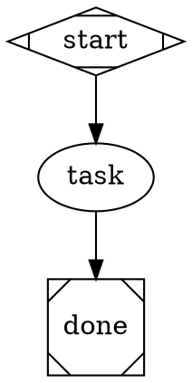

# Attractor

Multi-stage AI pipelines for code. Plan, implement, test, review — orchestrated as
directed graphs.

## Upstream Attribution and Layering

This bundle implements the **attractor nlspec** defined at
[github.com/strongdm/attractor](https://github.com/strongdm/attractor). Community
`.dot` files written against the canonical spec should work without modification.

We extend the spec selectively where high-value additions warrant it. Every extension is
backward-compatible and documented in [`specs/EXTENSIONS.md`](specs/EXTENSIONS.md).
If you find behavior that diverges from the canonical spec without an entry in that file,
treat it as a bug.

**Dependency awareness.** Per the Amplifier ecosystem
[REPOSITORY_RULES.md](https://github.com/microsoft/amplifier-foundation/blob/main/docs/REPOSITORY_RULES.md):
this bundle's declared code dependencies are `amplifier-core` and its own internal modules.
It does not reference downstream consumers (resolvers, orchestration platforms, or
application bundles). The one documented lineage exception is `amplifier-bundle-recipes`:
attractor is a follow-up to that recipe-bundle work, and specific recipe patterns may be
cited as prior-art inspiration where useful.

## Documentation

| Guide | Description |
|-------|-------------|
| [Vision](docs/VISION.md) | What this repo is for and how it is steered -- the north star it carries forward from the nlspec, the **decision matrix** governing every change, the layers we converge on, and what we resist. States the desired state, not status: what exists today lives in the ledgers |
| [Getting Started](docs/GETTING-STARTED.md) | Installation, first pipeline run, provider selection, common gotchas |
| [Attractor Explained](https://microsoft.github.io/amplifier-bundle-attractor/attractor-explained.html) | Visual explainer for people who want to understand what attractors are and how they work -- the convergence loop, evidence gates, engine mechanics, a worked run-through (rendered page; share the link) |
| [DOT Authoring Guide](docs/DOT-AUTHORING-GUIDE.md) | How to design effective pipelines -- patterns, attributes, fidelity, stylesheets |
| [DOT Syntax Reference](docs/DOT-SYNTAX.md) | Quick reference tables and copy-paste patterns |
| [Routing Reference](docs/ROUTING-REFERENCE.md) | Edge selection algorithm, `report_outcome` tool, condition expressions, common pitfalls |
| [App Integration Guide](docs/APP-INTEGRATION-GUIDE.md) | Using pipelines from Python applications (DirectProvider vs AmplifierSession) |
| [Pipeline Design Principles](docs/PIPELINE_DESIGN_PRINCIPLES.md) | Six framework-agnostic design principles: tier discipline, validation patterns, loop convergence, LLM output protocols, parameterization, verdict-bearing nodes |
| [Issue Pipeline](docs/ISSUE_PIPELINE.md) | What happens after a maintainer labels an issue `ready:spec` (defects) or `ready:feature-spec` (features) -- the autonomous specify/implement pipelines, their human review gates, what makes a good defect report, and how a maintainer supplies binding acceptance criteria for a feature |
| [Quality Protocol](docs/QUALITY_PROTOCOL.md) | How work gets proven here -- the design -> build -> live-proof -> adversarial-review -> maintainer's-word arc, the evidence each class of change owes before merge, the five-layer drift defense against the upstream nlspec, and the meta-protocol for amending and retiring all of it |
| [Guidance Eval](evals/guidance/README.md) | The standing instrument behind the Quality Protocol's **Guidance surfaces** row -- six scenarios that install this bundle the way a user does, drive real sessions against `agents/`, `skills/`, `context/` and the teaching docs, and grade them blind against criteria anchored in the canonical spec and the vision |

## Quick Start

**1. Add to your Amplifier config:**

```yaml
# .amplifier/config.yaml (or any bundle that includes this)
includes:
  - bundle: git+https://github.com/microsoft/amplifier-bundle-attractor@main#subdirectory=profiles/attractor-profile-anthropic
```

Pick your provider: `attractor-profile-anthropic`, `attractor-profile-openai`, or `attractor-profile-gemini`.

**2. Point the pipeline orchestrator at a `.dot` file:**

```yaml
# .amplifier/config.yaml (or any bundle file)
includes:
  - bundle: attractor:bundles/attractor-pipeline
session:
  orchestrator:
    config:
      dot_file: examples/pipelines/00-convergence-loop.dot   # or dot_source: "digraph { ... }"
```

Then run the configured bundle -- there are no pipeline-specific CLI flags. The
goal is carried by the DOT graph attribute `graph [goal="Write a Python function
count_words(text) ..."]` (or via `params`), not a `--goal` flag. The pipeline
loops until `pytest` passes -- that is the convergence loop in action.

**3. Or just ask conversationally:**

> "Run the plan-implement-test pipeline to add input validation to the login endpoint"

> "Build a test suite for the auth module using a parallel pipeline"

The agent can generate pipelines on-the-fly or use any of the included examples.

**4. Or run an example directly from the CLI:**

The `attractor run` CLI executes a `.dot` with no config file. The
`bug-fix` / `refactor` / `test-gen` [practical examples](examples/pipelines/practical/)
ship a runnable sample target, so they work walk-up. From a clone of this repo:

```bash
DOT="$PWD/examples/pipelines/practical/bug-fix.dot"
cp -r examples/pipelines/practical/sample /tmp/attractor-demo
cd /tmp/attractor-demo
attractor run "$DOT" \
    --param goal="Fix the TypeError in get_display_name when a user's avatar is None" \
    --cwd .
```

Then `pytest -v` in the copy to see the fix + regression test. The sample is
copied to a temp dir so the committed fixture stays pristine; `$DOT` is captured
absolute before `cd` because the `.dot` path resolves from your current directory
while `--cwd` is where the pipeline reads and writes (the two must match for
agent pipelines -- see
[modules/pipeline-runner/KNOWN_ISSUES.md](modules/pipeline-runner/KNOWN_ISSUES.md)).
See the [practical examples guide](examples/pipelines/practical/) for the full set.

If a run is interrupted (a crash, a kill, a lost machine), resume it from the
run directory it left behind — completed nodes are not re-executed and the
restored context carries forward:

```bash
attractor resume /path/to/run-dir --cwd .
```

Resume is explicit and opt-in: `attractor run` never reads a checkpoint back,
so a leftover `checkpoint.json` can never change what a fresh run does. Use the
same `--cwd` the interrupted run used. A missing, corrupted, already-completed
or foreign checkpoint fails loud and exits non-zero — it never silently
restarts from the start node. See
[attractor-spec §5.3](specs/canonical/attractor-spec-canonical.md) and
[the design record](docs/designs/2026-08-14-engine-checkpoint-resume.md).

## What Can It Do?

**Fix a bug systematically** -- reproduce, diagnose, fix, regression test, verify:
```yaml
# .amplifier/config.yaml (or any bundle file)
includes:
  - bundle: attractor:bundles/attractor-pipeline
session:
  orchestrator:
    config:
      dot_file: examples/pipelines/practical/bug-fix.dot
```
The goal lives in the DOT itself: `graph [goal="Fix the NullPointerError in UserService.getProfile()"]` (or supply `params` for `$param` substitution).

**Review a PR in parallel** -- analyze diff, then simultaneously check bugs, security,
performance, and style -- then synthesize review comments:
```yaml
# .amplifier/config.yaml (or any bundle file)
includes:
  - bundle: attractor:bundles/attractor-pipeline
session:
  orchestrator:
    config:
      dot_file: examples/pipelines/practical/pr-review.dot
```
The goal lives in the DOT itself: `graph [goal="Review PR #142"]` (or supply `params` for `$param` substitution).

**Build a feature safely** -- parse spec, parallel implement (core, API, tests),
integration test, human review gate:
```yaml
# .amplifier/config.yaml (or any bundle file)
includes:
  - bundle: attractor:bundles/attractor-pipeline
session:
  orchestrator:
    config:
      dot_file: examples/pipelines/practical/feature-build.dot
```
The goal lives in the DOT itself: `graph [goal="Add user avatar upload with S3 storage"]` (or supply `params` for `$param` substitution).

## Pipeline Gallery

### Objective-first — state the objective, not the pipeline

| Pipeline | What it does |
|----------|--------------|
| [Objective Runner](examples/objective/README.md) | You state an **objective**; it diagnoses, then **selects** a shipped lane, **composes** a purpose-built child pipeline, or **redirects** with an honest written no |
| [Authoring Attractor](examples/authoring/README.md) | You state a design **brief**; it diagnoses, **authors** a new reusable pipeline, converges it under `attractor lint` + a structural contract + an independent critique, and publishes it with provenance — or **redirects** with an honest written no |

### Canonical attractor exemplars — teach the shape

| Pipeline | What it teaches |
|----------|----------------|
| [Convergence Loop](examples/pipelines/00-convergence-loop.md) | **The bowl** — minimal 4-node convergence loop. Start here. |
| [Plan-Implement-Test](examples/pipelines/02-plan-implement-test.md) | Staged convergence: `plan → implement → test_gate` with `goal_gate` + `retry_target` + corrective back-edge |
| [Bug Fix](examples/pipelines/practical/bug-fix.md) | The bowl applied to real work: inner fix loop + root-cause wall + outer feedback loop |
| [Task Runner](examples/patterns/task-runner.md) | Battle-hardened goal+DoD runner (orient/attempt/verify/critique/triage) |

### Engine-feature demos — teach individual mechanisms

| Pipeline | Mechanism |
|----------|-----------|
| [Simple Linear](examples/pipelines/01-simple-linear.md) | `A -> B -> C` linear flow |
| [Conditional Routing](examples/pipelines/03-conditional-routing.md) | `diamond` routing node |
| [Retry with Fallback](examples/pipelines/04-retry-with-fallback.md) | Retry loop with fallback |
| [Parallel Fan-Out](examples/pipelines/05-parallel-fan-out.md) | `component` fork / `tripleoctagon` join |
| [Model Stylesheet](examples/pipelines/06-model-stylesheet.md) | CSS-like per-node model routing |
| [Fidelity Modes](examples/pipelines/07-fidelity-modes.md) | Context fidelity control |
| [Human Gate](examples/pipelines/08-human-gate.md) | `hexagon` human-approval gate |
| [Manager-Supervisor](examples/pipelines/09-manager-supervisor.md) | `house` manager/supervisor loop |
| [Full Attractor](examples/pipelines/10-full-attractor.md) | All features together |
| [Manager Child + HITL](examples/pipelines/11-manager-child-dotfile-hitl/) | Nested pipeline + gate |
| [Graph Resume](examples/pipelines/12-graph-resume.md) | File-state guards / resumable |

### Practical task pipelines — real work, walk-up runnable

| Pipeline | Use Case |
|----------|----------|
| [PR Review](examples/pipelines/practical/pr-review.md) | Parallel multi-dimension code review |
| [Test Generation](examples/pipelines/practical/test-gen.md) | Test authoring with validation loop |
| [Bug Fix](examples/pipelines/practical/bug-fix.md) | Reproduce → diagnose → fix → verify |
| [Feature Build](examples/pipelines/practical/feature-build.md) | Parallel implementation + human gate |
| [Refactoring](examples/pipelines/practical/refactor.md) | Snapshot-safe code improvement |
| [Multi-Lens Review](examples/pipelines/practical/multi-lens-review.md) | 3 providers × 3 lenses |
| [Drift Review](examples/drift-review/README.md) | `QUALITY_PROTOCOL.md` Layer 3: holistic semantic review of this repo against the canonical spec and `docs/VISION.md` |

`Bug Fix`, `Test Generation`, and `Refactoring` ship a runnable sample, so they work with no setup. See [examples/pipelines/practical/](examples/pipelines/practical/) for the full set.

## How It Works

The **loop-pipeline** orchestrator walks a Graphviz DOT digraph. Each node is an AI
task (or control node like fork/join/gate), and edges define the flow between them.
For each LLM node, the orchestrator spawns a **loop-agent** sub-session that runs
an agentic tool loop -- call LLM, execute tools, feed results back -- until the
node's task completes. Results flow forward along edges to the next node.

### The objective layer

The graph is the program — but choosing *which* graph is still a decision, and
it is usually the one a user cannot make. `examples/objective/objective-runner.dot`
takes that decision as its input: you pass an **objective**, and the runner
diagnoses it with the three-question test, then **selects** one of the shipped
practical pipelines, **composes** a purpose-built child graph (which must clear
`attractor lint` and a structural contract check before it is allowed to run), or
**redirects** — exiting green with a written diagnosis when the honest answer is
that the work wants a recipe, a conversation, or a one-shot.

It stacks the same doctrine one level up rather than relaxing it. The first
routing decision runs on a schema-validated artifact written by a worker and
admitted by a *code* gate, not on the worker's self-report. A child pipeline's
own success is used for loud fail-routing only — satisfaction is decided by the
parent re-running the definition-of-done command itself, plus a delta assertion
against an anchor recorded before any work began. It is author-level content
only: one `.dot`, two stdlib scripts, no engine surface.

## Provider Profiles

Each profile wires a provider, an agent loop, provider-aligned tools, and a system
prompt. All profiles include `attractor-core` (shared hooks and the
`tool-report-outcome` tool).

| Profile | Provider | Tools | Env Var |
|---------|----------|-------|---------|
| `attractor-profile-anthropic` | Anthropic Claude | `tool-filesystem` (read/write/edit), `tool-bash` (120s timeout), `tool-search` | `ANTHROPIC_API_KEY` |
| `attractor-profile-openai` | OpenAI | `tool-apply-patch` (v4a diffs), `tool-filesystem` (read/write only), `tool-bash` (10s timeout), `tool-search` | `OPENAI_API_KEY` |
| `attractor-profile-gemini` | Gemini | `tool-filesystem`, `tool-bash` (10s timeout), `tool-search`, `tool-web` (search + fetch) | `GEMINI_API_KEY` |

The Anthropic profile mirrors Claude Code conventions (edit_file with old/new strings,
long shell timeouts). The OpenAI profile mirrors codex-rs conventions (apply_patch with
v4a unified diffs, short shell timeouts). The Gemini profile adds web tools for
grounding.

## DOT Syntax

See [docs/DOT-SYNTAX.md](docs/DOT-SYNTAX.md) for the complete reference.

Quick version -- pipelines are Graphviz DOT digraphs where node shapes determine behavior:

| Shape | What it does |
|-------|-------------|
| `Mdiamond` | Start node (entry point) |
| `Msquare` | Exit node (pipeline end) |
| `box` | LLM agent node (default) |
| `diamond` | Conditional routing point (no-op handler; edges do the routing) |
| `component` | Parallel fan-out |
| `tripleoctagon` | Parallel fan-in (collect results) |
| `hexagon` | Human approval gate |
| `parallelogram` | External tool execution |
| `folder` | Nested sub-pipeline (runs a child DOT via `dot_file=`) |
| `house` | Manager/supervisor loop |

Minimal pipeline:



## Customization

See [DOT Authoring Guide](docs/DOT-AUTHORING-GUIDE.md) for complete patterns and examples.

- **Model stylesheets** -- override provider, model, and reasoning effort per-node via CSS-like selectors:
  ```dot
  graph [model_stylesheet="
      box { llm_provider: anthropic; llm_model: claude-sonnet-4-6 }
      .fast { llm_model: claude-haiku-3-5-20241022 }
  "]
  ```
- **Fidelity modes** -- control context carryover between nodes (`full`, `compact`, `truncate`, `summary`)
- **Human gates** -- pause pipelines for human approval at any stage
- **`$param` expansion** -- pass key-value parameters for template reuse:
  ```json
  {
    "goal": "Build a REST API",
    "dot_file": "template.dot",
    "params": {"language": "Python", "framework": "FastAPI"}
  }
  ```

## Programmatic Usage

The pipeline engine works as a library from any Python app built on
`amplifier-core` + `amplifier-foundation`. No CLI dependency required.

See [examples/programmatic_usage.py](examples/programmatic_usage.py) for a
complete, runnable example.

### Option A: Direct LLM calls (no Amplifier session)

Best for analysis/reasoning pipelines where nodes only need to generate text
(no file editing or shell commands).

```python
import asyncio
import tempfile
from amplifier_module_loop_pipeline.dot_parser import parse_dot
from amplifier_module_loop_pipeline.engine import PipelineEngine
from amplifier_module_loop_pipeline.context import PipelineContext
from amplifier_module_loop_pipeline.handlers import HandlerRegistry
from amplifier_module_loop_pipeline.transforms import apply_transforms
from amplifier_module_loop_pipeline.validation import validate_or_raise
from amplifier_module_loop_pipeline import DirectProviderBackend

DOT = """
digraph {
    graph [goal="Explain what a monad is in 3 sentences"]
    start [shape=Mdiamond]
    draft [prompt="Write a first draft: $goal", llm_provider="anthropic"]
    review [prompt="Improve this draft, keep it concise: $context"]
    done [shape=Msquare]
    start -> draft -> review -> done
}
"""

async def main():
    graph = parse_dot(DOT)
    context = PipelineContext()
    apply_transforms(graph, context)
    validate_or_raise(graph)

    # provider=None auto-creates unified_llm.Client from env vars
    backend = DirectProviderBackend(provider=None)
    engine = PipelineEngine(
        graph=graph, context=context,
        handler_registry=HandlerRegistry(backend=backend),
        logs_root=tempfile.mkdtemp(),
    )
    outcome = await engine.run()
    print(f"Status: {outcome.status.value}")
    print(f"Result: {outcome.notes}")

asyncio.run(main())
```

Requirements: install `amplifier-module-loop-pipeline` from the bundle (this pulls in
`unified-llm-client` automatically):

```
pip install "amplifier-module-loop-pipeline @ git+https://github.com/microsoft/amplifier-bundle-attractor@main#subdirectory=modules/loop-pipeline"
```

Plus an API key in environment (`ANTHROPIC_API_KEY`, `OPENAI_API_KEY`, or `GEMINI_API_KEY`).

### Option B: Full Amplifier session with tools

Best for coding pipelines where nodes need to read/write files, run shell commands,
and use the full agent tool loop. Each pipeline node gets its own sub-session with
the complete tool set.

```python
import asyncio
from pathlib import Path
from amplifier_foundation import Bundle, load_bundle

ATTRACTOR_BUNDLE = "git+https://github.com/microsoft/amplifier-bundle-attractor@main#subdirectory=profiles/attractor-profile-anthropic"

DOT = """
digraph {
    graph [goal="Create a Python function that checks if a number is prime"]
    start [shape=Mdiamond]
    implement [prompt="$goal. Write it to prime.py.", goal_gate=true]
    test [prompt="Write tests for prime.py and run them."]
    done [shape=Msquare]
    start -> implement -> test -> done
}
"""

async def main():
    # Load the attractor profile bundle
    bundle = await load_bundle(ATTRACTOR_BUNDLE)

    # Overlay pipeline config with your DOT source
    overlay = Bundle(
        name="my-pipeline",
        session={"orchestrator": {
            "module": "loop-pipeline",
            "config": {"dot_source": DOT},
        }},
    )
    composed = bundle.compose(overlay)

    # Prepare (downloads modules if needed) and create session
    prepared = await composed.prepare()
    session = await prepared.create_session(session_cwd=Path.cwd())

    # Register session.spawn so pipeline nodes get full sub-sessions
    # (See examples/programmatic_usage.py for the spawn capability impl)
    # See examples/programmatic_usage.py for register_spawn_capability implementation
    register_spawn_capability(session, prepared)

    async with session:
        result = await session.execute("Run the pipeline")
        print(result)

asyncio.run(main())
```

The key difference: with `session.spawn` registered, the `AmplifierBackend` kicks
in and each pipeline node gets a full child session with tools (filesystem, bash,
search). Without it, you get `DirectProviderBackend` (LLM-only, no tools).

See [`amplifier-foundation/examples/07_full_workflow.py`](https://github.com/microsoft/amplifier-foundation/blob/main/examples/07_full_workflow.py) for the reference
`register_spawn_capability()` implementation. For a comprehensive guide,
see [App Integration Guide](docs/APP-INTEGRATION-GUIDE.md).

## Attractor Expert Agent

Sessions that compose `attractor-core` have access to the `attractor-expert`
agent -- a context-sink that carries deep knowledge of DOT syntax, pipeline
patterns, programmatic integration, and debugging. Delegate to it for pipeline
design questions, DOT authoring help, or troubleshooting:

```
delegate to attractor:attractor-expert
```

## Stability & Compatibility

This engine implements StrongDM's [attractor nlspec](https://github.com/strongdm/attractor).
It ships documented extensions to that spec (see [`specs/EXTENSIONS.md`](specs/EXTENSIONS.md))
and at least one documented divergence from it (main-loop no-matching-edge hard-fail —
`specs/EXTENSIONS.md` §33 — where we hard-fail instead of the spec's dead-end-implies-success
default; see `SPEC_CONFORMANCE.md` ATX-11 for the rationale).

**We do not currently offer semver guarantees or a formal deprecation policy on this repo.**
Development velocity is high and behavior can change between commits. If you depend on this
engine, **pin a commit SHA** rather than tracking `@main`.

**Known caveat:** `Outcome.suggested_next_ids` entries must be strings that exactly match a
target node's `id`. Non-string or mismatched entries currently fail to match during edge
selection (`edge_selection.py`), silently falling through to the next selection step rather
than the intended target. If an outcome report seems to route unexpectedly, check the types
and exact spelling of `suggested_next_ids` first. This is a known issue being addressed; no
version cutover is implied by that work landing.

## Architecture

<details>
<summary>Expand architecture details</summary>

### Layers

- **attractor-core** (behavior): Provider-agnostic tools and hooks shared by all profiles. Includes `tool-report-outcome`, `hooks-tool-truncation`, `hooks-pipeline-progress`, and `hooks-pipeline-observability`.
- **Profiles**: Each profile includes `attractor-core` and adds a provider, orchestrator (`loop-agent`), provider-specific tools, and a system prompt.
- **Modules**: Self-contained Amplifier modules in `modules/`, each independently testable with its own `pyproject.toml`.

### Repository Structure

```
amplifier-bundle-attractor/
├── behaviors/
│   └── attractor-core.yaml     # Shared tools + hooks (provider-agnostic)
├── profiles/                    # Provider-specific complete configs
│   ├── attractor-profile-anthropic.yaml
│   ├── attractor-profile-openai.yaml
│   └── attractor-profile-gemini.yaml
├── context/                     # System prompts per provider
│   ├── system-anthropic.md
│   ├── system-openai.md
│   └── system-gemini.md
├── examples/
│   ├── pipelines/               # 10 example + 5 practical DOT pipelines
│   └── programmatic_usage.py    # Using the engine from Python code
├── modules/                     # Amplifier modules
│   ├── loop-agent/              # Agent loop orchestrator
│   ├── loop-pipeline/           # DOT graph-driven pipeline orchestrator
│   ├── tool-apply-patch/        # v4a unified diff tool (OpenAI only)
│   ├── unified-llm-client/      # Multi-provider LLM client library
│   ├── tool-report-outcome/     # Structured outcome reporting tool
│   ├── tool-pipeline-run/       # Runtime pipeline invocation tool
│   ├── hooks-tool-truncation/   # Tool output truncation hook
│   ├── hooks-pipeline-progress/ # Pipeline progress reporting hook
│   ├── hooks-pipeline-observability/ # Pipeline observability hooks (state aggregator, status bar, event persistence)
│   ├── tool-dashboard-query/    # Pipeline status queries and management via HTTP API
│   └── tool-pipeline-status/   # Returns pipeline execution state
└── docs/
    └── DOT-SYNTAX.md            # DOT syntax reference
```

### Module Responsibilities

| Module | Type | Description |
|--------|------|-------------|
| `loop-agent` | orchestrator | Single-turn coding agent loop with steering, loop detection, and context management |
| `loop-pipeline` | orchestrator | Multi-stage DOT graph-driven pipeline with checkpointing, retry, and fidelity control |
| `tool-apply-patch` | tool | v4a unified diff patch application (OpenAI/codex-rs style) |
| `unified-llm-client` | library | Multi-provider LLM client with adapters for Anthropic, OpenAI, Gemini |
| `tool-report-outcome` | tool | Structured result reporting for pipeline integration |
| `tool-pipeline-run` | tool | Runtime pipeline invocation via session.spawn |
| `hooks-tool-truncation` | hook | Truncates large tool outputs to manage context window |
| `hooks-pipeline-progress` | hook | Reports pipeline stage progress |
| `hooks-pipeline-observability` | hook | Pipeline observability hooks — state aggregator, status bar, and event persistence |
| `tool-dashboard-query` | tool | Pipeline status queries and management via HTTP API |
| `tool-pipeline-status` | tool | Returns pipeline execution state |

### Backend Selection

The pipeline orchestrator auto-selects the execution backend:

1. If `session.spawn` capability is registered --> `AmplifierBackend` (full sub-sessions per node, tools included)
2. Else if a provider is available --> `DirectProviderBackend` (per-node **agentic tool loop** via `unified_llm` -- whatever tools are mounted are passed through, and `unified-llm-client` drives the call -> tool -> call rounds internally. Node tools are only absent when the host mounts none, e.g. the bare programmatic path above. Requires an explicit `llm_model` on every node; there is no default)
3. Otherwise --> simulation mode (for testing)

</details>

## Development

Each module is independently testable:

```bash
cd modules/loop-agent && uv run pytest tests/ -q
cd modules/loop-pipeline && uv run pytest tests/ -q
cd modules/tool-apply-patch && uv run pytest tests/ -q
cd modules/unified-llm-client && uv run pytest tests/ -q
cd modules/tool-report-outcome && uv run pytest tests/ -q
cd modules/tool-pipeline-run && uv run pytest tests/ -q
cd modules/hooks-tool-truncation && uv run pytest tests/ -q
cd modules/hooks-pipeline-progress && uv run pytest tests/ -q
cd modules/hooks-pipeline-observability && uv run pytest tests/ -q
cd modules/tool-dashboard-query && uv run pytest tests/ -q
cd modules/tool-pipeline-status && uv run pytest tests/ -q
```

Run all modules:

```bash
for mod in modules/*/; do
    echo "=== $mod ===" && (cd "$mod" && uv run pytest tests/ -q)
done
```

### Dependencies

- Modules depend on `amplifier-core`. Each `pyproject.toml` uses a relative path for local dev:
  ```toml
  [tool.uv.sources]
  amplifier-core = { path = "../../../amplifier-core", editable = true }
  ```
- `loop-pipeline` and `loop-agent` additionally depend on `unified-llm-client` (bundled at `modules/unified-llm-client/`, resolved via `[tool.uv.sources]` relative paths).
- For programmatic usage with full sessions: `pip install amplifier-foundation`.

### E2E Tests

Manual end-to-end tests against real LLM providers are in `tests/e2e/`. See
[tests/e2e/MANUAL_E2E.md](tests/e2e/MANUAL_E2E.md) for instructions.

## Contributing

Contributions are welcome. Pull requests are reviewed by the repository's code owners and
must pass the required `CI Gate (all checks passed)` check before merge (see `AGENTS.md`).
If your change alters an observable contract — dispatch semantics, event contracts, or
admission/validation behavior — it needs a `specs/EXTENSIONS.md` entry describing the
change (the PR template will prompt for this).

Most contributions require you to agree to a
Contributor License Agreement (CLA) declaring that you have the right to, and actually do, grant us
the rights to use your contribution. For details, visit [Contributor License Agreements](https://cla.opensource.microsoft.com).

When you submit a pull request, a CLA bot will automatically determine whether you need to provide
a CLA and decorate the PR appropriately (e.g., status check, comment). Simply follow the instructions
provided by the bot. You will only need to do this once across all repos using our CLA.

This project has adopted the [Microsoft Open Source Code of Conduct](https://opensource.microsoft.com/codeofconduct/).
For more information see the [Code of Conduct FAQ](https://opensource.microsoft.com/codeofconduct/faq/) or
contact [opencode@microsoft.com](mailto:opencode@microsoft.com) with any additional questions or comments.

## Trademarks

This project may contain trademarks or logos for projects, products, or services. Authorized use of Microsoft
trademarks or logos is subject to and must follow
[Microsoft's Trademark & Brand Guidelines](https://www.microsoft.com/legal/intellectualproperty/trademarks/usage/general).
Use of Microsoft trademarks or logos in modified versions of this project must not cause confusion or imply Microsoft sponsorship.
Any use of third-party trademarks or logos are subject to those third-party's policies.