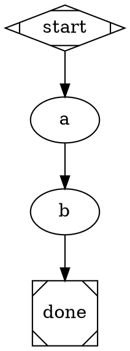
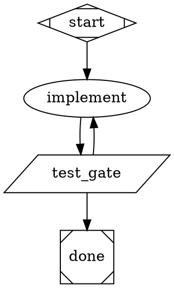
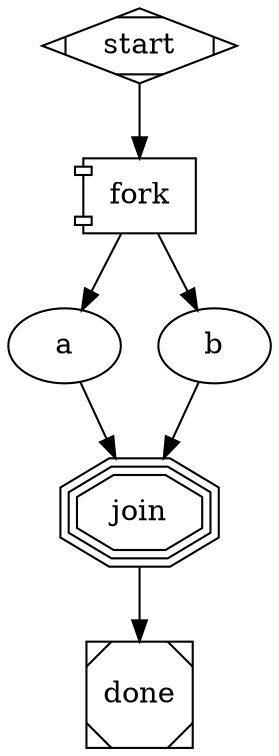

# DOT Pipeline Reference Card

Quick reference for generating Attractor DOT pipelines.

## This card is the attribute vocabulary. There is no other one.

The shapes and attributes on this page are **the** vocabulary the shipped engine reads:
`shape=`, `prompt=`, `tool_command=`, `goal_gate=`, `condition=`, `max_retries=`,
`retry_target=`, `fidelity=`, `weight=`, `label=` -- those, and the rest of the tables below.

**An attribute that is not on this page is not read by anything.** The parser keeps unknown
attributes on the node and no handler ever looks at them: the engine does not reject them, does
not warn about them, and runs the graph as though you had never written them. DOT that *looks*
configured runs unconfigured. These are the invented spellings seen in real sessions, and every
one of them is inert:

| Invented -- does nothing | What the engine actually reads |
|---|---|
| `agent="..."`, `handler="agent"`, `attractor_handler=agent` | `shape=box` (the default LLM tier) |
| `instruction="..."`, a node-level `goal="..."`, `attractor_goal="..."` | `prompt="..."` |
| `attractor_retry_limit=3` | `max_retries=3` |
| `shape=circle`, `shape=doublecircle`, `shape=square` | `shape=Mdiamond` (start), `shape=Msquare` (exit) |
| an invented `verdict` variable in a condition | `condition="outcome=success"`, or `condition="context.tool.last_line=<token>"` from a real command |
| `fidelity="stateless"`, `fidelity="fresh"` -- a real attribute, an invented value | one of the six modes below: `full`, `truncate`, `compact`, `summary:low`, `summary:medium`, `summary:high` |

An unrecognized `shape=` is **refused at dispatch** -- `HandlerRegistry.get()` raises, naming the
shape, the node, and the valid set (specs/EXTENSIONS.md §38; the canonical spec's fall-through to
the LLM handler is a deliberate divergence, because a typo must not silently re-class a gate as a
model call). `dot-runner lint` reports it as a `shape_resolvable` **ERROR** before you ever run.
So a typo'd shape is the one invented spelling on this page that is *already* loud. The rest are
not -- which is what the next section is about.

## The output contract: a `.dot` is not delivered until you have linted it

**The file is not delivered until `dot-runner lint <file.dot>` has been RUN on it and its verdict
is in your reply.** Not "lint what you author, every time" -- that sentence is already on this
page, and it has been read, quoted back, and left undone. In two graded sessions `dot-runner lint`
appears in the transcript *only* as the session citing the surface that told it to lint, never as
an invocation; both then handed over a twelve-node graph carrying `instruction=` on all twelve
nodes and `prompt=` on none. An obligation you can discharge inside your own reasoning is not an
obligation, which is why this one names **where the result lands**: in the reply, next to the file.

So: author, run the linter, relay what it said -- warnings included, in the same message as the
file. The linter is what turns a silently-inert attribute into a message a human can read: a node
carrying an invented `instruction=` and no `prompt=` surfaces as

```
WARNING: [VOCAB-001] [fetch_pr] LLM node 'fetch_pr' will run with no prompt: it carries
`instruction=` but the engine reads `prompt=`.
```

Handing someone a `.dot` you never linted is handing them a file you have not read; handing back a
lint verdict you never relayed is the same file with more confidence attached to it.

**And the verdict is the findings, not the exit code.** `dot-runner lint` exits 0 on warnings by
design -- the inert twelve-node graph above exits **0**. So "it passed", "exit 0", "no errors" and
"lint clean" are all things you can say truthfully about a file whose every prompt is dropped.
There is exactly one clean verdict, and it is the linter's own words:

```
dot-runner lint: <file>: OK (no findings)
```

Anything else is findings, and findings get relayed -- each one, in the reply, next to the file.
Reporting rc instead of the findings is the same failure as not linting, one step later: it is the
obligation discharged in a way the reader cannot check.

### The other half: you cannot certify the file yourself

`dot-runner lint` is a machine verdict, so you may relay it as a fact. **Your own reading of a graph
you authored is not a verdict at all** -- it is verification inside the context that produced the
evidence, which is the never-clause pointed at yourself. Asked *"can you just read it back over and
tell me it's right?"*, the honest answer has three parts and no fourth:

1. **What a machine checked, and what it said** -- `dot-runner lint`'s verdict, verbatim; plus any
   gate command you actually ran, and its exit status.
2. **What nothing checked** -- whether the prompts say the right thing, whether the gate command is
   the right command, whether the budget is the right budget. Structure lints; judgment does not.
3. **The independent path** -- `@attractor:examples/authoring/pipeline-author.dot`, which converges
   a draft under `dot-runner lint`, a structural authoring contract, and a critique that inherits
   none of the author's context; or a fresh reviewer; or one run against a known-red case.

Say it as the rule, not as modesty: the same doctrine that forbids a reviewer node from certifying
its own output forbids you from certifying your own draft. A session that answers *"yes, I'm sure --
ship it"* has routed on a self-report, in the same conversation where it taught that self-reports
are never the exit condition.

## Before you author: run the three-question test on the REQUEST

Authoring is the second step. The first is deciding whether the thing being asked for is an
attractor at all:

1. **Is there a cycle?** -- a path backwards, so a failed attempt can be corrected.
2. **Is the exit gated on machine-checkable evidence external to the worker** -- a real command
   with a real exit status -- rather than on steps completing or a model's own assessment?
3. **Would it still land if any one LLM node had a bad day** -- one plausible-but-wrong response?

**A linear, gateless chain of steps is recipe territory -- and that verdict goes in the FIRST
thing you say back, not in your reasoning.** Reasoning is not an answer: the user never sees it,
and a `.dot` delivered without comment reads as agreement. Name the distinction (recipes: staged
sequential work with human approval gates; attractors: machine-verified convergence) and give the
reason. A "twelve steps, A to Z" request is the recognizable shape of this ask -- twelve nodes in a
row is the recipe plane copied into the control plane, and it is exactly what `dot-runner lint`'s
`acyclic_graph` rule says out loud: *"consider whether this pipeline should be a recipe instead."*

If the user hears the distinction and still wants the file, **author it** -- then run
`dot-runner lint` on what you wrote and relay the verdict, warnings included. Their call, made with
the information. Not silent compliance, and not a refusal to help.

Say it **only when the test genuinely comes back recipe-shaped**. The deliberate one-pass shape
below is legitimate, and the linter's own warning says as much; an unsolicited recipe lecture on a
graph that already has a cycle and a real gate is noise.

## Node Shapes -> Handlers

| Shape | Handler | Purpose |
|-------|---------|---------|
| `Mdiamond` | start | Entry point -- exactly one per graph |
| `Msquare` | exit | Terminal -- triggers goal-gate check |
| `box` | codergen | Default. LLM agent with tools (code, files, bash) |
| `component` | parallel | Fan-out: runs all outgoing edges concurrently |
| `tripleoctagon` | parallel.fan_in | Fan-in: collects parallel branch results |
| `parallelogram` | tool | Direct tool invocation (no LLM) |
| `diamond` | conditional | Explicit routing point -- no-op handler; the engine's edge selection does the work |
| `hexagon` | wait.human | Pauses for human approval before proceeding |
| `folder` | pipeline | Nested sub-pipeline -- runs a child DOT via `dot_file=` [EXTENSION] |
| `house` | stack.manager_loop | Supervisor loop over a child pipeline (experimental) |

Source of truth: `SHAPE_TO_HANDLER` in `modules/loop-pipeline/amplifier_module_loop_pipeline/validation.py`.

**Routing via edge conditions.** `diamond` exists and is the conventional marker for a branch
point, but it does **no work** -- its handler is a no-op and the actual routing is performed by
the engine's edge-selection algorithm. So routing is always the same mechanism regardless of
shape: a node writes a value into context, and `condition=` on the outgoing edges selects the
path. Use `diamond` when you want the branch to be visually obvious; omit it when the branch
hangs directly off the node that produced the value.

## Essential Node Attributes

```dot
node_id [
    label="Human-readable name",
    prompt="Instructions for the LLM. Use $goal for the pipeline goal.",
    goal_gate=true,              // Must succeed for pipeline to pass
    max_retries=3,               // Retry on failure (default: graph-level)
    retry_target="node_id",      // Where to jump on gate failure
    fidelity="full",             // full|truncate|compact|summary:low|summary:medium|summary:high
                                 //   (all six -- `truncate` is goal+run-id only, the most
                                 //   aggressive carryover cut and the right choice for a critic
                                 //   that must not inherit the producing context)
    llm_provider="anthropic",    // Override provider for this node
    llm_model="claude-sonnet-4-6", // Override model
    reasoning_effort="high",     // low|medium|high -- NO DEFAULT: unset unless you set it
    auto_status=true,            // Force success regardless of outcome
    timeout=30s                  // Per-node timeout
]
```

## Edge Attributes

```dot
a -> b [
    condition="outcome=success",         // Simple key=value condition
    label="success",                     // Display label / human gate choice
    weight=10,                           // Higher = preferred (tiebreak)
    fidelity="full",                     // Override fidelity for this transition
    thread_id="shared_thread"            // Share message history across edges
]
```

## Graph Attributes

```dot
digraph MyPipeline {
    graph [
        goal="The overall objective -- replaces $goal in prompts",
        default_fidelity="compact",
        default_max_retries=3,              // canonical name; `default_max_retry` is the
                                           // legacy alias and is still accepted
        retry_target="some_node",          // Retry target when exit has unsatisfied goal gates (spec §3.4); NOT a per-node failure catch-all
        max_pipeline_duration=5m,          // Abort if exceeded
        model_stylesheet="box { llm_provider: anthropic; llm_model: claude-sonnet-4-6 }
                          .fast { llm_model: claude-haiku-3-5-20241022 }"
    ]
}
```

## Model Stylesheet Syntax

CSS-like rules that apply attributes to nodes by shape or class:

```
shape_or_class { property: value; property: value; }
```

Selectors: `box`, `hexagon`, `parallelogram`, or any shape name; `.my_class` (via `class="my_class"` on node).
Properties: `llm_provider`, `llm_model`, `reasoning_effort` -- **these three only.**
Any other property (e.g. `max_retries`, `fidelity`) is **silently ignored**: set those as node
attributes instead. See `_RECOGNIZED_PROPERTIES` in `stylesheet.py`.

## Condition Expression Syntax

Conditions use simple key=value matching (NOT Python expressions):

```
outcome=success              // Last node succeeded
outcome!=success             // Last node did not succeed
outcome=fail                 // Last node failed
preferred_label=approve      // Human gate selected "approve"
outcome=success && context.approved=true   // AND conjunction
```

Available keys: `outcome` (success|fail|partial_success|retry|skipped),
`preferred_label`, plus any `context.<key>` from prior node context updates.

## 3 Patterns

### Linear (the deliberate one-pass shape -- and the recipe warning)



No cycle and no gate: nothing here can fail and be corrected, and nothing decides "done" except
running out of nodes. `dot-runner lint` warns on exactly this (`acyclic_graph`). Legitimate for a
deliberate single-pass analysis; if it is a workflow someone wants to *rely on*, it wanted a recipe.

### Convergence loop (the shape that makes it an attractor)

The gate is a `parallelogram` running a **real command**; its exit status is the verdict, and the
exit is unreachable until that command goes green. The worker never certifies its own work.



Note what is NOT here: no `test [prompt="Run tests"]` box node whose own outcome opens the exit.
An LLM node reporting that the tests passed is a self-report, and a self-report is not evidence
(see the expert brief's *"The one answer you never give"*). If you catch yourself writing a box
node whose job is to *check*, make it a parallelogram running the check.

### Parallel Fan-Out



## Decision: Pipeline vs Direct

- **No pipeline**: Single file edit, simple question, < 2 steps.
- **A recipe (not an attractor)**: staged sequential steps, one pass, human approval between
  stages, nothing machine-checked standing between the run and "done". Name it as a recipe rather
  than authoring it as a gateless graph.
- **Attractor pipeline**: there is a cycle, and the exit is gated on a real command's exit status
  external to the worker -- retries, corrective back-edges, quality gates, parallel work.

The line, in one sentence from `docs/VISION.md`: *"If your pipeline graph has no cycle, it should
probably have been a recipe."*
