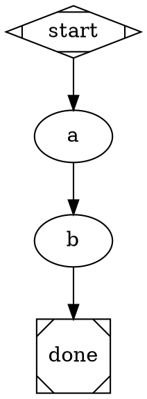
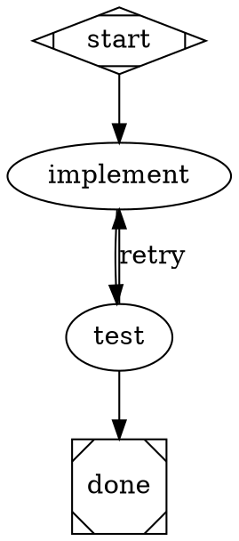
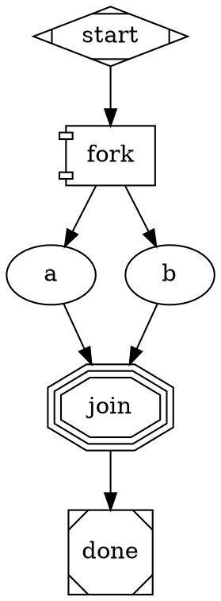

# DOT Pipeline Reference Card

Quick reference for generating Attractor DOT pipelines.

## Node Shapes -> Handlers

| Shape | Handler | Purpose |
|-------|---------|---------|
| `Mdiamond` | start | Entry point -- exactly one per graph |
| `Msquare` | exit | Terminal -- triggers goal-gate check |
| `box` | codergen | Default. LLM agent with tools (code, files, bash) |
| `component` | parallel | Fan-out: runs all outgoing edges concurrently |
| `tripleoctagon` | parallel.fan_in | Fan-in: collects parallel branch results |
| `parallelogram` | tool | Direct tool invocation (no LLM) |
| `diamond` | conditional | Explicit routing point -- no-op handler; the engine's edge selection does the work |
| `hexagon` | wait.human | Pauses for human approval before proceeding |
| `folder` | pipeline | Nested sub-pipeline -- runs a child DOT via `dot_file=` [EXTENSION] |
| `house` | stack.manager_loop | Supervisor loop over a child pipeline (experimental) |

Source of truth: `SHAPE_TO_HANDLER` in `modules/loop-pipeline/amplifier_module_loop_pipeline/validation.py`.

**Routing via edge conditions.** `diamond` exists and is the conventional marker for a branch
point, but it does **no work** -- its handler is a no-op and the actual routing is performed by
the engine's edge-selection algorithm. So routing is always the same mechanism regardless of
shape: a node writes a value into context, and `condition=` on the outgoing edges selects the
path. Use `diamond` when you want the branch to be visually obvious; omit it when the branch
hangs directly off the node that produced the value.

## Essential Node Attributes

```dot
node_id [
    label="Human-readable name",
    prompt="Instructions for the LLM. Use $goal for the pipeline goal.",
    goal_gate=true,              // Must succeed for pipeline to pass
    max_retries=3,               // Retry on failure (default: graph-level)
    retry_target="node_id",      // Where to jump on gate failure
    fidelity="full",             // full|compact|summary:high|summary:low
    llm_provider="anthropic",    // Override provider for this node
    llm_model="claude-sonnet-4-6", // Override model
    reasoning_effort="high",     // low|medium|high -- NO DEFAULT: unset unless you set it
    auto_status=true,            // Force success regardless of outcome
    timeout=30s                  // Per-node timeout
]
```

## Edge Attributes

```dot
a -> b [
    condition="outcome=success",         // Simple key=value condition
    label="success",                     // Display label / human gate choice
    weight=10,                           // Higher = preferred (tiebreak)
    fidelity="full",                     // Override fidelity for this transition
    thread_id="shared_thread"            // Share message history across edges
]
```

## Graph Attributes

```dot
digraph MyPipeline {
    graph [
        goal="The overall objective -- replaces $goal in prompts",
        default_fidelity="compact",
        default_max_retry=3,
        retry_target="some_node",          // Retry target when exit has unsatisfied goal gates (spec §3.4); NOT a per-node failure catch-all
        max_pipeline_duration=5m,          // Abort if exceeded
        model_stylesheet="box { llm_provider: anthropic; llm_model: claude-sonnet-4-6 }
                          .fast { llm_model: claude-haiku-3-5-20241022 }"
    ]
}
```

## Model Stylesheet Syntax

CSS-like rules that apply attributes to nodes by shape or class:

```
shape_or_class { property: value; property: value; }
```

Selectors: `box`, `hexagon`, `parallelogram`, or any shape name; `.my_class` (via `class="my_class"` on node).
Properties: `llm_provider`, `llm_model`, `reasoning_effort` -- **these three only.**
Any other property (e.g. `max_retries`, `fidelity`) is **silently ignored**: set those as node
attributes instead. See `_RECOGNIZED_PROPERTIES` in `stylesheet.py`.

## Condition Expression Syntax

Conditions use simple key=value matching (NOT Python expressions):

```
outcome=success              // Last node succeeded
outcome!=success             // Last node did not succeed
outcome=fail                 // Last node failed
preferred_label=approve      // Human gate selected "approve"
outcome=success && context.approved=true   // AND conjunction
```

Available keys: `outcome` (success|fail|partial_success|retry|skipped),
`preferred_label`, plus any `context.<key>` from prior node context updates.

## 3 Patterns

### Linear



### Conditional Loop (retry on failure)



### Parallel Fan-Out



## Decision: Pipeline vs Direct

- **No pipeline**: Single file edit, simple question, < 2 steps.
- **Inline pipeline**: 2-4 ordered steps, clear sequence, no branching.
- **Full pipeline**: Branches, retries, parallel work, quality gates, human review.
