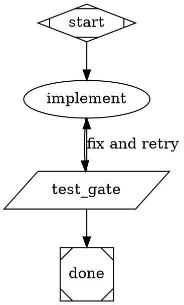
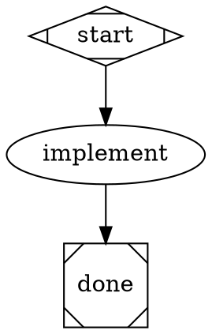
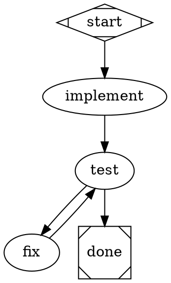
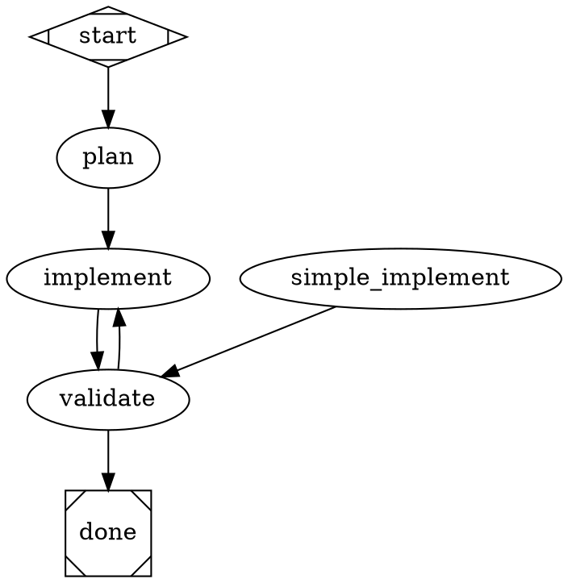
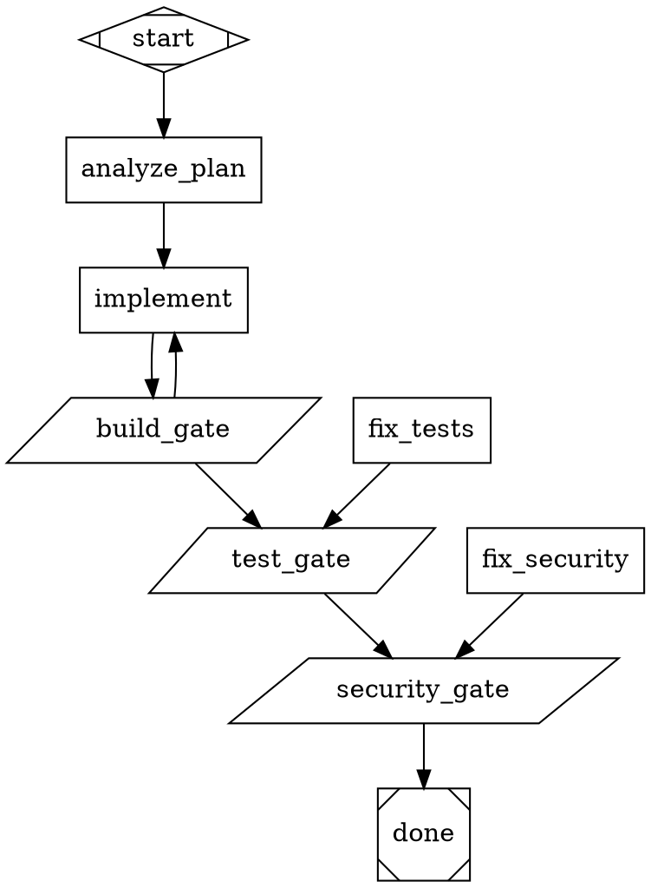
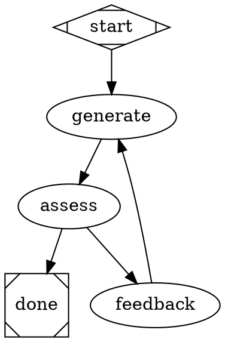
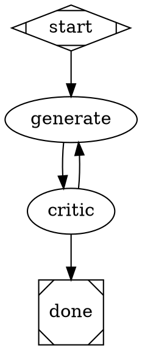
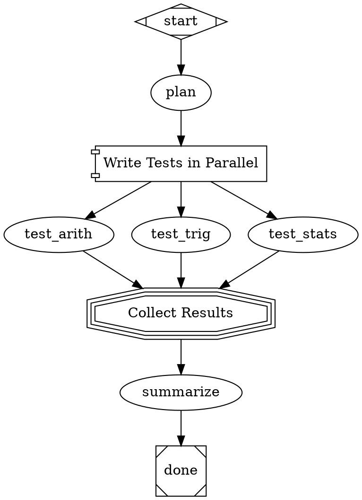
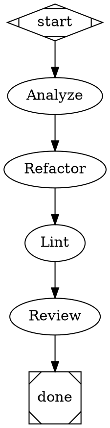
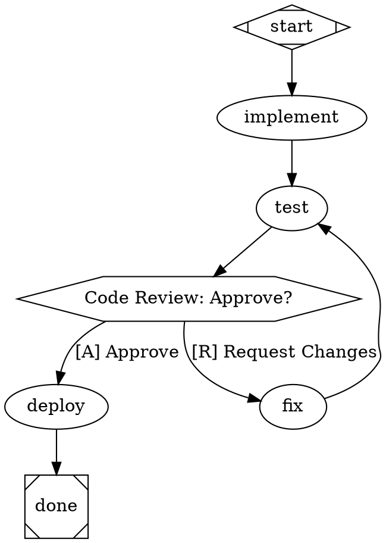

# DOT Pipeline Authoring Guide

How to design effective multi-stage AI pipelines using Graphviz DOT digraphs.

## Philosophy

Attractor pipelines are **convergence graphs**: the graph encodes the
control structure -- gates, budgets, corrective loops, feedback channels --
and the engine walks it from `start` to `done`, executing each node and
following edges based on outcomes.

**The pipeline author's job is the convergence skeleton, not the domain
decomposition.** Keep the task-agnostic control structure: the gates, budgets,
walls, and feedback channels that make the loop descend. Delete the domain
decomposition -- plan/implement/test phases, backend/frontend splits -- that is
the model's job, not the graph's. `examples/patterns/task-runner.dot` is the
canonical example: its stages are control-plane responsibilities (orient /
attempt / verify / critique / triage / postmortem / package), zero domain phases.

**The node contract.** Every LLM node (`shape=box`) should state:

1. **Objective** -- what the node is responsible for achieving
2. **Constraints** -- what it must not do or assume
3. **Available capabilities** -- what tools or context it has access to
4. **Required evidence** -- what artifact or observable state proves it succeeded

The prompt states the contract, not the algorithm -- never enumerate the
procedure step-by-step unless the procedure itself is a business or safety
requirement. A node that carries the algorithm cannot absorb a model's bad day;
a node that carries objective + constraints + capabilities + required evidence
lets the loop correct the *work* because "done" is defined outside the worker.

**`goal_gate` belongs on evidence-bearing nodes, not implementation nodes.**
The engine's `goal_gate` contract (spec §3.4) is: this node must succeed before
the pipeline can exit. Attaching it to an implementation node makes "the
implementer finished" the exit criterion -- an implementation finishing is not a
goal state. Attach `goal_gate` to the node that *bears evidence*: a test gate,
an acceptance check, a human approval gate, or an evidence-backed review node.
Shipped positive example: `examples/pipelines/practical/bug-fix.dot`'s exit is
gated on `verdict_gate` output -- implementation completing earns nothing.

**`goal_gate` nodes require an explicit verdict (fail-closed).** A goal gate is
satisfied only by an explicit verdict, and the escalation ladder below is the
taught order for producing one: a `parallelogram` tool node's exit code, a
node-written `status.json` (canonical spec §4.5 / Appendix C), a pure or fenced
JSON response with a `status` field, an embedded trailing JSON verdict, or --
as a legacy compatibility window, not the taught mechanism -- a `report_outcome`
tool call. A plain-prose response ("looks good, all done") returns RETRY instead
of SUCCESS, so the gate is never satisfied by a defaulted response; even prose
that says "CONVERGED" does not count (`specs/EXTENSIONS.md` §25). Make the gate a
parallelogram tool node whose exit code is the verdict, or have the node write
`status.json` directly:

```dot
judge [shape=box, goal_gate=true, retry_target="implement",
    prompt="Evaluate the work against the criteria. Write your verdict to the
    status.json contract path given in your instructions with status=success only
    if all criteria pass; otherwise status=retry with what is missing."]
```

See ["Spec-Intended Pipeline Design"](#spec-intended-pipeline-design) below for the
full escalation ladder and why files-as-interface sits above self-report.

**Recipes vs. attractor pipelines.** Recipes are for staged sequential workflows
with human approval gates; attractor pipelines are for machine-verified
convergence. If your pipeline graph has no cycle, it should probably have been a
recipe. (TOPO-003 warns on acyclic graphs for this reason; deliberate one-pass
pipelines are legitimate -- the "probably" is load-bearing.)

**Design principles:**

- Each node should have a single, clear responsibility
- Prompts should be self-contained -- a node should not assume context unless fidelity is `full`
- Use `$goal` to inject the pipeline's overall objective into node prompts
- Prefer fewer, well-prompted nodes over many thin ones
- Use `goal_gate` on evidence-bearing nodes (test gates, acceptance checks, human gates)
- Use conditional routing to handle success/failure paths explicitly

## Spec-Intended Pipeline Design

The spec's own shape for a node's outcome channel, restated as design discipline -- this is
the frame every pattern below and every gate in this repo implements:

- **Files-as-interface.** The durable handoff between a worker and the graph is a file the
  worker wrote, not a claim the worker made about its own work. Prompts should tell a node to
  *write evidence*, not to *announce a verdict*.
- **Gates check artifacts via exit codes / `tool.last_line`.** A `parallelogram` node greps or
  validates the artifact and turns the result into an exit code; `context.tool.last_line`
  carries the routing token. This is machine evidence, produced outside the worker's own
  context -- the worker cannot grade its own homework.
- **Context is for routing scalars, not payloads.** `context_updates` / `preferred_label` carry
  small, closed-vocabulary routing decisions (`"pass"`, `"retry"`, a lane name) between nodes.
  They are not where a verdict's *evidence* lives -- the evidence lives in the file the gate
  actually checked.
- **Nodes are stateless between visits.** A node's prompt should not depend on the engine
  remembering that node's own prior self-assessment; it depends on the file(s) on disk and the
  context keys explicitly carried forward. Re-entry (`loop_restart`) is designed to reset
  exactly this kind of accumulated, ungrounded state.
- **`status.json` is the spec-native envelope for out-of-band and spawned outcomes** (canonical
  spec §4.5 / Appendix C): `outcome` / `preferred_label` / `suggested_next_ids` /
  `context_updates` / `notes`. The engine reads a node's stage-directory `status.json` back and
  auto-injects the absolute path plus this envelope into every SPAWNED worker's instruction, so
  a spawned child (which cannot return a Python `Outcome` in-process) always has a reachable
  channel.

**The escalation ladder this implies, in taught order:**

1. **Artifact file + tool-node exit code, first.** The default answer for "how does this node's
   result reach the graph."
2. **Node-written `status.json`**, when the outcome is produced out-of-band or by a spawned
   worker with no other channel back.
3. **A pure-JSON verdict** in the node's own LLM response, when neither of the above fits and
   the node must self-describe (fenced or bare `{...}` with a `status` field -- EXTENSIONS.md
   §25's recovery ladder, paths 2-4).
4. **`report_outcome`** -- a legacy compatibility window, still honored, but not the taught
   mechanism. It is a tool call, but the verdict it carries is still self-reported from inside
   the same context that produced the work; machine evidence (rungs 1-2) outranks it. See the
   anti-pattern catalog entry ("`report_outcome`-as-primary", `PIPELINE_PATTERNS.md` §6) and
   the existing self-report anti-pattern ("LLM-Emitted Routing Sentinel", same section) --
   wrapping a self-report in a tool call does not make it evidence.

Pointers: `docs/PIPELINE_PATTERNS.md` (the layering discipline this section summarizes),
`docs/ROUTING-REFERENCE.md` (the routing mechanics `status.json` / `report_outcome` feed),
`context/dot-reference.md` (the self-report doctrine at the authoring-review layer),
`context/engine-semantics.md` §5 (the full verdict-recovery ladder and fail-closed contract).

## Pipeline Patterns

### Convergence Loop (canonical attractor shape)

**Start here.** The convergence loop is the recommended shape for any task where
the first attempt may not succeed -- which is most coding tasks.

```
start → implement → test_gate ──(gate_pass)──→ done
                       ↑
                       └──────(gate_fail)──────────
```

A worker node produces an artifact, a deterministic evidence gate checks it, and
a corrective back-edge routes the worker back when the gate fails. The exit is
structurally unreachable until the gate reports success.

**Why loops beat chains:** a 6-step linear chain of 0.90-probability nodes has
~0.53 end-to-end reliability; one corrective loop around the same nodes raises
it to ~0.94. See `examples/pipelines/00-convergence-loop.dot` for the
walk-up-runnable tutorial.



The `test_gate` is a deterministic tool node (not an LLM self-report): it runs
`pytest` and echoes a routing label as its last stdout line. The engine stores
that label in `context.tool.last_line`; outgoing edges condition on it.
`goal_gate=true` is on the evidence-bearing node, not on `implement`.

Three mechanics worth copying exactly:

1. **Test output travels through a file** (`test_output.txt`), not a prompt
   variable. LLM-node prompts expand only `$goal`, `$context`, and plain
   (dot-free) context keys -- `tool.output` is a dotted key available to
   `tool_command` strings, not to prompts.
2. **The gate uses plain redirection** (`> test_output.txt 2>&1`) rather than
   a pipe. `tool_command` runs under `/bin/sh`, where a pipe would make the
   exit code `tee`'s, not pytest's. Redirection preserves pytest's exit code.
3. **`loop_restart="true"` on the back-edge** resets iteration state so
   `implement` starts fresh on each retry.

### Linear Pipeline (engine-feature demo)

The simplest pattern. Stages execute in sequence. Use this to learn the engine
mechanics; use the convergence loop for real work.



The linear `start -> implement -> test -> done` shape (no back-edge) is a recipe
shape and will trigger TOPO-003. If that is intentional -- a one-pass workflow --
use a recipe.

### Conditional Routing

Conditional routing is done via `condition=` attributes on edges, which work
from **any node type** (per nlspec Section 3.3). No special shape is needed --
the engine evaluates `condition` attributes on outgoing edges to pick the path.



**How conditions work:** The engine evaluates conditions against the most recent
node's outcome. Supported operators are `=` and `!=`. Combine with `&&`:

```dot
gate -> deploy [condition="outcome=success && context.tests_passed=true"]
```

Keys available in conditions:
- `outcome` -- resolves to `preferred_label` if one was set (by a node-written
  `status.json`, or -- legacy -- by the agent via `report_outcome`), otherwise falls
  back to the raw status value (`success`, `fail`, etc.)
- `preferred_label` -- the custom routing label set via a node-written `status.json`
  or (legacy) `report_outcome` (null if not set)
- `context.<key>` -- any value in the pipeline context (set via `context_updates` in
  a node-written `status.json` or, legacy, `report_outcome`)

**Dynamic routing: prefer evidence over self-report.** Nodes that make routing
decisions (review gates, test runners) should route on a `preferred_label` set by the
escalation ladder in ["Spec-Intended Pipeline Design"](#spec-intended-pipeline-design):
an artifact file a downstream `parallelogram` gate greps and turns into
`context.tool.last_line`, or a node-written `status.json` for out-of-band/spawned
outcomes. For example, a review node with edges `condition="outcome=pass"` and
`condition="outcome=retry"` should write a verdict file (or `status.json`) carrying
`preferred_label="pass"` or `"retry"`. `report_outcome` still sets the same fields and
is still honored, but it is a legacy compatibility window, not the taught mechanism --
a self-reported tool call is still a self-report.

> **Common mistake: escaped-quote delimiters** — Condition (and all attribute)
> values must use **plain double-quotes** as delimiters.  Writing
> `condition=\"key=value\"` (backslash-quote) instead of
> `condition="key=value"` is a syntax error.  Before the fail-loud fix was
> added, the tokenizer silently mis-parsed the backslash-delimited form as a
> bare key (`key=value`), which resolves truthy — causing ALL conditional edges
> to "match" and the engine to fan-out instead of routing.  The parser now
> raises a `ValueError` immediately with the position and the correct form.
> See [DOT-SYNTAX.md](DOT-SYNTAX.md#quoting-and-escaping) for the full rule
> and the one legitimate place `\"` is valid (inside a quoted string value,
> e.g. a shell command containing literal double-quotes).

> **Recommended pattern:** Use `condition="outcome!=retry"` instead of
> `condition="outcome=pass"` for forward edges. This is resilient to agents
> that return `status="success"` without setting `preferred_label`.
> See [ROUTING-REFERENCE.md](ROUTING-REFERENCE.md) for the full routing
> system documentation, including edge selection algorithm details and pitfalls.

### Retry with Fallback

Use `max_retries`, `retry_target`, and `fallback_retry_target` for resilient
execution. When a node's retries are exhausted, execution jumps to its
`retry_target`. If the node has no `retry_target`, its `fallback_retry_target`
is tried instead — these are two separate fallback slots on the same failing
node, not a chain where the retry target's failure triggers the fallback.
Graph-level `retry_target` and `fallback_retry_target` are consulted only on
unsatisfied goal-gate exit (spec §3.4), not on per-node failure.



### Causal Retry Patterns

The basic retry pattern (`retry_target="attempt"`) works well when all failure
classes have the same cause. For convergence pipelines with multiple
independent gates, **causal per-gate retry targets** and **per-failure-class
fix nodes** give the engine a more precise recovery path — routing to the node
that can change the cause, not always back to a single generic attempt node.

**Causal per-gate `retry_target`s:**



Two causal routing forms appear above, and both need a *complete* loop:

- **Conditional corrective edge** (`build_gate -> implement
  [condition="outcome=fail"]`): routes on failure evidence immediately.
  This is the lint-visible back-edge — `dot-runner lint` sees the cycle.
- **Node-level `retry_target`** (`test_gate`, `security_gate`): fires only
  when no edge matches after failure (spec §3.7) — fail-fast means a FAIL
  outcome does not traverse plain unconditional edges, so the gate dispatches
  to its fix node. The fix node's ordinary success edge back to the gate is
  the return half of the loop. Without it, the loop is dead: fix succeeds,
  no edge matches, run terminates FAIL.

**Per-failure-class fix nodes** (differentiated failure edges):

```dot
// Instead of one generic corrective edge:
verify -> attempt [condition="outcome=fail"]

// Use per-class routing when failures have distinct causes:
verify -> fix_build    [condition="tool.last_line=build_failed",   weight=3]
verify -> fix_tests    [condition="tool.last_line=test_failed",    weight=2]
verify -> fix_security [condition="tool.last_line=security_failed", weight=1]
```

This is the mechanized form of the differentiated-failure-edges pattern. Use
it when failure classes are distinct and have different remediation strategies.

**Graph-level `fallback_retry_target` as convergence doctrine:**

Graph-level `retry_target` and `fallback_retry_target` are consulted on
**unsatisfied goal-gate exit** (spec §3.4) — they are the final steps in the
resolution order: node retry → node fallback → graph retry → graph fallback.
They are NOT consulted on per-node failure (spec §3.7); per-node failure with
no matching edge and no node-level retry target terminates FAIL. For per-node
recovery, use a node-level `retry_target` or a conditional corrective edge.

In convergence pipelines, set graph-level targets as the last resort in
goal-gate-exit resolution:

```dot
graph [
    goal="...",
    retry_target="implement",            // goal-gate exit: retry at the work node
    fallback_retry_target="analyze_plan" // goal-gate exit: last resort — replan
]
```

This is convergence doctrine — not just a tutorial feature. The graph-level
fallback is the final safety net when all goal gates are unsatisfied and the
primary retry cannot address the failure (e.g., a fundamentally wrong approach).
See `examples/pipelines/04-retry-with-fallback.dot` for a minimal working example.

### Iterative Pipelines (`loop_restart`)

Use `loop_restart="true"` on a back-edge to create a convergence loop. The
engine resets execution state (completed nodes, outcomes) and increments
`$iteration` before re-running from the target node. Context values set via
`context_updates` are preserved so accumulated state (e.g., feedback files,
assessment results) carries across iterations.



**How `loop_restart` works:**

1. The engine traverses the `loop_restart` edge normally.
2. It increments the internal `iteration_count` (starting from 0).
3. It updates `$iteration` and `$loop_count` in context.
4. It resets `completed_nodes` and `node_outcomes` so the target node and all
   downstream nodes re-execute cleanly.
5. Context values accumulated via `context_updates` (e.g., `preferred_label`,
   custom keys) are preserved — the loop can carry state forward.

**Per-iteration records and the descent curve (Extension #24):**

After each node completes, the engine writes:
- `logs_root/<node_id>/status.json` — flat path (backward compatible)
- `logs_root/iteration_N/<node_id>/status.json` — iteration-scoped record

All iteration records coexist: a 10-iteration run produces 10 complete
per-iteration snapshots, none overwritten. The engine also appends one JSONL
record to `logs_root/trace.jsonl` per node completion:

```json
{"iteration": 2, "node_id": "generate", "status": "success",
 "preferred_label": null, "duration_ms": 1240.5, "ts": "2024-01-01T00:00:00+00:00"}
```

To inspect the descent curve after a run:

```
dot-runner trace <run-dir>
```

This prints a human-readable summary of iterations, nodes, statuses, and
durations — the empirical form of the convergence claim.

To continue a run that was interrupted mid-graph (spec §5.3):

```
dot-runner resume <run-dir>
```

The engine restores context, completed nodes and retry counters from
`<run-dir>/checkpoint.json`, makes ONE edge-selection decision from the last
completed node's recorded outcome, and carries on — completed nodes are never
re-visited. The node the interruption hit re-executes from its start, because
it never completed. Resume is opt-in only: a plain `dot-runner run` never reads
a checkpoint, so this is additive to (never a replacement for) the graph-owned
idempotency pattern in
[`examples/pipelines/12-graph-resume.dot`](../examples/pipelines/12-graph-resume.dot),
which answers a different question — "is this work already done on disk?".

**Difference from `max_retries`:** `max_retries` re-attempts a single node
in place — and only for RETRY-class outcomes, retryable exceptions
(timeouts, connection errors, HTTP 429/5xx), and `must_write=`
artifact-contract violations; a plain FAIL is returned immediately, never
retried (route FAILs with `retry_target` or `outcome=fail` edges instead).
`loop_restart` resets the entire pipeline pass for intentional
multi-iteration refinement. Use `max_retries` for transient failures, use
`loop_restart` for structured convergence loops.

### Feedback Accumulation (`feedback_from=`) — Extension #29

**A retry without critique of the prior attempt is a coin re-flip. A retry
with accumulated critique is descent.** The `feedback_from=` attribute
promotes that load-bearing behavior from a prompt-string convention to an
engine-enforced contract.

Declare `feedback_from="<critic_node_id>"` on the **generator node** (the
node that will receive the critique). On every `loop_restart`, the engine:

1. Reads the named critic node's output from the just-completed iteration.
2. Labels it `"Iteration N critique: <text>"`.
3. Appends it to an accumulated channel (max 5 entries; oldest dropped),
   stored per target node to prevent leakage between multiple generators.
4. Writes the channel as a newline-joined string to the plain context key
   `prior_critiques_<target_node_id>` (e.g. `prior_critiques_generate` for
   a node named `generate`), available as `$prior_critiques_<target_node_id>`
   (e.g. `$prior_critiques_generate`) in `prompt` on the next iteration.
   The placeholder is optional: it controls WHERE the history appears. If
   the prompt does not reference it, the engine appends a labeled
   critique-history block automatically — declaring `feedback_from=` is
   sufficient on its own; forgetting the placeholder cannot silently sever
   the feedback loop.
5. Writes the accumulated channel to a durable artifact at
   `<logs_root>/feedback/<target_node_id>.md`.



**Why the attribute, not a prompt instruction:** A prompt instruction
("check `.ai/feedback/` for prior guidance") is invisible to the engine,
unverifiable at run time, silently lost when a prompt is edited, and
dependent on the model choosing to comply every iteration. One bad day
— the exact perturbation the basin exists to absorb — and the loop
degrades into an infinite re-flip. `feedback_from=` makes whether feedback
reaches the next iteration a property of the graph structure, not of model
obedience.

**Disk layout:** The accumulated channel is written to
`<logs_root>/feedback/<target_node_id>.md` on every `loop_restart`. This
file always reflects the current window (last 5 critiques). It is the
canonical co-location artifact: unlike Extension #24's per-iteration
records (which scatter one critique per file), this file holds critiques
from all retained iterations together.

**Interplay with `loop_restart`:** `collect_and_inject_feedback()` is
called at `loop_restart` time, AFTER the critic node completes and BEFORE
`node_outcomes.clear()`. The injected `prior_critiques_<target_node_id>` key
survives the restart because `context_updates` are intentionally left
untouched by the restart block — the same reason custom `outputs=` values
persist across iterations.

**Interplay with fidelity:** `feedback_from=` is the complement of fidelity
modes. Fidelity controls what the *same* actor remembers of its own prior
attempt (inner loop). `feedback_from=` gives the *next, fresh* actor the
distilled lesson from the prior iteration (outer loop). Use `fidelity=full`
(same thread, full transcript) for continuity of effort; use `feedback_from=`
for accumulated critique across fresh-eyes restarts. Combining both
— `full` fidelity on the generator plus `feedback_from=` on the same node
— is valid but creates overlap: the generator sees both its own full history
AND the injected critiques. Prefer one or the other depending on whether you
want continuity (full) or fresh-eyes descent (feedback_from + compact).

**Curation / token discipline:** Each critique entry is capped at 500
characters (`[…truncated]` suffix). The channel holds at most 5 entries;
older entries are dropped first. Token cost per iteration: at most
`5 × 500 = 2 500` characters — bounded regardless of iteration count.
The critique node itself is the primary curator: write its prompt to emit a
single highest-leverage observation per iteration (the "Pyramid Summary"
pattern). The window bound is a safety net.

**Backward compatibility:** Fully opt-in. Nodes without `feedback_from=`
are untouched. The file-based `.ai/feedback/` convention used by existing
pipelines continues to work. Both can coexist in the same pipeline.

**See also:** `specs/EXTENSIONS.md §29`; `examples/patterns/convergence-factory.dot`.

### Parallel Fan-Out / Fan-In

Use `shape=component` for parallel fan-out and `shape=tripleoctagon` for fan-in.
All outgoing edges from a `component` node become parallel branches.



**Parallel handler attributes:**

| Attribute | Values | Default | Description |
|-----------|--------|---------|-------------|
| `join_policy` | `wait_all`, `k_of_n`, `first_success`, `quorum` | `wait_all` | When to proceed |
| `error_policy` | `fail_fast`, `continue`, `ignore` | `continue` | How to handle branch failures |
| `max_parallel` | Integer | `4` | Max concurrent branches |

### Multi-Provider with Model Stylesheet

Use `model_stylesheet` to route different nodes to different providers using
CSS-like selectors. Nodes get a `class` attribute for targeting.



**Selector specificity** (highest wins):

| Selector | Example | Specificity |
|----------|---------|-------------|
| `#node_id` | `#critical_review` | 2 (highest) |
| `.class` | `.planning` | 1 |
| `*` | `*` | 0 (lowest) |

Explicit node attributes (`llm_model="..."` on the node) always override
stylesheet values.

**Startup provider preflight (fail-loud):** every provider a node declares --
explicitly or via the stylesheet -- must be serviceable by the run (a mounted
provider/profile with its credential env var set). The engine cross-checks
this BEFORE the walk begins and refuses to start, naming each failing node,
its provider, and the missing credential, instead of letting one
unserviceable node crash on every visit and drain the whole iteration budget
(issue #155, `specs/EXTENSIONS.md` §36). There is deliberately no silent
fallback to another provider: a multi-provider graph (e.g. dual-family
critique) that cannot be honored is an error, not a quiet downgrade.

### Model selection: globs and evergreen forms

A node's `llm_model` -- whether set directly on the node or via
`model_stylesheet` -- may take two useful forms:

- an fnmatch **glob**, e.g. `claude-sonnet-*` -- resolved at run time against the
  provider's **live** model list (its `/models` endpoint), newest **stable** match
  wins.
- a **concrete id**, e.g. `claude-sonnet-4-6` -- **not** resolved; passed to the
  provider verbatim (and 404s once that id is retired).

Only a glob gets live resolution, and it fails **loud** (the node fails) if
nothing matches -- there is no silent fallback. Concrete ids are the rot vector:
they look precise but go stale.

**How evergreen a glob is depends on the provider's naming.** A glob tracks new
generations only if the provider keeps a stable *tier name*:

| Provider | Persistent tier? | Evergreen form |
|----------|------------------|----------------|
| Anthropic | yes (`sonnet`/`opus`/`haiku`) | `claude-sonnet-*`, `claude-opus-*` |
| Gemini | yes (`flash`/`pro`) | `gemini-*-flash`, `gemini-*-pro` |
| OpenAI | **no** -- the generation *is* the name | `gpt-[5-9]*` (a range) |

- Widen to the **whole family**: `claude-sonnet-*` tracks Sonnet 4 -> 5 -> ...
  A version-pinned glob like `claude-sonnet-4-*` is **frozen to gen-4** and misses
  Sonnet 5 -- avoid it unless you deliberately want to pin the major.
- OpenAI has no tier that survives `gpt-5 -> gpt-6`, and a bare `gpt-*` matches
  junk (embeddings, audio, realtime). Use the generation **range** `gpt-[5-9]*`:
  it tracks the newest through gpt-9 and needs a one-character bump at gpt-10.
- Prefer an explicit family glob over a bare token like `sonnet`: the glob is
  unambiguous about provider and family and resolves reliably.

**Overriding a model on a node? Override the provider too.** A glob resolves
against the node's `llm_provider`, so `llm_model="gemini-*-flash"` needs
`llm_provider="gemini"` alongside it -- otherwise it inherits the class/default
provider (e.g. anthropic) and matches nothing. (Concrete ids bypass resolution
and are provider-inferred, which masks this.)

**Reproducibility.** Because a glob always picks the latest match, the chosen
model drifts as providers ship new ones. For a locked, reproducible evaluation,
pin a concrete id (or capture the resolved id -- the engine emits a
`model:resolved` event recording it).

**Scope.** This resolution applies to a node's `llm_model` only. A provider's
`default_model` (providers config) and `provider_preferences` overrides are
passed to the SDK verbatim and are **not** resolved -- keep those a concrete
served id.

### Human Approval Gate

Use `shape=hexagon` for human-in-the-loop gates. Choices are derived from
outgoing edge labels. Accelerator keys use `[X]` prefix notation.



When the pipeline reaches a hexagon node, it pauses and presents the edge
labels as choices. The human selects one, and the pipeline follows that edge.

### Sub-Pipeline Composition (Folder)

Use `shape=folder` to invoke a child pipeline defined in a separate DOT file.
The folder node runs the referenced pipeline as a sub-pipeline, passing context
from the parent, and optionally merging declared outputs back on success.

```dot
digraph {
    graph [goal="Build and validate a Python library"]

    start [shape=Mdiamond]
    done  [shape=Msquare]

    implement [prompt="Implement the library for: $goal"]
    test [prompt="Write unit tests for the library."]

    validate [
        shape=folder,
        label="Run Validation Suite",
        dot_file="pipelines/validate.dot",
        context.target="library",
        context.goal="$goal",
        outputs="validation_report,passed"
    ]

    fix [prompt="Fix issues identified in the validation report."]

    start -> implement -> test -> validate
    validate -> done [condition="outcome=success", weight=10]
    validate -> fix  [condition="outcome!=success", weight=5]
    fix -> test
}
```

**Folder node attributes:**

| Attribute | Required | Default | Description |
|-----------|----------|---------|-------------|
| `dot_file` | Yes | — | Path to the child pipeline DOT file |
| `context.<key>` | No | — | Inject named values into the child context (`context.goal="$goal"`) |
| `outputs` | No | `""` | Comma-separated child context keys to merge back into parent on success |

**Context flow:**

1. **Parent → Child (clone + inject):** When the folder node executes, the
   engine clones the parent pipeline context and injects any `context.<key>`
   attributes as named values. The child pipeline runs with this enriched
   context.

2. **Child → Parent (only declared outputs on success):** When the child
   pipeline completes successfully, only the context keys listed in `outputs`
   are merged back into the parent context. Keys not listed in `outputs` are
   discarded.

   **A dead end inside the child silently reports as success.** `run_subgraph`
   (the shared executor for a folder node's child pipeline) has no top-level
   hard-fail: when edge selection finds no matching outgoing edge, it returns
   the last node's own `Outcome` rather than failing loudly, and if the child
   never executed a node it falls back to a bare `Outcome(SUCCESS)`. This is
   the opposite of the top-level engine, which hard-fails on a no-matching-edge
   dead end. A child graph whose corrective loop runs off the rim -- a
   conditional edge nobody drew for some outcome -- reports SUCCESS to the
   parent instead of surfacing the dead end. **The practical rule: give every
   child graph its own fail-route.** Every node in a composed sub-pipeline
   should have an outgoing edge for every outcome it can produce (including an
   explicit `condition="outcome=fail"` edge to a terminal or recovery node),
   the same discipline §3 of `docs/PIPELINE_DESIGN_PRINCIPLES.md` already asks
   for at the top level -- composition does not relax it.

3. **Isolation (undeclared changes don't affect parent):** Any context
   modifications made inside the child pipeline that are not declared in
   `outputs` do not affect the parent pipeline's context. This isolation
   prevents accidental side-effects from leaking across pipeline boundaries.

**Path resolution for `dot_file`:** Relative paths are resolved relative to
the parent DOT file's directory. Absolute paths are used as-is. For example,
if the parent pipeline is at `pipelines/main.dot` and `dot_file="validate.dot"`,
the engine looks for `pipelines/validate.dot`.

### Manager-Supervisor Pattern

Use `shape=house` for a supervisor that oversees a sub-pipeline through
observe/steer/wait cycles.

```dot
digraph {
    graph [goal="Build a data pipeline for CSV processing"]

    start [shape=Mdiamond]
    done  [shape=Msquare]

    plan [prompt="Create a plan for: $goal"]

    manager [
        shape=house,
        label="Supervise Implementation",
        prompt="Oversee implementation. Steer toward success.",
        manager.max_cycles=5,
        manager.poll_interval="0s",
        manager.stop_condition="outcome=success",
        manager.actions="observe,steer,wait"
    ]

    implement [prompt="Implement the data pipeline. Incorporate steering feedback."]
    test [prompt="Run tests. Report success or failure."]
    report [prompt="Summarize results."]

    start -> plan -> manager
    manager -> implement
    implement -> test
    test -> done [condition="outcome=success"]
    test -> implement [condition="outcome!=success"]
    manager -> report [weight=0]
    report -> done
}
```

## Node Attribute Reference

Every node in a DOT pipeline can have these attributes:

| Attribute | Type | Default | Description |
|-----------|------|---------|-------------|
| `shape` | String | `box` | Determines handler type (see shape table below) |
| `label` | String | node ID | Display name. Used as prompt fallback if `prompt` is empty. |
| `prompt` | String | `""` | Primary instruction for LLM nodes. Supports `$goal` expansion. |
| `type` | String | `""` | Explicit handler type override. Takes precedence over shape. |
| `goal_gate` | Boolean | `false` | Node must succeed **with an explicit verdict** (tool exit code / node-written `status.json` / JSON -- `report_outcome` is a legacy compatibility window) before pipeline can exit. Plain prose returns RETRY (fail-closed, EXTENSIONS.md §25). |
| `max_retries` | Integer | `0` | Additional attempts beyond the first. `max_retries=3` = 4 total. |
| `retry_target` | String | `""` | Node to jump to when retries exhausted. |
| `fallback_retry_target` | String | `""` | Secondary retry target if primary is missing. |
| `fidelity` | String | inherited | Context mode for this node (see Fidelity Modes below). |
| `thread_id` | String | derived | Thread identifier for session reuse under `full` fidelity. |
| `class` | String | `""` | Comma-separated CSS classes for model stylesheet targeting. |
| `llm_model` | String | inherited | LLM model identifier. Overrides stylesheet. |
| `llm_provider` | String | auto | Provider key (`anthropic`, `openai`, `gemini`). Selects a MODEL FAMILY only -- orthogonal to `worker` below, which selects the EXECUTION MECHANISM. |
| `worker` | String | unset (falls through to the run-level default, then capability-fallback) | Which registered worker executes this node -- see [Worker Selection](#worker-selection) below. A conformant `.dot` file never needs this: it is fully defaulted. |
| `reasoning_effort` | String | unset (provider default) | `low`, `medium`, or `high`. No engine default is injected: unset means the provider's own default applies. The canonical spec's `high` default deliberately does not hold here — set it per node, via `model_stylesheet`, or in a profile (`specs/EXTENSIONS.md` §39, ledger ATX-14). |
| `timeout` | Duration | unset | Max execution time (e.g., `900s`, `15m`). |
| `auto_status` | Boolean | `false` | Auto-generate SUCCESS if handler writes no status. |
| `allow_partial` | Boolean | `false` | Accept PARTIAL_SUCCESS when retries exhausted. |
| `feedback_from` | String | `""` | Engine-enforced feedback accumulation contract (Extension #29). Declare on the generator node: `feedback_from="<critic_node_id>"`. On every `loop_restart`, the engine collects the named critic's output, labels it with the iteration number, and injects the accumulated history into the generator's prompt — in place of `$prior_critiques_<node_id>` (e.g. `$prior_critiques_generate`) when the prompt references it, appended as a labeled block otherwise (delivery is guaranteed; the placeholder controls placement only). Channel is bounded to 5 entries (oldest-first drop). See [Feedback Accumulation](#feedback-accumulation-feedback_from--extension-29). |

**Shape-to-handler mapping:**

| Shape | Handler | LLM Call? | Description |
|-------|---------|-----------|-------------|
| `Mdiamond` | `start` | No | Pipeline entry point (required) |
| `Msquare` | `exit` | No | Pipeline exit point (required) |
| `box` | `codergen` | Yes | LLM task node (default for all nodes) |
| `component` | `parallel` | No | Parallel fan-out |
| `tripleoctagon` | `parallel.fan_in` | Optional | Collects parallel branch results |
| `hexagon` | `wait.human` | No | Human approval gate |
| `parallelogram` | `tool` | No | External tool/shell execution |
| `house` | `stack.manager_loop` | Indirect | Supervisor loop over sub-pipeline (experimental — future form TBD); engine classifies as non-LLM for validation, but handler internally delegates to LLM |
| `folder` | `pipeline` | No | Sub-pipeline from external DOT file |

## Edge Attribute Reference

| Attribute | Type | Default | Description |
|-----------|------|---------|-------------|
| `label` | String | `""` | Display caption. Also used for routing and human gate choices. |
| `condition` | String | `""` | Boolean guard: `outcome=success`, `outcome!=fail`, `&&` conjunction. |
| `weight` | Integer | `0` | Priority for edge selection. Higher wins among equally eligible edges. |
| `fidelity` | String | unset | Override fidelity for the target node. Highest precedence. |
| `thread_id` | String | unset | Override thread ID for the target node. |
| `loop_restart` | Boolean | `false` | When `true`, the engine increments the iteration counter and resets execution state (completed nodes, outcomes) before continuing to the target node. Context values set via `context_updates` are preserved across the restart. See [Iterative Pipelines](#iterative-pipelines-loop_restart) below. |

**Edge selection priority** (the engine picks the first match):
1. Condition-matching edges (condition evaluates to true)
2. Preferred label match (from outcome's suggested label)
3. Highest `weight` among unconditional edges
4. Lexical tiebreak (target node ID, ascending)

## Variable Expansion

Variables in node `prompt` and `tool_command` attributes are expanded before
execution. The following built-in variables are always available:

| Variable | Source | Description |
|----------|--------|-------------|
| `$goal` | `graph.goal` attribute | The pipeline objective |
| `$iteration` | engine context (Extension #24) | Current iteration number (0-based; increments on each `loop_restart`) |
| `$loop_count` | engine context (Extension #24) | Alias for `$iteration` |
| `$prior_critiques_<node_id>` | engine context (Extension #29) | Accumulated critique history injected by `feedback_from=`. The key is scoped to the target node ID (e.g. `$prior_critiques_generate` for a node named `generate`). Contains iteration-labeled entries from the last N critic outputs. Empty string on iteration 0. Optional in prompts: when absent, the engine appends the history as a labeled block instead (placement control only). |
| `$<param>` | `--param k=v` CLI flag or `params` dict | Custom key-value parameters |

```dot
graph [goal="Create a REST API with authentication"]
plan [prompt="Plan the implementation of: $goal"]
// Expands to: "Plan the implementation of: Create a REST API with authentication"
```

The `goal` value comes from the graph-level `goal` attribute. Override it at run
time with `--param goal="..."` on the `dot-runner run` CLI, or the `goal`
parameter in `run_pipeline`.

**`$goal` in a `tool_command` resolves differently than in a `prompt`.** LLM-node
prompts are given `$goal` from the graph's `goal` attribute directly. Tool
commands are substituted against the pipeline *context*, where the graph
attribute lives under the dotted key `graph.goal` -- a bare `goal` key exists
only when one was passed in (`--param goal="..."`, or a `params` entry). So a
`tool_command` that must work regardless of how the pipeline was invoked --
notably inside a `shape=folder` child, which inherits `graph.goal` from its
parent but not necessarily a flat `goal` param -- should reference
`${graph.goal}`, or accept `goal` as an explicit param.

`$iteration` is seeded to `"0"` at pipeline start and increments by 1 on each
`loop_restart` edge traversal. Use it in prompts to let the LLM know which
attempt it is on:

```dot
work [prompt="Attempt $iteration: fix the failing tests and re-run them."]
```

Custom parameters passed via `--param language=Python` are available as
`$language` in prompts and `tool_command` attributes.

## Fidelity Modes

Fidelity controls how much prior context each node receives from earlier stages.

| Mode | Session | Context Carried | When to Use |
|------|---------|----------------|-------------|
| `full` | Reused | Full conversation history | Nodes that build on prior work (implement after plan) |
| `compact` | Fresh | Structured summary of completed stages | Default. Good balance of context and cost. |
| `truncate` | Fresh | Minimal: only goal and run ID | Independent tasks that need no prior context |
| `summary:low` | Fresh | Brief summary (~600 tokens) | Light context carry |
| `summary:medium` | Fresh | Moderate detail (~1500 tokens) | Review/polish stages |
| `summary:high` | Fresh | Detailed summary (~3000 tokens) | Stages that need substantial prior context |

**Fidelity resolution precedence** (highest wins):
1. Edge `fidelity` attribute
2. Target node `fidelity` attribute
3. Graph `default_fidelity` attribute
4. Default: `compact`

**Thread IDs and session reuse:** Under `full` fidelity, nodes with the same
`thread_id` share a single LLM session. This preserves full conversation
history between those nodes:

```dot
graph [default_fidelity="full"]
implement_auth [thread_id="backend", prompt="Implement auth middleware."]
implement_rate [thread_id="backend", prompt="Add rate limiting middleware."]
// Both share the same LLM session -- rate limiting sees auth context
```

## Model Stylesheet Syntax

```
Selector { property: value; property: value; }
```

**Selectors:**
- `*` -- all nodes
- `.classname` -- nodes with `class="classname"`
- `#node_id` -- specific node by ID

**Properties:**
- `llm_model` -- model identifier
- `llm_provider` -- provider key
- `reasoning_effort` -- `low`, `medium`, `high`

```dot
graph [model_stylesheet="
    * { llm_model: claude-sonnet-*; llm_provider: anthropic; }
    .code { llm_model: claude-sonnet-*; }
    .reasoning { llm_model: gpt-[5-9]*; llm_provider: openai; reasoning_effort: high; }
    #final_check { llm_model: claude-opus-*; reasoning_effort: high; }
"]
```

## Worker Selection

A **worker** is the mechanism that actually executes an LLM (codergen) node --
distinct from `llm_provider`, which only picks the model family. Selection
precedence (highest to lowest), per dot-runner `specs/EXTENSIONS.md` §40:

1. The node's own `worker=` attribute, if set (e.g. `worker="direct"`).
2. The run-level default, set via the pipeline orchestrator's
   `config.worker` key (e.g. `worker: "spawn"`).
3. Capability fallback (unchanged): `"spawn"` if `session.spawn` resolved
   for this run, else `"direct"`.

An unrecognized value at either level raises `ValueError` naming every known
worker -- never a silent fallback. **A conformant `.dot` file never needs
`worker=`**: it is defaulted at every level, and the run-level default is the
primary control surface for an opinionated layer (like this one) that wants
to pin a mechanism without touching individual nodes.

**What the two names mean:**

- **`direct`** -- the one worker the engine registers by name today: a single
  in-process tool-loop against a provider, no hosted session, no spawn.
  Cheapest, no sub-agent identity, no Amplifier-specific capabilities.
- **`"spawn"`** -- a reserved sentinel, not a registry entry. It tells the
  adapter to reach a hosted child agent session via `session.spawn`, using
  the (unchanged) `profiles` map to pick which agent to spawn per node's
  `llm_provider`. Which orchestrator that spawned agent itself runs under
  (`loop-agent`, `loop-amplifier-agent`, or a bespoke profile) is decided
  entirely by that agent's own `session.orchestrator.module` -- the registry
  has no opinion on it.
- **`loop-agent`** -- the general Amplifier agent-loop orchestrator,
  reachable ONLY as a spawned child agent's own orchestrator (never a
  registry name). This is what the attractor layer's spawned coding agents
  run today.
- **`amplifier-agent`** -- the opt-in adapter over the standalone
  `amplifier-agent` peer library. Also reachable only as a spawned child
  agent's orchestrator, and never pulled in by a root bundle -- explicitly
  opt-in via a behavior partial (e.g.
  `behaviors/dot-runner-amplifier-agent.yaml` in dot-runner).

**What this layer declares.** The attractor bundles (`bundles/*.yaml`,
`agents/pipeline-runner.yaml`, `bundle.md`) declare their pipeline
orchestrator's worker EXPLICITLY, rather than relying on the
capability-fallback tier:

```yaml
session:
  orchestrator:
    module: loop-pipeline
    source: git+https://github.com/microsoft/amplifier-bundle-dot-runner@main#subdirectory=modules/loop-pipeline
    config:
      worker: "spawn"       # explicit -- see specs/EXTENSIONS.md §40
      profiles:
        anthropic: attractor-agent-anthropic
        openai: attractor-agent-openai
        gemini: attractor-agent-gemini
```

Each spawned child agent (`attractor-agent-{anthropic,openai,gemini}`, one
per profile) in turn declares an explicit inline `session.orchestrator:
module: loop-agent` -- required regardless of the `worker` declaration
above, so the spawned child does not inherit the parent's `loop-pipeline`
orchestrator and recurse. The `worker: "spawn"` declaration and the
per-child `loop-agent` orchestrator answer two different questions: the
former picks the MECHANISM the pipeline uses to reach a node's agent; the
latter picks what THAT AGENT runs once reached.

## Graph-Level Attributes

Set these on the `graph` element:

| Attribute | Type | Default | Description |
|-----------|------|---------|-------------|
| `goal` | String | `""` | Pipeline objective. Available as `$goal` in prompts. |
| `label` | String | `""` | Display name for the pipeline. |
| `model_stylesheet` | String | `""` | CSS-like model assignment rules. |
| `default_fidelity` | String | `compact` | Default context fidelity for all nodes. |
| `default_max_retries` | Integer | `0` | Global retry ceiling. Legacy alias: `default_max_retry`. |
| `retry_target` | String | `""` | Global retry target when exit has unsatisfied goal gates. |
| `fallback_retry_target` | String | `""` | Global fallback retry target when exit has unsatisfied goal gates. |

## Tips for Effective Node Prompts

1. **Be specific.** "Write pytest tests for calculator.py covering add, subtract,
   multiply, divide including edge cases" is better than "Write some tests."

2. **Include the goal.** Use `$goal` to ground each node in the pipeline objective:
   "Plan the implementation of: $goal"

3. **State the expected output.** "Create the file using write_file" or "Run the
   tests and report pass/fail results" tells the agent what to do concretely.

4. **Reference prior work explicitly under compact/truncate fidelity.** Since the
   node may not see prior conversation, say "Based on the plan from the previous
   stage" rather than assuming context is available.

5. **Keep prompts under ~500 words.** Long prompts eat into the context window
   and reduce the agent's working space.

## Anti-Patterns to Avoid

| Anti-Pattern | Problem | Fix |
|-------------|---------|-----|
| Missing `shape=Mdiamond` start node | Pipeline will not parse | Every digraph needs exactly one `Mdiamond` and one `Msquare` |
| `goal_gate=true` without `retry_target` | Node fails with no recovery path | Add `retry_target` pointing to a node that can fix the issue |
| Wrong condition key | `condition="status=success"` does not match anything | Use `outcome=success` (not `status`) |
| Too many nodes (>10) | Long execution, high cost, context dilution | Combine related steps into fewer, well-prompted nodes |
| Vague prompts | Agent wanders, produces irrelevant output | Be specific about inputs, actions, and expected outputs |
| Missing `weight` on conditional edges | Nondeterministic edge selection | Add `weight` to break ties between equally-matched edges |
| Using `full` fidelity everywhere | High cost, slow execution | Use `full` only where conversation continuity matters |
| Circular dependencies without exit | Infinite loop | Ensure every cycle has a conditional exit path |
| `condition=\"key=value\"` (backslash delimiters) | Parser error (or, before the fail-loud fix, silent wrong routing) | Use plain quotes: `condition="key=value"` — see callout above |
| `tool_command="cmd 2>&1 \| tail -N"` (pipe-masked exit code, CMD-001) | In `/bin/sh`, the pipeline's exit code is `tail`'s — always 0.  The gate records SUCCESS even when `cmd` failed. | Redirect instead: `cmd > out.log 2>&1`.  See CMD-001 below. |
| `tool_command="cmd \| tail -N && echo TOKEN"` (always-true sentinel, CMD-002) | `tail` exits 0, so `&& echo TOKEN` fires unconditionally.  `tool.last_line` becomes the sentinel regardless of `cmd`'s result. | Use the honest token gate: `cmd && printf ok \|\| printf fail` (no pipe).  See CMD-002 below. |

| `report_outcome`-as-primary: prompting a `goal_gate=true` node to "call `report_outcome`" as the verdict mechanism | A tool call is still a self-report from inside the same context that produced the work -- structurally the same hazard as the LLM-emitted-sentinel anti-pattern above, just wearing a tool-call costume. `report_outcome` is a legacy compatibility window, not the taught mechanism. | Climb the escalation ladder instead: artifact file + tool-node exit code first, node-written `status.json` for out-of-band/spawned outcomes, pure JSON only if neither fits. See ["Spec-Intended Pipeline Design"](#spec-intended-pipeline-design). |

## Complete Example: Feature Build Pipeline

This pipeline demonstrates multiple patterns working together:

```dot
digraph FeatureBuild {
    graph [
        goal="$goal",
        label="Feature Build Pipeline",
        default_max_retries=2,
        default_fidelity="full",
        default_thread_id="feature-build"
    ]

    start [shape=Mdiamond]
    done  [shape=Msquare]

    // Planning
    parse_spec [prompt="Read the feature spec. Break into: data model, logic, API, tests."]
    plan [prompt="Create 2-3 independent subtasks that can run in parallel."]

    // Parallel implementation
    parallel_impl [shape=component, join_policy="wait_all", error_policy="fail_fast"]
    impl_core  [prompt="Implement core business logic. Include type hints and docstrings."]
    impl_api   [prompt="Implement API layer. Wire up to core logic interfaces."]
    impl_tests [prompt="Write unit tests for core logic and API layer."]
    collect [shape=tripleoctagon, label="Collect"]

    // Integration and verification
    integration [
        prompt="Run all tests. Fix integration issues.",
        goal_gate=true,
        retry_target="integration",
        max_retries=3
    ]
    // Human review
    review [shape=hexagon, label="Ship or Rework?"]

    // Flow
    start -> parse_spec -> plan -> parallel_impl
    parallel_impl -> impl_core
    parallel_impl -> impl_api
    parallel_impl -> impl_tests
    impl_core -> collect
    impl_api -> collect
    impl_tests -> collect
    collect -> integration
    integration -> review [condition="outcome=success"]
    integration -> integration [condition="outcome!=success", label="fix"]
    review -> done [label="[S] Ship"]
    review -> integration [label="[R] Rework"]
}
```

## Static Lint Rules (`dot-runner lint`)

Run `dot-runner lint <file.dot>` to check a pipeline file before running it.
Lint is static (no API calls, sub-second), safe to run in CI, and does not
change run-time validation behaviour.

**Exit-code contract:**
- Errors (ERROR severity) → exit 1 (pipeline will not execute correctly)
- Warnings only → exit 0 (use `--strict` to treat warnings as errors)

Two structural errors are enforced by both run-time `validate()` and `attractor
lint`:

- **`tool_command_requires_tool_handler`** -- a non-empty `tool_command`
  requires the effective built-in `tool` handler. Use `shape=parallelogram`,
  `type=tool`, or `node_type=tool`; do not attach shell commands to a node
  explicitly handled as `codergen` or another recognized built-in type.
- **`retry_budget_non_negative`** -- node `max_retries` and graph defaults
  must be non-negative integers. Both graph aliases,
  `default_max_retry` and `default_max_retries`, are accepted. Valid forms
  include `0`, `2`, and quoted integers such as `"2"`. Booleans, negative
  values, fractions, and malformed strings are rejected, including `true`,
  `-1`, `1.5`, and `"invalid"`.

**Spec note:** The structural errors above are also run-time validation
errors. The topology, command-content, vocabulary and render-compliance rules
below are lint-only: they do not change run-time behaviour and require no
`specs/EXTENSIONS.md` entry. They enforce the canonical attractor spec's
routing semantics statically, at author time.

---

### TOPO-001 — Dead conditional edge out of a diamond node

**What it detects:** An edge out of a `diamond` (ConditionalHandler) node
whose condition is `outcome!=success` or `outcome=fail`.

**Why it's wrong:** `ConditionalHandler` (shape=`diamond`) always returns
`SUCCESS` unconditionally (`handlers/conditional.py`).  Additionally, `FAIL`
is fail-fast — it never reaches a diamond via plain edges
(`edge_selection.py`).  Therefore, `outcome!=success` and `outcome=fail`
edges out of a diamond can **never fire**.  The corrective branch is silently
dead.  This was the root cause of 8 shipped examples having dead corrective
edges for months.

**Severity:** ERROR — the edge is provably unreachable.

**Fix:** Replace the `outcome=` condition with an evidence-based condition set
by a preceding tool or LLM node:

```dot
// WRONG — dead edge: ConditionalHandler always returns SUCCESS
gate -> fix [condition="outcome!=success"]

// CORRECT — route on evidence set by the preceding tool/LLM node
gate -> fix [condition="context.preferred_label=retry"]
gate -> done [condition="context.preferred_label=done"]
```

Diamond nodes are pure routing hubs.  They do not execute logic and cannot
observe upstream outcomes.  Use `context.preferred_label` (set via a node-written
`status.json`, or legacy `report_outcome`) or `context.tool.last_line` (set by a
tool node -- the preferred, machine-checked source) to route.

---

### TOPO-002 — Ambiguous multi-match on a tool node

**What it detects:** A `parallelogram` (ToolHandler) node that has BOTH:
- an outgoing edge conditioned on `context.tool.last_line=X` (without also
  asserting `&& outcome=success`), AND
- an outgoing edge conditioned on `outcome=fail`

**Why it matters:** `ToolHandler` sets `context.tool.last_line` only on
success (`tool.py`).  On failure, it returns `FAIL` early before setting the
label.  On the second visit after a failure, `tool.last_line` still holds the
stale value from the prior success.  Both edges then match simultaneously —
the stale `last_line` edge AND the `outcome=fail` edge.  The engine (spec
§3.3) deterministically picks **one** edge: the highest-weight match, with
lexical target-id tiebreak.  That deterministic pick may not be the edge the
author intended.

**Severity:** WARNING — the engine does not fan out (T0-4 restored spec §3.3
single-edge selection), but the selected edge may be the wrong one.  Make
intent explicit.

**Fix:** Add `&& outcome=success` to the `last_line` edge so it only fires
when the tool actually succeeded and the label is fresh:

```dot
// AMBIGUOUS — on second visit, stale last_line + FAIL both match;
//             engine picks one deterministically (weight/lexical tiebreak)
tool -> done [condition="context.tool.last_line=green"]
tool -> fix  [condition="outcome=fail"]

// EXPLICIT — conjunction ensures label edge only fires on fresh success
tool -> done [condition="context.tool.last_line=green && outcome=success"]
tool -> fix  [condition="outcome=fail"]
```

> **Note:** The engine now selects ONE best edge per spec §3.3 (deterministic
> priority order, weight then lexical tiebreak) — multiple matching edges no
> longer fan out in parallel. (Historically, a since-retired engine dialect
> selected ALL matching edges; this rule dates from that era.) The
> `&& outcome=success` conjunction is therefore no longer required for
> correctness, but it remains harmless legacy defense and still documents
> intent: it makes the label edge's freshness requirement explicit rather
> than relying on tiebreak order, so the lint keeps recommending it.

---

### TOPO-003 — Acyclic graph (no corrective cycle)

**What it detects:** A pipeline with no back-edge (no cycle at all).

**Why it matters:** An attractor pipeline should have at least one corrective
loop that allows it to retry, self-correct, or converge.  A pipeline with no
cycle is a linear one-pass analysis — which may be deliberate (a "recipe") but
is more likely a design gap.  12 of 24 shipped examples were acyclic.

**Severity:** WARNING — deliberate one-pass pipelines are legitimate
(single-pass analysis, no retry needed).

**Fix:** If convergence is needed, add a corrective back-edge:

```dot
// Add a back-edge with evidence-based exit condition
validate -> work  [condition="outcome=fail"]
validate -> done  [condition="context.tool.last_line=pass && outcome=success"]
```

If the pipeline is deliberately linear, ignore this warning.  Consider whether
it should be a recipe (a staged, human-approved sequence) rather than an
attractor.

---

### TOPO-004 — Cycle with no explicitly-gated exit

**What it detects:** A cycle (strongly-connected component) where no edge
**exiting the cycle** (from a cycle node to a node outside the cycle) carries
an explicit gate.  Two edge forms count as explicitly gated:

- an exit edge with a `condition` expression, or
- a **labeled** exit edge from a human-gate (`hexagon`) node — the human's
  selection routes on edge labels, an explicit gate without a `condition`.

Note: conditional edges that route *within* the cycle do not count — only an
exit edge leaving the SCC provides a gated termination path.

**Why it matters:** Without an explicit gate, termination rests on implicit
routing mechanics (unconditional-edge weight/lexical tiebreaks, fail-fast
halts) or on budget caps (`max_retries`, `max_pipeline_duration`).  That may
work, but the convergence criterion is invisible to a reader of the graph —
make the exit explicit.

**Severity:** WARNING — implicitly-routed and budget-capped loops are
legitimate in some contexts (bounded exploration).

**Fix:** Add a condition expression to the cycle's exit edge:

```dot
// WRONG — unconditional exit, budget-cap only
validate -> done  // no condition

// CORRECT — evidence-gated exit
validate -> done [condition="context.tool.last_line=pass && outcome=success"]
validate -> work [condition="outcome=fail"]
```

The check runs per strongly-connected component (SCC) so that a compliant
loop does not suppress diagnostics for a separate non-compliant loop in the
same graph.

---

### TOPO-005 — Cycle with no deterministic evidence gate

**What it detects:** A cycle (SCC) whose continuation/exit decisions rest
solely on LLM say-so — no `parallelogram` (tool) node on the cycle whose
evidence actually gates control flow, and no human gate on the cycle.

**Why it matters:** LLMs may claim success prematurely (wrong-but-plausible
work exits the loop) or loop indefinitely.  The corrective loop only descends
when a mechanical gate on the cycle forces bad work back around — or halts it
loudly.

A tool node counts as a deterministic evidence gate when its outcome or
output participates in routing.  Grounded in engine semantics, that happens
in two ways:

1. **Evidence-conditioned edges:** an outgoing edge routing on `outcome`
   (a tool's outcome is its command's exit status — mechanical) or on a
   `context.tool.*` key (set from the tool's output).
2. **A plain (unconditional) outgoing edge:** plain edges only traverse on
   SUCCESS — FAIL is fail-fast — so a failing tool mechanically halts the
   pipeline.  That is an implicit `outcome=success` gate.  (Exception: a
   plain edge to a `runs_on=always` / `runs_on=failure` target traverses on
   FAIL too, and gates nothing.)

A tool merely *being present* on the cycle is NOT enough.  A no-op router
tool whose outgoing edges are all conditioned on LLM-set context keys (e.g.
`context.preferred_label`) leaves the loop LLM-gated — its own evidence is
unused — and this rule fires.

A human-gate (`hexagon`) node on the cycle also counts as a real gate: every
iteration passes through external human judgment, which is exactly the check
that catches wrong-but-plausible output.  Human-gated loops do not warn.

**The honest limit of static analysis:** lint credits the topology, not the
command.  A tool whose command is a meaningless no-op that always succeeds
(e.g. `echo ok`) followed by a plain edge satisfies form 2 syntactically;
whether the command performs a real check is not statically decidable.

**Severity:** WARNING — LLM-gated loops are legitimate in some contexts
(goal_gate with retry_target).

**Fix:** Put a tool node on the cycle whose evidence gates routing:

```dot
// WRONG — LLM-only cycle, exit gated on LLM outcome
generate -> assess
assess -> done [condition="outcome=success"]   // LLM says "done"
assess -> generate [condition="outcome!=success"]

// CORRECT — tool on cycle, routing gated on tool evidence
generate -> validate  // validate is shape=parallelogram
validate -> done    [condition="context.tool.last_line=pass && outcome=success"]
validate -> generate [condition="outcome=fail"]
```

See `examples/patterns/convergence-factory.dot` for the canonical pattern:
its `validate` tool has a plain out-edge, so a failing validation halts the
loop via fail-fast before the LLM assessor ever judges the work.

The check runs per SCC so that a compliant loop does not suppress diagnostics
for a separate non-compliant loop.

---

### TOPO-006 — Failure outcome routed into the terminal success node

**What it detects:** A failure-conditioned edge (`outcome=fail`,
`outcome=error`, `outcome!=success`) routed into the exit node — directly, or
through a silent pass-through path.  Two forms:

1. **Direct:** `verify -> done [condition="outcome=fail"]`.  The failure
   leaves through the pipeline's success door: no corrective loop, no retry,
   no distinct failure terminal.  Always flagged — there is no intermediary
   to mark.
2. **Indirect:** the failure edge's receiving path reaches the exit with
   every hop unconditional and no re-gating in between, through at least one
   *unmarked* intermediary (default `runs_on`, with a plain outgoing edge the
   flow can follow).

**Why it matters:** This is the graph-topology sibling of the CMD-001/CMD-002
hazard class — a gate whose failure is structurally converted into a
completed, green-looking run — and the "silent-success exit" incident class.
The indirect form is the sharper hazard: add ONE succeeding bookkeeping step
between the failed gate and `done` (a recorder, a notifier, a cleanup) and
the run's final status comes from that step, not from the failed gate —
`status: success`, exit code 0, hours of work silently lost.

**What is NOT flagged** (grounded in the engine's own failure-routing
semantics — `engine.py::_get_runs_on` and `edge_selection.py::select_edge`):

- **A marked handled-failure path.**  `runs_on` normalizes to `"always"`,
  `"failure"`, or the default `"success"` (anything else normalizes to
  `"success"` — `_get_runs_on`).  On a FAIL outcome, plain edges are followed
  ONLY to targets whose `runs_on` is `always` or `failure`; default targets
  are not reached — the documented fail-fast behavior (`select_edge`).
  `runs_on` is therefore the engine's first-class failure-routing opt-in: a
  failure route in which **every** intermediary carries `runs_on="always"` or
  `runs_on="failure"` is a deliberately declared handled-failure termination
  and stays silent:

  ```dot
  verify -> record_failure [condition="outcome=fail"]
  record_failure -> done
  record_failure [shape=parallelogram, tool_command="echo recorded", runs_on=always]
  ```

- **A re-gating intermediary.**  A node whose outgoing edges are **all**
  condition-bearing makes a fresh routing decision (retry-vs-escalate and the
  like) — corrective routing, not a silent pass-through.  One conditional
  edge is not enough: a node that *also* carries a plain (unconditional)
  outgoing edge does **not** re-gate, because the failure can still take that
  plain escape to the exit.  To re-gate, make **every** outgoing edge
  condition-bearing — remove or condition the plain escape:

  ```dot
  // NOT a re-gate — the plain triage -> done edge is the silent escape
  triage -> work [condition="context.tool.last_line=retry"]
  triage -> done

  // A re-gate — every outgoing edge of triage is condition-bearing
  triage -> work     [condition="context.tool.last_line=retry"]
  triage -> escalate [condition="context.tool.last_line=escalate"]
  ```

- **A human-gate intermediary.**  A `hexagon` (`wait.human`) node on the
  failure path is external human judgment — the failure cannot exit green
  without a human seeing it (the TOPO-004/TOPO-005 human-gate precedent).

**Severity:** WARNING — joins the CMD-001/CMD-002 family: the hazard is real
but intent is not statically provable, and deliberate finish-through-`done`
designs exist (e.g. a budget-exhaustion exit that deliberately ends at the
single exit node with a genuine FAIL outcome, as in
`examples/patterns/convergence-factory.dot`, which consciously carries this
diagnostic).  ERROR would hard-fail such graphs via `validate_or_raise`.

**Fix:** Route the failure to a corrective target with a back-edge to retry:

```dot
// WRONG — failure exits through the success door
verify -> done [condition="outcome=success"]
verify -> done [condition="outcome=fail"]

// CORRECT — failure routes to a corrective loop
verify -> done [condition="outcome=success"]
verify -> fix  [condition="outcome=fail"]
fix -> verify
```

Or, if finishing after a handled failure is deliberate, declare it: mark
every intermediary on the path with `runs_on="always"` or
`runs_on="failure"`, or genuinely re-gate the flow by making **every**
outgoing edge of an intermediary condition-bearing (remove or condition its
plain escape — a node with any plain outgoing edge does not re-gate).  The
diagnostic names the failure-conditioned edge, its source node, and (for the
indirect form) the pass-through path.

---

### TOPO-007 — Goal-gate retry budget dead under `loop_restart`

**What it detects:** A `goal_gate=true` node whose effective retry target
(node `retry_target` > node `fallback_retry_target` > graph `retry_target` >
graph `fallback_retry_target`) can only get back to the exit node by crossing
a `loop_restart` edge — measured on the graph's *success projection*
(`loop_restart` edges and failure-conditioned edges removed).

**Why it matters:** The engine bounds exit-time goal-gate retries at 50
(`_MAX_GOAL_GATE_RETRIES`), but every `loop_restart` traversal resets that
counter to zero — the fresh-attempt semantics ledgered as ATX-12
(`specs/EXTENSIONS.md` §24).  When every success-path walk from the retry
target back to the exit crosses a `loop_restart` edge, the budget resets on
*every* gate-retry cycle: the counter stays pinned at 1 and the loop is
bounded only by the global step cap (nodes × 50).  Measured on the shipped
engine (issue #253, 4-node reduction): without `loop_restart` on the retry
walk the gate executed 51 times and stopped at the budget; with it, 66
times, ended only by the step cap.  The same shape shipped in
`objective-runner.dot` until PR #248 dropped the gate's `retry_target`.

```dot
// WRONG — the gate's retry walk crosses the loop_restart edge every cycle:
// the 50-retry budget resets each time and can never bind
gate [shape=parallelogram, tool_command="./dod.sh", goal_gate=true, retry_target="feedback"]
gate -> feedback [condition="outcome=fail"]
feedback -> triage [loop_restart=true]   // feedback's only success-path edge
```

**What is NOT flagged:** the shipped convergence pattern where
`loop_restart` rides a fail-conditioned or iterate back-edge
(`examples/patterns/task-runner.dot`, `02-plan-implement-test.dot`, the
capsule pipelines) — there the forward success walk re-reaches the exit
without a reset, so the budget stays live for the exit-time retry loop.  The
iterate cycle also resets the counter when a run keeps choosing it, but that
cycle is the author's declared iteration protocol, bounded by its own budget
wall (section 3's doctrine), not the gate-retry loop.  Context-conditioned
escapes count as live — statically unknowable routing is conservative
toward silence.

**Severity:** WARNING — the run still terminates (at the step cap), and
run-time routing is not statically provable.

**Fix:** Point `retry_target` at a node whose success path reaches the exit
without crossing a `loop_restart` edge; or bound the `loop_restart` cycle
with an explicit budget wall; or — if the gate's failure cause survives
retries (an altered pinned check, a missing artifact) — drop the
`retry_target` and let the failure be terminal, the PR #248 resolution.

---

### TOPO-008 — Inert evidence gate (both answers end the run green)

**What it detects:** A reachable *evidence gate* — a `parallelogram` (tool)
node carrying a substantive `tool_command` and routing on its result (at
least two outgoing edges, at least one of them conditional) — whose edges
select on two or more **different** `context.tool.last_line` values that all
land on the same terminal exit node.  Landing is measured through relay
no-ops: a `diamond`/`point` with exactly one unconditional outgoing edge
decides nothing, so passing through it is indistinguishable from taking the
edge directly.

**Why it matters:** The gate runs, it prints a verdict, and the graph reaches
the exit either way — so the answer decided nothing.  This shape is green on
every other rule in the family: the exit is reached only through the gate, no
failure outcome is routed near the exit, and the cycle has a deterministic
conditional exit, so TOPO-004, TOPO-005 and TOPO-006 all pass while the run
ends successfully whether the tests passed or not.  Only equality is read:
`context.tool.last_line!=green` selects on no particular answer and is
deliberately ignored.

```dot
// WRONG — the gate's verdict routes both ways into the success door:
// the run ends green whether the tests passed or failed
gate [shape=parallelogram, tool_command="pytest -q && echo green || echo red"]
gate -> done [condition="context.tool.last_line=green"]
gate -> done [condition="context.tool.last_line=red"]

// CORRECT — the failing answer goes back into the corrective loop
gate -> done [condition="context.tool.last_line=green"]
gate -> work [condition="context.tool.last_line=red"]
```

**Lineage:** This is the `dot-runner lint` sibling of the authoring checker's
**A10** (`examples/authoring/check_authored_pipeline.py`, issue #245), which
caught the shape on a graph that satisfied every other doctrine check.  A10
only sees machine-authored graphs; TOPO-008 asks the same question of
hand-authored ones.  The semantics are A10's verbatim in kind — same
evidence-gate definition, same token extraction (through
`conditions.parse_condition`, the grammar entry point the engine itself
routes with), same relay-transparent landing chase, same exit-only scope —
and a test asserts the two layers never disagree on a shipped graph.

**What is NOT flagged:** two answers converging on an *ordinary* node that
writes them up rather than routes on them — the general "two tokens into ANY
node" form was rejected on measurement, because it fires on this
repository's own deliberate `.github/` capsule patterns where several
distinct diagnoses legitimately converge on one recording node.  Also not
flagged: a chase that stops at a node which does real work (if the two
answers ran different work before converging, the gate's answer demonstrably
changed what happened), a branching diamond, a constant emitter such as
`printf gate_pass` (it cannot fail, so nothing behind it is gated), an
inequality condition, the same token twice, and an unreachable gate.

**Severity:** WARNING — consistent with the rest of the family (TOPO-002
through TOPO-010; TOPO-001 is `ERROR`).  The hazard is real but the author's
intent is not statically provable, and it is `lint()`-only: `validate()` and
`validate_or_raise()` stay silent, so no graph that executes today starts
failing at run time.

**Fix:** Route the failing token somewhere that is not the success door —
back into the corrective loop, to a postmortem, or to a LOUD escalation.  If
the node is genuinely not a decision point, drop the conditions and let it
record instead of routing on it.

---

### TOPO-009 — `outcome=` shadowed by a status-word label

**What it detects:** One node carrying **both** halves of a vocabulary
collision: an outgoing edge whose condition routes on the `outcome` key
against a status word (`success`, `fail`, `partial_success`, `retry`,
`skipped` — via `=` or `!=`), **and** an outgoing *unconditional, labelled*
edge whose label is one of those same words.

**Why it matters:** `outcome=` does not mean here what canonical §10.4 says it
means.  Canonical defines it as `outcome.status` only; this engine resolves it
to **`preferred_label` first**, falling back to `status` only when no label is
set.  That divergence is deliberate and ledgered — `specs/EXTENSIONS.md` §22,
`SPEC_CONFORMANCE.md` ATX-5 (disposition DIVERGE, decided) — because it is how
a node steers its own routing via `preferred_label`, whether that label was set by a
node-written `status.json` or, legacy, `report_outcome`.  The trap is that
`preferred_label` is free-form and the status words are exactly the words an
author reaches for as a label.  When they overlap, the label silently wins:

```dot
// WRONG — `review` steers by label AND is routed on `outcome=retry`
review -> fix    [condition="outcome=retry"]   // author means the STATUS
review -> rework [label="retry"]               // node steers by LABEL

// A node reporting status="success", preferred_label="retry" takes the edge
// to `fix` anyway — its status is SUCCESS.
// A node reporting status="retry", preferred_label="needs_work" does not take
// it at all — its status is RETRY.  Neither case is logged.

// CORRECT — say which key you mean; both are exact
review -> fix    [condition="status=retry"]           // the status
review -> fix    [condition="preferred_label=retry"]  // ...or the label
```

**Calibration:** measured over every `.dot` in this repository (63 files:
`examples/`, `.github/`, `skills/`, and every test fixture).  Flagging *any*
`outcome=<status word>` edge — the shape issue #226 first proposed — fires on
**23 of 63** shipped graphs; routing on `outcome=success` in a graph whose
nodes never emit labels is ordinary and correct.  Adding "…and a status-word
`label=` anywhere in the graph" still fires on **6**.  What ships — the
collision scoped to one node's own out-edges, and to the edges
`preferred_label` can actually select — fires on **zero** shipped graphs.

**What is NOT flagged:** an `outcome=` condition on a node with no labelled
edges (the common, correct case); a status word on a *conditional* edge —
spec §3.3 Step 2 considers only unconditional edges when matching
`preferred_label`, so such a label is documentation the label matcher can
never select, and it is this repository's own shipped convention
(`gate -> fix [condition="context.tool.last_line=fail", label="fail"]`); a
label outside the status vocabulary (`label="needs_work"`); a labelled edge
belonging to a *different* node (`select_edge` resolves a node's outcome
against that node's own out-edges); and conditions on any other key
(`context.tool.last_line=fail` never goes through the overloaded key).  A node
that emits a colliding `preferred_label` with no labelled edge to reveal it is
not statically visible and is not detected.

**Severity:** WARNING — the pattern is legal and sometimes exactly what the
author wants, so this is advisory and `lint()`-only; `validate()` and
`validate_or_raise()` stay silent and no graph that runs today starts failing.

**Fix:** Use the unambiguous key.  `status=<word>` matches the status and
nothing else; `preferred_label=<word>` matches the label and nothing else.  If
the node is not meant to steer itself by label, take the status word off its
labelled edge instead.  Background: `docs/ROUTING-REFERENCE.md` §3 ("Engine
delta: `outcome` resolves `preferred_label` first").

---

### TOPO-010 — `shape=folder` child graph missing at lint time

**What it detects:** A `shape=folder` (sub-pipeline) node whose `dot_file=` is
a **static relative** path that names no file on disk when you lint.

```dot
// Flagged — child.dot is not next to this file, and nothing writes it
child [shape=folder, dot_file="pipelines/child.dot"];
```

**Why it matters:** `dot_file=` resolution is a **precedence chain**, not a
search path (`specs/EXTENSIONS.md` §10): a relative value resolves against the
parent `.dot` file's **own directory** first — *not* against `--cwd`. The most
common form of this bug is a path that is perfectly correct relative to where
you ran the command and wrong relative to where the graph lives. Left alone it
surfaces at run time, when the folder node is entered, as a child-DOT
resolution error naming every candidate path that was tried.

**Severity:** WARNING — and it can never be an ERROR. The linter cannot
distinguish "the author typo'd the path" from "a node upstream writes this file
during the run": **write-then-run composition** (a node generates a child
`.dot` mid-run and a later folder node executes it) is a supported, shipped
shape, and `examples/objective/objective-runner.dot` does exactly this. An
ERROR here would refuse to lint every composition graph. Warnings do not affect
the exit code (rc stays 0 without `--strict`), so an author with a typo sees it
immediately and a composition graph is never blocked.

**What is NOT flagged:**
- an **absolute** `dot_file=` — a lint-time absolute path tells you nothing
  about the machine or workspace it will resolve against at run time;
- any value containing **`$`** (`dot_file="$target_dir/.objective/gen/child.dot"`)
  — a `$variable` target is resolved from run-time context, so its lint-time
  spelling is not a path. This is also the exact shape a composition graph uses
  for a generated child;
- a graph with no `source_dir` — an inline DOT source (`--dot-source`, a library
  caller) has no backing file, so there is no honest base directory to resolve a
  relative target against, and guessing one would manufacture false positives.

**Fix:** Ship the child graph beside its parent, or correct the path so it is
relative to the **parent `.dot` file's directory**. If an upstream node
generates the file at run time, no change is needed — this warning is advisory.

---

### CMD-001 — Pipe-masked exit code

**What it detects:** A `parallelogram` (tool) node whose `tool_command` ends
in a pipe to a filter or pager program (`tail`, `head`, `grep`, `sed`, `awk`,
`cut`, `sort`, `uniq`, `wc`, `xargs`) without `set -o pipefail`.

**Why it matters:** In `/bin/sh` (the engine's execution environment), a
pipeline's exit status is the **last stage's** — not the real command's.
`false | tail -1` exits 0 whenever `tail` can read its input, which is always.
The gate records SUCCESS even when the wrapped command failed with a fatal
error.

This was the root cause of the 2026-07-28 incident: a `run_harness` node
printed `bash: scripts/verify-remote-access.sh: No such file or directory`
and recorded **SUCCESS** (duration ~1 s) because its `tool_command` was
`cmd 2>&1 | tail -N`.  The pipeline ran 2.4 h and exited success with zero
work product.

**The two honest gate idioms (not flagged):**

```sh
# Token gate — always exits 0; routing on the emitted token
cmd && printf green || printf red

# Exit-code gate — preserves failure
cmd && printf green || { printf red; exit 1; }
```

Both idioms preserve the wrapped command's result.  The hazard shape destroys
it.

**Doctrinally-correct alternative:** redirect output to a file instead of
piping to `tail`.  This preserves the exit code AND keeps `tool.last_line`
clean (it becomes the routing token, not noise):

```sh
# WRONG — exit code is tail's (always 0)
cmd 2>&1 | tail -30

# CORRECT — exit code is cmd's; output in out.log for diagnostics
cmd > out.log 2>&1
```

If you need to see the last N lines, write to a file and read it separately
from the routing logic.

**Severity:** WARNING — consistent with the WARNING-severity TOPO rules
(TOPO-002 through TOPO-010; note TOPO-001 is `ERROR`, not this family's
default).  The hazard is real but static analysis cannot prove the command is
a meaningful gate; conservative analysis may miss complex cases.

**Suppression:** The lint rule is suppressed when `set -o pipefail` appears as
an **executable shell statement** in the command (not inside a quoted string).
`echo "set -o pipefail"; false | tail -1` does NOT suppress the rule — the
`set` is inside a quoted argument to `echo`, not executed.  Only a bare
`set -o pipefail` (or `set -eo pipefail`, `set -euo pipefail`, etc.) that
appears outside quotes suppresses CMD-001.

**Important:** `pipefail` is not POSIX sh — on Debian/Ubuntu-family systems
`/bin/sh` is `dash`, where `set -o pipefail` exits 2 with `Illegal option`.  The engine
runs tool commands under `/bin/sh`.  If you write `set -o pipefail` to suppress
this warning, your tool command must explicitly invoke bash:
`bash -c 'set -o pipefail; ...'`.  The portable alternative is the redirect
idiom (shown above) or the honest token gate without a pipe:
`cmd && printf ok || printf fail`.

**What this rule does NOT catch:** pipes inside `$(...)` command substitutions,
pipes inside single- or double-quoted strings (e.g. `echo 'false | tail -1'`
is safe), `bash -o pipefail -c '...'` wrappers (pipefail not detected inside
the quoted string argument), explicit exit-code capture (`cmd | tail; rc=$?;
...` — use the redirect idiom or `set -o pipefail` for a suppression that lint
detects), custom filter scripts not in the recognised set, or pipes in a
non-final `;`-separated segment (e.g. `false | tail -1; echo done` is CLEAN —
`echo done` determines the exit code).

---

### CMD-002 — Always-true sentinel

**What it detects:** A `parallelogram` (tool) node whose `tool_command`
contains a pipe to a filter/pager followed by `&& echo TOKEN` or
`&& printf TOKEN` at the end of the command.  The sentinel fires
unconditionally because the filter always exits 0 when it can read its input.

**Why it matters:** `tool.last_line` (the primary routing channel) becomes
the sentinel string regardless of whether the wrapped command succeeded.
The gate always says yes.

Example hazard (incident shape):
```sh
sh -c 'exit 1' 2>&1 | tail -5 && echo GREEN
# tail exits 0 → && echo GREEN fires → tool.last_line = "GREEN"
# The routing channel says success unconditionally.
```

Contrast with the honest token-gate idiom (NOT flagged):
```sh
# Both branches fire — the || distinguishes success from failure
cmd && printf green || printf red

# Exit-code gate — failure is preserved
cmd && printf green || { printf red; exit 1; }
```

**The key discriminator:** does the command's success or failure still
influence either the exit code or the emitted token?  The hazard shapes
destroy that influence.  The honest idioms preserve it.

**Severity:** WARNING — consistent with CMD-001 and the WARNING-severity TOPO
rules (TOPO-002 through TOPO-010; TOPO-001 is `ERROR`).

**What this rule does NOT catch:** sentinels inside `$(...)` substitutions,
sentinels after non-pipe-masked commands (where `&& echo TOKEN` is the honest
token-gate idiom and is safe), variable-interpolated filter names, or sentinels
where the pipe appears in a non-final `;`-separated segment (e.g.
`false | tail -1; echo done && echo SENTINEL` is CLEAN — the final segment
`echo done && echo SENTINEL` has no pipe).

---

### VOCAB-001 — LLM node configured in attributes the engine never reads

**What it detects:** A codergen (LLM) node that carries **no `prompt=` at all**
but does carry an invented spelling from `context/dot-reference.md`'s
invented-attribute table — `instruction=`, a node-level `goal=`,
`attractor_goal=`, `agent=`, `handler=`, or `attractor_handler=`.

**Why it matters:** The parser promotes exactly `{label, shape, type, prompt}`
to node fields (`dot_parser._NODE_FIELD_MAP`). Every other attribute survives
as an inert `node.attrs` entry that no handler ever reads. So a `.dot`
authored with `instruction=` parses cleanly, validates cleanly, and runs its
LLM nodes **with no prompt at all** — no error, no warning, and no visible
difference between "configured" and "unconfigured".

This is measured, not hypothetical. Two graded sessions (issue #261) authored
twelve-node pipelines carrying `instruction=` on all twelve nodes and
`prompt=` on none; one of them linted **rc=0** with a single unrelated
warning. `prompt_on_llm_nodes` could not see them: it fires only when a node
has no prompt **and** no explicit label, and every node in both files was
labelled.

```dot
// WRONG — parses, lints rc=0, runs with no prompt
fetch_pr [
    shape=box,
    label="Fetch PR Branch",
    instruction="Fetch the PR branch using git."
];

// CORRECT — prompt= is the attribute the engine reads
fetch_pr [
    shape=box,
    label="Fetch PR Branch",
    prompt="Fetch the PR branch using git."
];
```

**Severity:** WARNING — consistent with CMD-001/002 and TOPO-002 through
TOPO-010. It must never be an ERROR: the rule infers *intent* from an
attribute the engine is entitled to ignore, and a graph may legitimately carry
passthrough attributes the rule does not know about.

**What this rule does NOT flag** (the false-positive discipline):

- A node that has a real `prompt=` **and** also carries `instruction=`,
  `agent=`, or any other attribute — the prompt is real, so the node is
  configured. Carrying an extra attribute is not by itself a defect.
- Any non-codergen node: a `parallelogram` tool node (configured by
  `tool_command=`), a `hexagon` human gate, a `diamond` router, a
  `component`/`tripleoctagon` parallel node, a `folder` sub-pipeline
  (`goal=` on a `folder` node is a child parameter, not a dropped prompt).
- Start (`Mdiamond`) and exit (`Msquare`) nodes.
- A node whose `shape=` is *unrecognized* — dispatch refuses that node
  outright (specs/EXTENSIONS.md §38) and `shape_resolvable` already reports
  it as an **ERROR**; flagging it here too would double-diagnose.
- A bare LLM node with no prompt and no invented spelling — that is
  `prompt_on_llm_nodes`' existing territory.

Measured over this repository's shipped corpus: **zero** of the 33
`examples/**/*.dot` graphs fire it. Pinned by
`modules/loop-pipeline/tests/test_inert_vocabulary_lint.py`.

**Related — an invented `fidelity=` value:** `fidelity` is a real attribute,
but `fidelity="stateless"` / `"fresh"` are not among its six values, and
`backend.py` falls back to `compact`. That case is reported by the existing
`fidelity_valid` rule (WARNING), which runs in both `validate()` and
`dot-runner lint`.

**Reading the verdict:** VOCAB-001 is a WARNING, so `dot-runner lint` exits
**0** on a graph whose every prompt was dropped. Relay the *findings*, not the
exit code — the only clean verdict is
`dot-runner lint: <file>: OK (no findings)`.

---

### RENDER-001 — Unescaped inner quote closes an attribute string early

**What it detects:** A raw `"` inside a `"…"` attribute value. It terminates
the string, and everything after it is read as a bare identifier.

**Why it matters:** A `.dot` file is read by **two** validators with different
strictness — this engine's `dot_parser` (lenient) and `dot -Tsvg` (strict, the
real GraphViz grammar). Our tokenizer never re-checks that the token stream
after a string is grammatical, so a mangled value parses; GraphViz refuses the
file outright. The graph **runs and cannot be drawn**.

Worse, the value the engine actually stores is silently truncated at the stray
quote. Measured on `examples/patterns/task-runner.dot` before this fix, the
`verify` gate's 663-character `tool_command` was parsed as the 13-character
fragment `n=$(grep -c '` — a live defect the render failure was pointing at.

```dot
// WRONG — the " before gate closes the string; the command is truncated
verify [shape=parallelogram,
    tool_command="n=$(grep -c '"gate": "verify"' .ai/convergence.jsonl); printf $n"]

// CORRECT — interior quotes escaped; renders, and the full command survives
verify [shape=parallelogram,
    tool_command="n=$(grep -c '\"gate\": \"verify\"' .ai/convergence.jsonl); printf $n"]
```

**Severity:** WARNING — consistent with CMD-001/002, TOPO-002…010 and
VOCAB-001. It must never be an ERROR: a non-rendering graph is *conforming to
the runtime contract* (this parser accepts it, the engine runs it), so
promoting renderability to an ERROR would break a community author's working
pipeline for a reason unrelated to whether it works.

**What this rule does NOT flag:** a correctly escaped `\"` (the escape is
consumed *inside* the string token, so it is structurally incapable of firing
the rule); a string abutting `= , ; [ ] { } : +` or the `->` edge operator;
anything inside a `//` or `/* */` comment.

**Honest limit — that list is not exhaustive:** the rule flags the common
single-abutment case but does **not** catch every GraphViz string-quoting
violation — a value that re-opens a string mid-attribute (`prompt="a " b "c"`)
leaves every token separator-clean, so the rule stays silent even though
`dot -Tsvg` still rejects the file.

The CI render gate (Tier 3, `dot-render-gate` in `.github/workflows/ci.yml`)
runs `dot -Tsvg` over every git-tracked `.dot` and is the exhaustive backstop
for what this static rule misses.

---

### RENDER-002 — Dotted bare attribute key

**What it detects:** A bare identifier containing `.` — matching neither
GraphViz's `NAME` production (`[A-Za-z_][A-Za-z_0-9]*`, **no dot**) nor its
`NUMERAL` production.

**Why it matters:** A dotted key is legal DOT **only when quoted**. This
engine's tokenizer deliberately diverges — its ident pattern allows the
qualified form `ident(.ident)*`, which is load-bearing for the folder-node
`context.*` injection mechanism and the `manager.*` / `stack.*` manager-loop
attributes. So `manager.max_cycles=5` parses for us and is a syntax error for
GraphViz: `syntax error in line 40 near '.'`. Again, the graph **runs and
cannot be drawn**.

```dot
// WRONG — bare dotted keys; the file will not render
manager [shape=house, prompt="Supervise",
    manager.max_cycles=5,
    stack.child_dotfile="child.dot"]

gate1 [shape=folder, dot_file="conversational-gate.dot",
    context.gate_topic="Rate this project's decomposability."]

// CORRECT — quote the key; renders, and nothing else changes
manager [shape=house, prompt="Supervise",
    "manager.max_cycles"=5,
    "stack.child_dotfile"="child.dot"]

gate1 [shape=folder, dot_file="conversational-gate.dot",
    "context.gate_topic"="Rate this project's decomposability."]
```

**Quoting a key is semantically inert.** `dot_parser._unquote_key` strips the
surrounding quotes and does **not** coerce types, so the parsed attribute dict
is byte- and type-identical either way — `manager.max_cycles` stays the int
`5`, and `node.attrs["manager.max_cycles"]` lookups are untouched. This is
asserted, not assumed, by
`modules/loop-pipeline/tests/test_dot_render_compliance.py::test_quoting_a_dotted_key_is_semantically_inert`.

**Severity:** WARNING — same reasoning as RENDER-001. The qualified-ident form
is a deliberate engine extension that runs correctly today; the rule advises,
it does not forbid.

**What this rule does NOT flag:** a quoted dotted key (that is the fix); a `.`
inside a legal `NUMERAL` (`1.5`, `.5`, `1.`); a dotted key mentioned only in a
`//` or `/* */` comment (comments are blanked before scanning, with byte
offsets preserved so reported line numbers stay exact).

**Honest limit:** both RENDER rules see what the *engine's own tokenizer* sees.
A pathological form the tokenizer splits into two individually-legal tokens
(`a.5` → ident `a` + numeral `.5`) is not caught. This repository's CI carries
a `dot -Tsvg` sweep over every git-tracked `.dot` (`dot-render-gate` in
`.github/workflows/ci.yml`) as the backstop; that gate is scoped to **this
repo's own corpus** and imposes nothing on community authors.

Both rules are pure-lexer: they read `graph.dot_source` with the engine's own
tokenizer regex and take **no GraphViz dependency** — `dot-runner lint` stays
sub-second and hermetic on a machine with no `dot` binary. They are silent on a
programmatically-constructed `Graph` (no source text to check). Design
rationale: `docs/designs/2026-08-23-dot-render-compliance.md`.

---

### Record-validating gates: parse, don't grep

A companion design rule to the CMD family, for gates whose evidence is a
**record written by another actor**.  A gate that validates an LLM-authored
artifact — a renegotiation disclosure, a review verdict file, anything a
worker node writes — must match **structure**: anchored, ordered, whole-line
headings with non-empty section content.  Never bare substring presence.  A
keyword grep on someone else's record is routing on typed sentinels — the
sentinel has just moved into the record.

Two live forge shapes break every substring check (use them as the breaking
inputs for your gate's negative tests):

```text
# Forge 1 — every heading keyword on one line, plus an unrelated sentence
ORIGINAL GOAL RELAXED CRITERIA REASON ... and the weather is nice today.

# Forge 2 — bare headings, empty sections
ORIGINAL GOAL
RELAXED CRITERIA
REASON
...
```

Both contain every required keyword; neither records anything.  A structural
parser rejects both: each heading must be its own line, appear exactly once,
in the prescribed order, outside code fences, and every section must contain
at least one non-empty content line.

**Scope — this is a trust boundary, not a blanket rule:**

- An anchored single-token line contract (e.g. `^VERDICT: SHIP$` as the last
  line) is a degenerate parse, and fine.
- A gate may grep artifacts **it authored itself** — its own ledgers,
  counters, and state files are inside the trust boundary.

Reference implementation: the `check_renegotiation` gate in
[`examples/pipelines/04-retry-with-fallback.dot`](../examples/pipelines/04-retry-with-fallback.dot)
and its negative-test battery in
[`modules/loop-pipeline/tests/test_retry_with_fallback_evidence.py`](../modules/loop-pipeline/tests/test_retry_with_fallback_evidence.py).

This is deliberately not a lint rule: content forgery is semantic, and lint
checks shape.

---

## Further Reading

- [DOT-SYNTAX.md](DOT-SYNTAX.md) -- Quick reference tables and copy-paste patterns
- [APP-INTEGRATION-GUIDE.md](APP-INTEGRATION-GUIDE.md) -- Using pipelines from Python code
- [GETTING-STARTED.md](GETTING-STARTED.md) -- Installation and first run
- [examples/pipelines/](../examples/pipelines/) -- 10 tutorial + 5 practical pipeline examples
- [modules/loop-pipeline/tests/test_examples_lint_clean.py](../modules/loop-pipeline/tests/test_examples_lint_clean.py) -- Self-updating lint sweep (replaces the static LINT-SWEEP.md artifact; run `pytest` to re-sweep)
