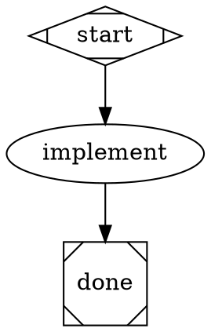
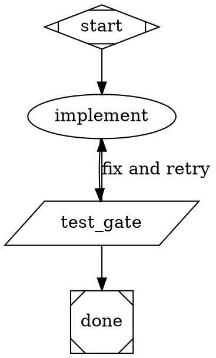
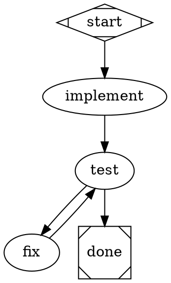
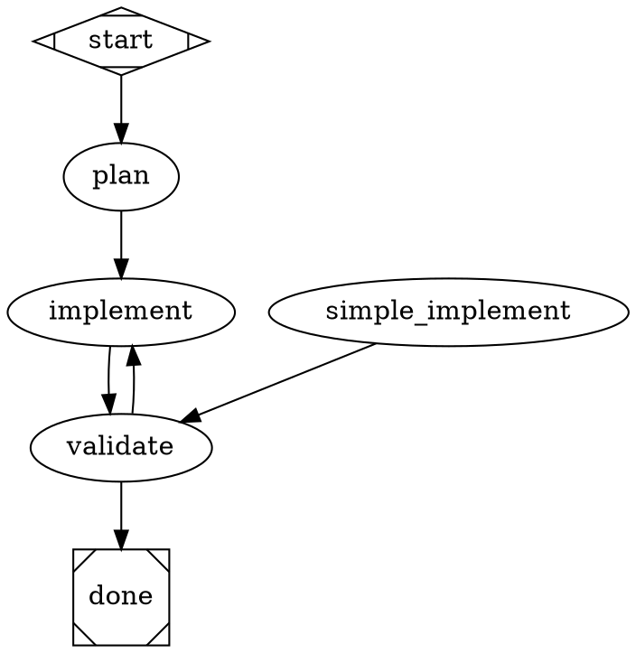
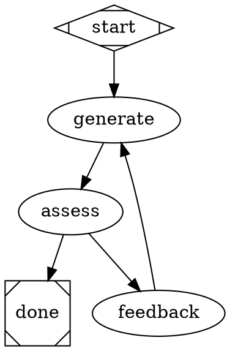
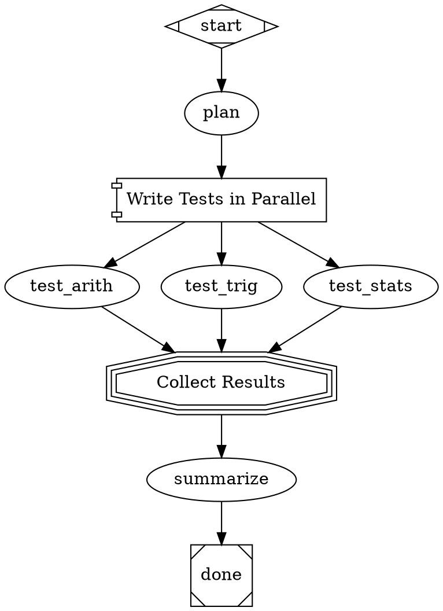
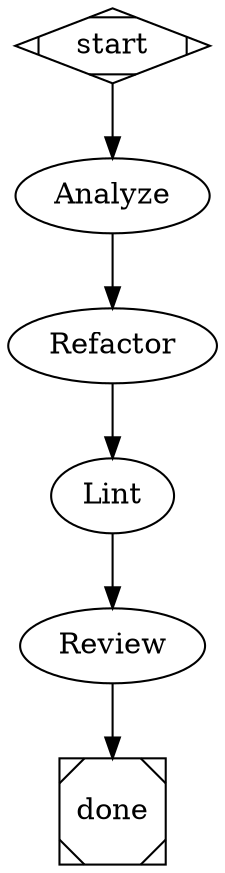
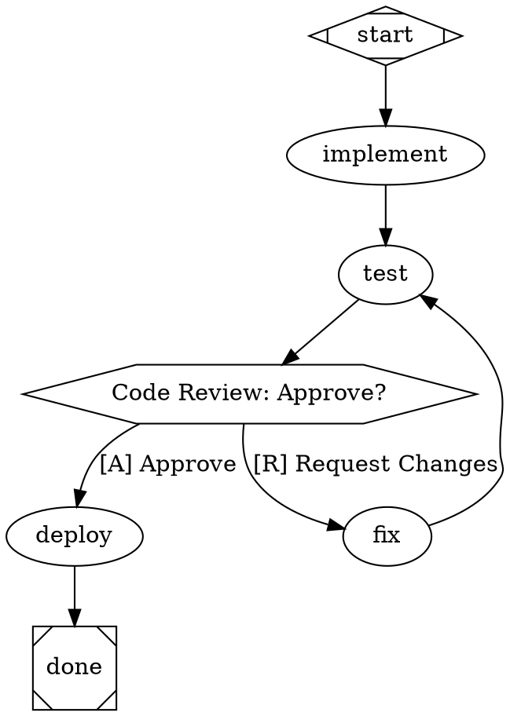
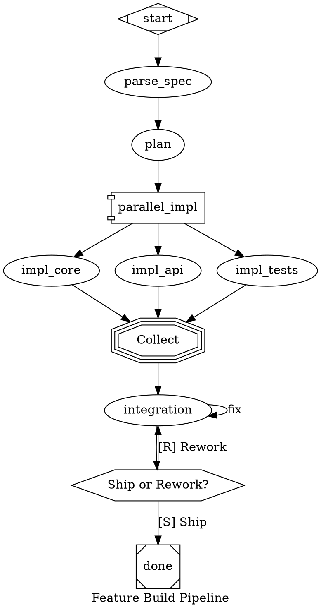

# DOT Pipeline Authoring Guide

How to design effective multi-stage AI pipelines using Graphviz DOT digraphs.

## Philosophy

Attractor pipelines are **convergence graphs**: the graph encodes the
control structure -- gates, budgets, corrective loops, feedback channels --
and the engine walks it from `start` to `done`, executing each node and
following edges based on outcomes.

**The pipeline author's job is the convergence skeleton, not the domain
decomposition.** Keep the task-agnostic control structure: the gates, budgets,
walls, and feedback channels that make the loop descend. Delete the domain
decomposition -- plan/implement/test phases, backend/frontend splits -- that is
the model's job, not the graph's. `examples/patterns/task-runner.dot` is the
canonical example: its stages are control-plane responsibilities (orient /
attempt / verify / critique / triage / postmortem / package), zero domain phases.

**The node contract.** Every LLM node (`shape=box`) should state:

1. **Objective** -- what the node is responsible for achieving
2. **Constraints** -- what it must not do or assume
3. **Available capabilities** -- what tools or context it has access to
4. **Required evidence** -- what artifact or observable state proves it succeeded

The prompt states the contract, not the algorithm -- never enumerate the
procedure step-by-step unless the procedure itself is a business or safety
requirement. A node that carries the algorithm cannot absorb a model's bad day;
a node that carries objective + constraints + capabilities + required evidence
lets the loop correct the *work* because "done" is defined outside the worker.

**`goal_gate` belongs on evidence-bearing nodes, not implementation nodes.**
The engine's `goal_gate` contract (spec §3.4) is: this node must succeed before
the pipeline can exit. Attaching it to an implementation node makes "the
implementer finished" the exit criterion -- an implementation finishing is not a
goal state. Attach `goal_gate` to the node that *bears evidence*: a test gate,
an acceptance check, a human approval gate, or an evidence-backed review node.
Shipped positive example: `examples/pipelines/practical/bug-fix.dot`'s exit is
gated on `verdict_gate` output -- implementation completing earns nothing.

**`goal_gate` nodes require an explicit verdict (fail-closed).** A goal gate is
satisfied only by an explicit verdict: a `report_outcome` tool call, a pure or
fenced JSON response with a `status` field, an embedded trailing JSON verdict,
or -- for `shape=parallelogram` tool nodes -- the command's exit code. A
plain-prose response ("looks good, all done") returns RETRY instead of SUCCESS,
so the gate is never satisfied by a defaulted response; even prose that says
"CONVERGED" does not count (`specs/EXTENSIONS.md` §25). Prompt your gate nodes
to call `report_outcome` (or emit pure JSON), or make the gate a parallelogram
tool node whose exit code is the verdict:

```dot
judge [shape=box, goal_gate=true, retry_target="implement",
    prompt="Evaluate the work against the criteria. You MUST call the report_outcome tool with status=success only if all criteria pass; otherwise status=retry with what is missing."]
```

**Recipes vs. attractor pipelines.** Recipes are for staged sequential workflows
with human approval gates; attractor pipelines are for machine-verified
convergence. If your pipeline graph has no cycle, it should probably have been a
recipe. (TOPO-003 warns on acyclic graphs for this reason; deliberate one-pass
pipelines are legitimate -- the "probably" is load-bearing.)

**Design principles:**

- Each node should have a single, clear responsibility
- Prompts should be self-contained -- a node should not assume context unless fidelity is `full`
- Use `$goal` to inject the pipeline's overall objective into node prompts
- Prefer fewer, well-prompted nodes over many thin ones
- Use `goal_gate` on evidence-bearing nodes (test gates, acceptance checks, human gates)
- Use conditional routing to handle success/failure paths explicitly

## Pipeline Patterns

### Linear Pipeline

The simplest pattern. Stages execute in sequence.



A convergence-shaped pipeline -- a worker node with an evidence gate and a corrective
back-edge. This is the recommended shape for any task where the first attempt may not succeed:



The `test_gate` is a deterministic tool node (not an LLM self-report): it runs
`pytest` and routes on the exit code. `goal_gate=true` is on the evidence-bearing node,
not on `implement`. The corrective back-edge (`test_gate -> implement`) is what makes
this a convergence graph rather than a recipe.

Two mechanics worth copying exactly. First, test output travels through a *file*
(`test_output.txt`), not a prompt variable: LLM-node prompts expand only `$goal`,
`$context`, and plain (dot-free) context keys -- `tool.output` is a dotted key
available to `tool_command` strings, not to prompts. Second, the gate uses plain
redirection (`> test_output.txt 2>&1`) rather than a pipe: `tool_command` runs under
`/bin/sh`, where a pipe would make the exit code `tee`'s, not pytest's (and bash-isms
like `PIPESTATUS` are unavailable). Redirection preserves pytest's exit code, which is
what the edges route on.

The linear `start -> implement -> test -> done` shape (no back-edge) is a recipe shape
and will trigger TOPO-003. If that is intentional -- a one-pass workflow -- use a recipe.

### Conditional Routing

Conditional routing is done via `condition=` attributes on edges, which work
from **any node type** (per nlspec Section 3.3). No special shape is needed --
the engine evaluates `condition` attributes on outgoing edges to pick the path.



**How conditions work:** The engine evaluates conditions against the most recent
node's outcome. Supported operators are `=` and `!=`. Combine with `&&`:

```dot
gate -> deploy [condition="outcome=success && context.tests_passed=true"]
```

Keys available in conditions:
- `outcome` -- resolves to `preferred_label` if set by the agent via `report_outcome`, otherwise falls back to the raw status value (`success`, `fail`, etc.)
- `preferred_label` -- the custom routing label set via `report_outcome` (null if not set)
- `context.<key>` -- any value in the pipeline context (set via `context_updates` in `report_outcome`)

**Dynamic routing with `report_outcome`:** Nodes that make routing decisions
(review gates, test runners) should call the `report_outcome` tool with a
`preferred_label` that matches their outgoing edge conditions. For example,
a review node with edges `condition="outcome=pass"` and `condition="outcome=retry"`
should call `report_outcome(status="success", preferred_label="pass")` or
`report_outcome(status="fail", preferred_label="retry")`.

> **Common mistake: escaped-quote delimiters** — Condition (and all attribute)
> values must use **plain double-quotes** as delimiters.  Writing
> `condition=\"key=value\"` (backslash-quote) instead of
> `condition="key=value"` is a syntax error.  Before the fail-loud fix was
> added, the tokenizer silently mis-parsed the backslash-delimited form as a
> bare key (`key=value`), which resolves truthy — causing ALL conditional edges
> to "match" and the engine to fan-out instead of routing.  The parser now
> raises a `ValueError` immediately with the position and the correct form.
> See [DOT-SYNTAX.md](DOT-SYNTAX.md#quoting-and-escaping) for the full rule
> and the one legitimate place `\"` is valid (inside a quoted string value,
> e.g. a shell command containing literal double-quotes).

> **Recommended pattern:** Use `condition="outcome!=retry"` instead of
> `condition="outcome=pass"` for forward edges. This is resilient to agents
> that return `status="success"` without setting `preferred_label`.
> See [ROUTING-REFERENCE.md](ROUTING-REFERENCE.md) for the full routing
> system documentation, including edge selection algorithm details and pitfalls.

### Retry with Fallback

Use `max_retries`, `retry_target`, and `fallback_retry_target` for resilient
execution. When a node fails and retries are exhausted, flow jumps to the
retry target. If that also fails, the fallback target catches it.



### Iterative Pipelines (`loop_restart`)

Use `loop_restart="true"` on a back-edge to create a convergence loop. The
engine resets execution state (completed nodes, outcomes) and increments
`$iteration` before re-running from the target node. Context values set via
`context_updates` are preserved so accumulated state (e.g., feedback files,
assessment results) carries across iterations.



**How `loop_restart` works:**

1. The engine traverses the `loop_restart` edge normally.
2. It increments the internal `iteration_count` (starting from 0).
3. It updates `$iteration` and `$loop_count` in context.
4. It resets `completed_nodes` and `node_outcomes` so the target node and all
   downstream nodes re-execute cleanly.
5. Context values accumulated via `context_updates` (e.g., `preferred_label`,
   custom keys) are preserved — the loop can carry state forward.

**Per-iteration records and the descent curve (Extension #24):**

After each node completes, the engine writes:
- `logs_root/<node_id>/status.json` — flat path (backward compatible)
- `logs_root/iteration_N/<node_id>/status.json` — iteration-scoped record

All iteration records coexist: a 10-iteration run produces 10 complete
per-iteration snapshots, none overwritten. The engine also appends one JSONL
record to `logs_root/trace.jsonl` per node completion:

```json
{"iteration": 2, "node_id": "generate", "status": "success",
 "preferred_label": null, "duration_ms": 1240.5, "ts": "2024-01-01T00:00:00+00:00"}
```

To inspect the descent curve after a run:

```
attractor trace <run-dir>
```

This prints a human-readable summary of iterations, nodes, statuses, and
durations — the empirical form of the convergence claim.

**Difference from `max_retries`:** `max_retries` retries a single node on
failure; `loop_restart` resets the entire pipeline pass for intentional
multi-iteration refinement. Use `max_retries` for transient failures, use
`loop_restart` for structured convergence loops.

### Parallel Fan-Out / Fan-In

Use `shape=component` for parallel fan-out and `shape=tripleoctagon` for fan-in.
All outgoing edges from a `component` node become parallel branches.



**Parallel handler attributes:**

| Attribute | Values | Default | Description |
|-----------|--------|---------|-------------|
| `join_policy` | `wait_all`, `k_of_n`, `first_success`, `quorum` | `wait_all` | When to proceed |
| `error_policy` | `fail_fast`, `continue`, `ignore` | `continue` | How to handle branch failures |
| `max_parallel` | Integer | `4` | Max concurrent branches |

### Multi-Provider with Model Stylesheet

Use `model_stylesheet` to route different nodes to different providers using
CSS-like selectors. Nodes get a `class` attribute for targeting.



**Selector specificity** (highest wins):

| Selector | Example | Specificity |
|----------|---------|-------------|
| `#node_id` | `#critical_review` | 2 (highest) |
| `.class` | `.planning` | 1 |
| `*` | `*` | 0 (lowest) |

Explicit node attributes (`llm_model="..."` on the node) always override
stylesheet values.

### Model selection: globs and evergreen forms

A node's `llm_model` -- whether set directly on the node or via
`model_stylesheet` -- may take two useful forms:

- an fnmatch **glob**, e.g. `claude-sonnet-*` -- resolved at run time against the
  provider's **live** model list (its `/models` endpoint), newest **stable** match
  wins.
- a **concrete id**, e.g. `claude-sonnet-4-6` -- **not** resolved; passed to the
  provider verbatim (and 404s once that id is retired).

Only a glob gets live resolution, and it fails **loud** (the node fails) if
nothing matches -- there is no silent fallback. Concrete ids are the rot vector:
they look precise but go stale.

**How evergreen a glob is depends on the provider's naming.** A glob tracks new
generations only if the provider keeps a stable *tier name*:

| Provider | Persistent tier? | Evergreen form |
|----------|------------------|----------------|
| Anthropic | yes (`sonnet`/`opus`/`haiku`) | `claude-sonnet-*`, `claude-opus-*` |
| Gemini | yes (`flash`/`pro`) | `gemini-*-flash`, `gemini-*-pro` |
| OpenAI | **no** -- the generation *is* the name | `gpt-[5-9]*` (a range) |

- Widen to the **whole family**: `claude-sonnet-*` tracks Sonnet 4 -> 5 -> ...
  A version-pinned glob like `claude-sonnet-4-*` is **frozen to gen-4** and misses
  Sonnet 5 -- avoid it unless you deliberately want to pin the major.
- OpenAI has no tier that survives `gpt-5 -> gpt-6`, and a bare `gpt-*` matches
  junk (embeddings, audio, realtime). Use the generation **range** `gpt-[5-9]*`:
  it tracks the newest through gpt-9 and needs a one-character bump at gpt-10.
- Prefer an explicit family glob over a bare token like `sonnet`: the glob is
  unambiguous about provider and family and resolves reliably.

**Overriding a model on a node? Override the provider too.** A glob resolves
against the node's `llm_provider`, so `llm_model="gemini-*-flash"` needs
`llm_provider="gemini"` alongside it -- otherwise it inherits the class/default
provider (e.g. anthropic) and matches nothing. (Concrete ids bypass resolution
and are provider-inferred, which masks this.)

**Reproducibility.** Because a glob always picks the latest match, the chosen
model drifts as providers ship new ones. For a locked, reproducible evaluation,
pin a concrete id (or capture the resolved id -- the engine emits a
`model:resolved` event recording it).

**Scope.** This resolution applies to a node's `llm_model` only. A provider's
`default_model` (providers config) and `provider_preferences` overrides are
passed to the SDK verbatim and are **not** resolved -- keep those a concrete
served id.

### Human Approval Gate

Use `shape=hexagon` for human-in-the-loop gates. Choices are derived from
outgoing edge labels. Accelerator keys use `[X]` prefix notation.



When the pipeline reaches a hexagon node, it pauses and presents the edge
labels as choices. The human selects one, and the pipeline follows that edge.

### Sub-Pipeline Composition (Folder)

Use `shape=folder` to invoke a child pipeline defined in a separate DOT file.
The folder node runs the referenced pipeline as a sub-pipeline, passing context
from the parent, and optionally merging declared outputs back on success.

```dot
digraph {
    graph [goal="Build and validate a Python library"]

    start [shape=Mdiamond]
    done  [shape=Msquare]

    implement [prompt="Implement the library for: $goal"]
    test [prompt="Write unit tests for the library."]

    validate [
        shape=folder,
        label="Run Validation Suite",
        dot_file="pipelines/validate.dot",
        context.target="library",
        context.goal="$goal",
        outputs="validation_report,passed"
    ]

    fix [prompt="Fix issues identified in the validation report."]

    start -> implement -> test -> validate
    validate -> done [condition="outcome=success", weight=10]
    validate -> fix  [condition="outcome!=success", weight=5]
    fix -> test
}
```

**Folder node attributes:**

| Attribute | Required | Default | Description |
|-----------|----------|---------|-------------|
| `dot_file` | Yes | — | Path to the child pipeline DOT file |
| `context.<key>` | No | — | Inject named values into the child context (`context.goal="$goal"`) |
| `outputs` | No | `""` | Comma-separated child context keys to merge back into parent on success |

**Context flow:**

1. **Parent → Child (clone + inject):** When the folder node executes, the
   engine clones the parent pipeline context and injects any `context.<key>`
   attributes as named values. The child pipeline runs with this enriched
   context.

2. **Child → Parent (only declared outputs on success):** When the child
   pipeline completes successfully, only the context keys listed in `outputs`
   are merged back into the parent context. Keys not listed in `outputs` are
   discarded.

3. **Isolation (undeclared changes don't affect parent):** Any context
   modifications made inside the child pipeline that are not declared in
   `outputs` do not affect the parent pipeline's context. This isolation
   prevents accidental side-effects from leaking across pipeline boundaries.

**Path resolution for `dot_file`:** Relative paths are resolved relative to
the parent DOT file's directory. Absolute paths are used as-is. For example,
if the parent pipeline is at `pipelines/main.dot` and `dot_file="validate.dot"`,
the engine looks for `pipelines/validate.dot`.

### Manager-Supervisor Pattern

Use `shape=house` for a supervisor that oversees a sub-pipeline through
observe/steer/wait cycles.

```dot
digraph {
    graph [goal="Build a data pipeline for CSV processing"]

    start [shape=Mdiamond]
    done  [shape=Msquare]

    plan [prompt="Create a plan for: $goal"]

    manager [
        shape=house,
        label="Supervise Implementation",
        prompt="Oversee implementation. Steer toward success.",
        manager.max_cycles=5,
        manager.poll_interval="0s",
        manager.stop_condition="outcome=success",
        manager.actions="observe,steer,wait"
    ]

    implement [prompt="Implement the data pipeline. Incorporate steering feedback."]
    test [prompt="Run tests. Report success or failure."]
    report [prompt="Summarize results."]

    start -> plan -> manager
    manager -> implement
    implement -> test
    test -> done [condition="outcome=success"]
    test -> implement [condition="outcome!=success"]
    manager -> report [weight=0]
    report -> done
}
```

## Node Attribute Reference

Every node in a DOT pipeline can have these attributes:

| Attribute | Type | Default | Description |
|-----------|------|---------|-------------|
| `shape` | String | `box` | Determines handler type (see shape table below) |
| `label` | String | node ID | Display name. Used as prompt fallback if `prompt` is empty. |
| `prompt` | String | `""` | Primary instruction for LLM nodes. Supports `$goal` expansion. |
| `type` | String | `""` | Explicit handler type override. Takes precedence over shape. |
| `goal_gate` | Boolean | `false` | Node must succeed **with an explicit verdict** (report_outcome / JSON / tool exit code) before pipeline can exit. Plain prose returns RETRY (fail-closed, EXTENSIONS.md §25). |
| `max_retries` | Integer | `0` | Additional attempts beyond the first. `max_retries=3` = 4 total. |
| `retry_target` | String | `""` | Node to jump to when retries exhausted. |
| `fallback_retry_target` | String | `""` | Secondary retry target if primary is missing. |
| `fidelity` | String | inherited | Context mode for this node (see Fidelity Modes below). |
| `thread_id` | String | derived | Thread identifier for session reuse under `full` fidelity. |
| `class` | String | `""` | Comma-separated CSS classes for model stylesheet targeting. |
| `llm_model` | String | inherited | LLM model identifier. Overrides stylesheet. |
| `llm_provider` | String | auto | Provider key (`anthropic`, `openai`, `gemini`). |
| `reasoning_effort` | String | `high` | `low`, `medium`, or `high`. |
| `timeout` | Duration | unset | Max execution time (e.g., `900s`, `15m`). |
| `auto_status` | Boolean | `false` | Auto-generate SUCCESS if handler writes no status. |
| `allow_partial` | Boolean | `false` | Accept PARTIAL_SUCCESS when retries exhausted. |

**Shape-to-handler mapping:**

| Shape | Handler | LLM Call? | Description |
|-------|---------|-----------|-------------|
| `Mdiamond` | `start` | No | Pipeline entry point (required) |
| `Msquare` | `exit` | No | Pipeline exit point (required) |
| `box` | `codergen` | Yes | LLM task node (default for all nodes) |
| `component` | `parallel` | No | Parallel fan-out |
| `tripleoctagon` | `parallel.fan_in` | Optional | Collects parallel branch results |
| `hexagon` | `wait.human` | No | Human approval gate |
| `parallelogram` | `tool` | No | External tool/shell execution |
| `house` | `stack.manager_loop` | Indirect | Supervisor loop over sub-pipeline (experimental — future form TBD); engine classifies as non-LLM for validation, but handler internally delegates to LLM |
| `folder` | `pipeline` | No | Sub-pipeline from external DOT file |

## Edge Attribute Reference

| Attribute | Type | Default | Description |
|-----------|------|---------|-------------|
| `label` | String | `""` | Display caption. Also used for routing and human gate choices. |
| `condition` | String | `""` | Boolean guard: `outcome=success`, `outcome!=fail`, `&&` conjunction. |
| `weight` | Integer | `0` | Priority for edge selection. Higher wins among equally eligible edges. |
| `fidelity` | String | unset | Override fidelity for the target node. Highest precedence. |
| `thread_id` | String | unset | Override thread ID for the target node. |
| `loop_restart` | Boolean | `false` | When `true`, the engine increments the iteration counter and resets execution state (completed nodes, outcomes) before continuing to the target node. Context values set via `context_updates` are preserved across the restart. See [Iterative Pipelines](#iterative-pipelines-loop_restart) below. |

**Edge selection priority** (the engine picks the first match):
1. Condition-matching edges (condition evaluates to true)
2. Preferred label match (from outcome's suggested label)
3. Highest `weight` among unconditional edges
4. Lexical tiebreak (target node ID, ascending)

## Variable Expansion

Variables in node `prompt` and `tool_command` attributes are expanded before
execution. The following built-in variables are always available:

| Variable | Source | Description |
|----------|--------|-------------|
| `$goal` | `graph.goal` attribute | The pipeline objective |
| `$iteration` | engine context (Extension #24) | Current iteration number (0-based; increments on each `loop_restart`) |
| `$loop_count` | engine context (Extension #24) | Alias for `$iteration` |
| `$<param>` | `--param k=v` CLI flag or `params` dict | Custom key-value parameters |

```dot
graph [goal="Create a REST API with authentication"]
plan [prompt="Plan the implementation of: $goal"]
// Expands to: "Plan the implementation of: Create a REST API with authentication"
```

The `goal` value comes from the graph-level `goal` attribute. Override it at run
time with `--param goal="..."` on the `attractor run` CLI, or the `goal`
parameter in `run_pipeline`.

`$iteration` is seeded to `"0"` at pipeline start and increments by 1 on each
`loop_restart` edge traversal. Use it in prompts to let the LLM know which
attempt it is on:

```dot
work [prompt="Attempt $iteration: fix the failing tests and re-run them."]
```

Custom parameters passed via `--param language=Python` are available as
`$language` in prompts and `tool_command` attributes.

## Fidelity Modes

Fidelity controls how much prior context each node receives from earlier stages.

| Mode | Session | Context Carried | When to Use |
|------|---------|----------------|-------------|
| `full` | Reused | Full conversation history | Nodes that build on prior work (implement after plan) |
| `compact` | Fresh | Structured summary of completed stages | Default. Good balance of context and cost. |
| `truncate` | Fresh | Minimal: only goal and run ID | Independent tasks that need no prior context |
| `summary:low` | Fresh | Brief summary (~600 tokens) | Light context carry |
| `summary:medium` | Fresh | Moderate detail (~1500 tokens) | Review/polish stages |
| `summary:high` | Fresh | Detailed summary (~3000 tokens) | Stages that need substantial prior context |

**Fidelity resolution precedence** (highest wins):
1. Edge `fidelity` attribute
2. Target node `fidelity` attribute
3. Graph `default_fidelity` attribute
4. Default: `compact`

**Thread IDs and session reuse:** Under `full` fidelity, nodes with the same
`thread_id` share a single LLM session. This preserves full conversation
history between those nodes:

```dot
graph [default_fidelity="full"]
implement_auth [thread_id="backend", prompt="Implement auth middleware."]
implement_rate [thread_id="backend", prompt="Add rate limiting middleware."]
// Both share the same LLM session -- rate limiting sees auth context
```

## Model Stylesheet Syntax

```
Selector { property: value; property: value; }
```

**Selectors:**
- `*` -- all nodes
- `.classname` -- nodes with `class="classname"`
- `#node_id` -- specific node by ID

**Properties:**
- `llm_model` -- model identifier
- `llm_provider` -- provider key
- `reasoning_effort` -- `low`, `medium`, `high`

```dot
graph [model_stylesheet="
    * { llm_model: claude-sonnet-*; llm_provider: anthropic; }
    .code { llm_model: claude-sonnet-*; }
    .reasoning { llm_model: gpt-[5-9]*; llm_provider: openai; reasoning_effort: high; }
    #final_check { llm_model: claude-opus-*; reasoning_effort: high; }
"]
```

## Graph-Level Attributes

Set these on the `graph` element:

| Attribute | Type | Default | Description |
|-----------|------|---------|-------------|
| `goal` | String | `""` | Pipeline objective. Available as `$goal` in prompts. |
| `label` | String | `""` | Display name for the pipeline. |
| `model_stylesheet` | String | `""` | CSS-like model assignment rules. |
| `default_fidelity` | String | `compact` | Default context fidelity for all nodes. |
| `default_max_retry` | Integer | `0` | Global retry ceiling. |
| `retry_target` | String | `""` | Global retry target when exit has unsatisfied goal gates. |
| `fallback_retry_target` | String | `""` | Global fallback retry target when exit has unsatisfied goal gates. |

## Tips for Effective Node Prompts

1. **Be specific.** "Write pytest tests for calculator.py covering add, subtract,
   multiply, divide including edge cases" is better than "Write some tests."

2. **Include the goal.** Use `$goal` to ground each node in the pipeline objective:
   "Plan the implementation of: $goal"

3. **State the expected output.** "Create the file using write_file" or "Run the
   tests and report pass/fail results" tells the agent what to do concretely.

4. **Reference prior work explicitly under compact/truncate fidelity.** Since the
   node may not see prior conversation, say "Based on the plan from the previous
   stage" rather than assuming context is available.

5. **Keep prompts under ~500 words.** Long prompts eat into the context window
   and reduce the agent's working space.

## Anti-Patterns to Avoid

| Anti-Pattern | Problem | Fix |
|-------------|---------|-----|
| Missing `shape=Mdiamond` start node | Pipeline will not parse | Every digraph needs exactly one `Mdiamond` and one `Msquare` |
| `goal_gate=true` without `retry_target` | Node fails with no recovery path | Add `retry_target` pointing to a node that can fix the issue |
| Wrong condition key | `condition="status=success"` does not match anything | Use `outcome=success` (not `status`) |
| Too many nodes (>10) | Long execution, high cost, context dilution | Combine related steps into fewer, well-prompted nodes |
| Vague prompts | Agent wanders, produces irrelevant output | Be specific about inputs, actions, and expected outputs |
| Missing `weight` on conditional edges | Nondeterministic edge selection | Add `weight` to break ties between equally-matched edges |
| Using `full` fidelity everywhere | High cost, slow execution | Use `full` only where conversation continuity matters |
| Circular dependencies without exit | Infinite loop | Ensure every cycle has a conditional exit path |
| `condition=\"key=value\"` (backslash delimiters) | Parser error (or, before the fail-loud fix, silent wrong routing) | Use plain quotes: `condition="key=value"` — see callout above |

## Complete Example: Feature Build Pipeline

This pipeline demonstrates multiple patterns working together:



## Static Lint Rules (`attractor lint`)

Run `attractor lint <file.dot>` to check a pipeline file before running it.
Lint is static (no API calls, sub-second), safe to run in CI, and does not
change run-time validation behaviour.

**Exit-code contract:**
- Errors (ERROR severity) → exit 1 (pipeline will not execute correctly)
- Warnings only → exit 0 (use `--strict` to treat warnings as errors)

**Spec note:** These lint rules are lint-only — they do not change run-time
behaviour and require no `specs/EXTENSIONS.md` entry.  They enforce the
canonical attractor spec's routing semantics statically, at author time.

---

### TOPO-001 — Dead conditional edge out of a diamond node

**What it detects:** An edge out of a `diamond` (ConditionalHandler) node
whose condition is `outcome!=success` or `outcome=fail`.

**Why it's wrong:** `ConditionalHandler` (shape=`diamond`) always returns
`SUCCESS` unconditionally (`handlers/conditional.py`).  Additionally, `FAIL`
is fail-fast — it never reaches a diamond via plain edges
(`edge_selection.py`).  Therefore, `outcome!=success` and `outcome=fail`
edges out of a diamond can **never fire**.  The corrective branch is silently
dead.  This was the root cause of 8 shipped examples having dead corrective
edges for months.

**Severity:** ERROR — the edge is provably unreachable.

**Fix:** Replace the `outcome=` condition with an evidence-based condition set
by a preceding tool or LLM node:

```dot
// WRONG — dead edge: ConditionalHandler always returns SUCCESS
gate -> fix [condition="outcome!=success"]

// CORRECT — route on evidence set by the preceding tool/LLM node
gate -> fix [condition="context.preferred_label=retry"]
gate -> done [condition="context.preferred_label=done"]
```

Diamond nodes are pure routing hubs.  They do not execute logic and cannot
observe upstream outcomes.  Use `context.preferred_label` (set via
`report_outcome`) or `context.tool.last_line` (set by a tool node) to route.

---

### TOPO-002 — Stale-label collision on a tool node

**What it detects:** A `parallelogram` (ToolHandler) node that has BOTH:
- an outgoing edge conditioned on `context.tool.last_line=X` (without also
  asserting `&& outcome=success`), AND
- an outgoing edge conditioned on `outcome=fail`

**Why it's wrong:** `ToolHandler` sets `context.tool.last_line` only on
success (`tool.py`).  On failure, it returns `FAIL` early before setting the
label.  On the second visit after a failure, `tool.last_line` still holds the
stale value from the prior success.  Both edges then match simultaneously —
the stale `last_line` edge AND the `outcome=fail` edge — causing a silent
double-dispatch.  This bug is invisible in single-pass testing.

**Severity:** ERROR — silent correctness bug on the second visit.

**Fix:** Add `&& outcome=success` to the `last_line` edge so it only fires
when the tool actually succeeded and the label is fresh:

```dot
// WRONG — stale-label collision on second visit
tool -> done [condition="context.tool.last_line=green"]
tool -> fix  [condition="outcome=fail"]

// CORRECT — conjunction ensures label is fresh
tool -> done [condition="context.tool.last_line=green && outcome=success"]
tool -> fix  [condition="outcome=fail"]
```

> **Spec-reconciliation note:** This defensive rule exists because the current
> engine selects ALL matching edges (parallel fan-out) where the canonical spec
> prescribes deterministic single-best-edge selection; that divergence is under
> active reconciliation.  If the engine adopts single-edge selection, the
> `&& outcome=success` conjunction becomes unnecessary — but it is harmless, so
> pipelines written with it stay correct either way.

---

### TOPO-003 — Acyclic graph (no corrective cycle)

**What it detects:** A pipeline with no back-edge (no cycle at all).

**Why it matters:** An attractor pipeline should have at least one corrective
loop that allows it to retry, self-correct, or converge.  A pipeline with no
cycle is a linear one-pass analysis — which may be deliberate (a "recipe") but
is more likely a design gap.  12 of 24 shipped examples were acyclic.

**Severity:** WARNING — deliberate one-pass pipelines are legitimate
(single-pass analysis, no retry needed).

**Fix:** If convergence is needed, add a corrective back-edge:

```dot
// Add a back-edge with evidence-based exit condition
validate -> work  [condition="outcome=fail"]
validate -> done  [condition="context.tool.last_line=pass && outcome=success"]
```

If the pipeline is deliberately linear, ignore this warning.  Consider whether
it should be a recipe (a staged, human-approved sequence) rather than an
attractor.

---

### TOPO-004 — Cycle with no explicitly-gated exit

**What it detects:** A cycle (strongly-connected component) where no edge
**exiting the cycle** (from a cycle node to a node outside the cycle) carries
an explicit gate.  Two edge forms count as explicitly gated:

- an exit edge with a `condition` expression, or
- a **labeled** exit edge from a human-gate (`hexagon`) node — the human's
  selection routes on edge labels, an explicit gate without a `condition`.

Note: conditional edges that route *within* the cycle do not count — only an
exit edge leaving the SCC provides a gated termination path.

**Why it matters:** Without an explicit gate, termination rests on implicit
routing mechanics (unconditional-edge weight/lexical tiebreaks, fail-fast
halts) or on budget caps (`max_retries`, `max_pipeline_duration`).  That may
work, but the convergence criterion is invisible to a reader of the graph —
make the exit explicit.

**Severity:** WARNING — implicitly-routed and budget-capped loops are
legitimate in some contexts (bounded exploration).

**Fix:** Add a condition expression to the cycle's exit edge:

```dot
// WRONG — unconditional exit, budget-cap only
validate -> done  // no condition

// CORRECT — evidence-gated exit
validate -> done [condition="context.tool.last_line=pass && outcome=success"]
validate -> work [condition="outcome=fail"]
```

The check runs per strongly-connected component (SCC) so that a compliant
loop does not suppress diagnostics for a separate non-compliant loop in the
same graph.

---

### TOPO-005 — Cycle with no deterministic evidence gate

**What it detects:** A cycle (SCC) whose continuation/exit decisions rest
solely on LLM say-so — no `parallelogram` (tool) node on the cycle whose
evidence actually gates control flow, and no human gate on the cycle.

**Why it matters:** LLMs may claim success prematurely (wrong-but-plausible
work exits the loop) or loop indefinitely.  The corrective loop only descends
when a mechanical gate on the cycle forces bad work back around — or halts it
loudly.

A tool node counts as a deterministic evidence gate when its outcome or
output participates in routing.  Grounded in engine semantics, that happens
in two ways:

1. **Evidence-conditioned edges:** an outgoing edge routing on `outcome`
   (a tool's outcome is its command's exit status — mechanical) or on a
   `context.tool.*` key (set from the tool's output).
2. **A plain (unconditional) outgoing edge:** plain edges only traverse on
   SUCCESS — FAIL is fail-fast — so a failing tool mechanically halts the
   pipeline.  That is an implicit `outcome=success` gate.  (Exception: a
   plain edge to a `runs_on=always` / `runs_on=failure` target traverses on
   FAIL too, and gates nothing.)

A tool merely *being present* on the cycle is NOT enough.  A no-op router
tool whose outgoing edges are all conditioned on LLM-set context keys (e.g.
`context.preferred_label`) leaves the loop LLM-gated — its own evidence is
unused — and this rule fires.

A human-gate (`hexagon`) node on the cycle also counts as a real gate: every
iteration passes through external human judgment, which is exactly the check
that catches wrong-but-plausible output.  Human-gated loops do not warn.

**The honest limit of static analysis:** lint credits the topology, not the
command.  A tool whose command is a meaningless no-op that always succeeds
(e.g. `echo ok`) followed by a plain edge satisfies form 2 syntactically;
whether the command performs a real check is not statically decidable.

**Severity:** WARNING — LLM-gated loops are legitimate in some contexts
(goal_gate with retry_target).

**Fix:** Put a tool node on the cycle whose evidence gates routing:

```dot
// WRONG — LLM-only cycle, exit gated on LLM outcome
generate -> assess
assess -> done [condition="outcome=success"]   // LLM says "done"
assess -> generate [condition="outcome!=success"]

// CORRECT — tool on cycle, routing gated on tool evidence
generate -> validate  // validate is shape=parallelogram
validate -> done    [condition="context.tool.last_line=pass && outcome=success"]
validate -> generate [condition="outcome=fail"]
```

See `examples/patterns/convergence-factory.dot` for the canonical pattern:
its `validate` tool has a plain out-edge, so a failing validation halts the
loop via fail-fast before the LLM assessor ever judges the work.

The check runs per SCC so that a compliant loop does not suppress diagnostics
for a separate non-compliant loop.

---

## Further Reading

- [DOT-SYNTAX.md](DOT-SYNTAX.md) -- Quick reference tables and copy-paste patterns
- [APP-INTEGRATION-GUIDE.md](APP-INTEGRATION-GUIDE.md) -- Using pipelines from Python code
- [GETTING-STARTED.md](GETTING-STARTED.md) -- Installation and first run
- [examples/pipelines/](../examples/pipelines/) -- 10 tutorial + 5 practical pipeline examples
- [modules/loop-pipeline/tests/test_examples_lint_clean.py](../modules/loop-pipeline/tests/test_examples_lint_clean.py) -- Self-updating lint sweep (replaces the static LINT-SWEEP.md artifact; run `pytest` to re-sweep)
