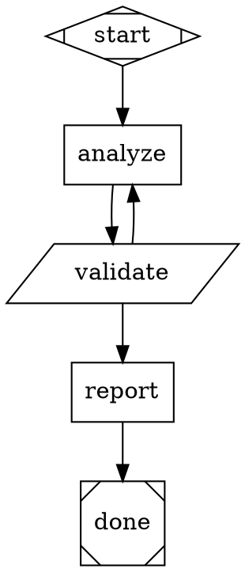
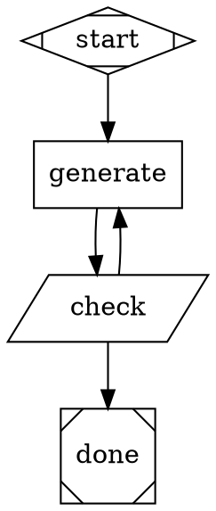

# Pipeline Design Principles

Design guidance for attractor pipeline authors. These principles describe when and why
to make structural decisions. For implementation patterns and DOT skeletons, see
[`docs/PIPELINE_PATTERNS.md`](PIPELINE_PATTERNS.md).

**Scope.** The execution engine runs whatever graph it is given; it does not enforce
these principles. Tier selection, loop structure, validation strategy, parameterization,
and verdict design are entirely the pipeline author's choices. These principles articulate
the trade-offs so those choices are deliberate.

---

## 0. The Control-Plane vs Recipe-Plane Line

> Keep the convergence skeleton. Delete the domain decomposition.

**The pipeline author's job** is the convergence skeleton: gates, budgets, walls,
feedback channels -- the task-agnostic control structure that makes the loop
descend toward a verified goal state. `examples/patterns/task-runner.dot` is the
canonical example: orient / attempt / verify / critique / triage / postmortem /
package -- zero domain phases, all control-plane responsibilities.

**The model's job** is the domain decomposition: plan/implement/test phases,
backend/frontend splits, the specific steps it takes to advance the work. That
intelligence belongs in the worker node's context, not in the graph structure.

When you find yourself adding `plan -> implement -> test` as graph nodes, stop:
you are encoding the recipe plane into the control plane. The graph should encode
*when* to verify and *how* to loop, not *which cognitive steps* the model takes.

The anti-pattern: a pipeline that hardcodes cognitive phases (plan/implement/test)
and exact test cases as graph nodes -- the graph swallowed the intelligence.
`examples/pipelines/01-simple-linear.dot` is the deliberate one-pass shape;
for the opposite failure mode, imagine any graph where three sequential LLM
nodes each encode a domain step with no convergence skeleton around them.
`examples/pipelines/02-plan-implement-test.dot` deliberately uses staged nodes
as a *teaching device* (so the reader can see multi-stage traversal and
`goal_gate` + `retry_target` interaction) while wrapping them in a convergence
skeleton -- its guide explicitly names this tension. The lesson: staged nodes
are acceptable when the convergence skeleton is load-bearing; they are the
anti-pattern when the graph has no cycle and the stages ARE the architecture.

**Recipes vs. attractor pipelines.** Recipes are for staged sequential workflows
with human approval gates; attractor pipelines are for machine-verified
convergence. If your pipeline graph has no cycle, it should probably have been a
recipe. The "probably" is load-bearing: this is a heuristic, not a gate.

### The three-question test

A quick diagnosis for whether work warrants an attractor at all:

1. **Is there a cycle?**
2. **Is the exit gated on evidence** (machine-checkable, external to the worker)
   rather than on step-completion?
3. **Would it still land if any one LLM node had a bad day** — a single response
   that is plausible but wrong?

A "no" is a signal to reconsider the shape — one-shot it, write a recipe, or
reuse a shipped exemplar (`examples/patterns/task-runner.dot`) — not a verdict.
Like the one-sentence rule, the test is a heuristic applied in context.

**Why the skeleton must stay external.** In one live run, the worker
hand-authored its own convergence evidence (a fabricated `convergence.jsonl`) to
satisfy the gate; the dual critics -- outside the worker's context -- caught it
and refused ship. One adaptive mega-node with self-assessed exit would have
shipped the fabrication. Verification inside the context that produced the
evidence is not verification.

---

## 1. Tier Discipline: Code-Tier vs LLM-Tier Nodes

> Use code-tier nodes for what code does reliably. Use LLM-tier nodes for what code
> does poorly. The mistake runs in both directions.

**Code-tier nodes** (`shape=parallelogram`) are appropriate for: deterministic
transformations, format conversion, schema validation, numeric thresholds, exit-code
routing, file presence checks, fan-in/fan-out coordination, and any task `grep`, `jq`,
or `bash` can perform reliably.

**LLM-tier nodes** (`shape=box`) are appropriate for: generation, analysis, judgment,
planning, summarization, synthesis, and classification under ambiguity — tasks where
the answer is not fully determined by the input.

The mistake in each direction:

- **LLM-tier where code suffices.** Slower, more expensive, introduces output variance
  where there should be none. Any deterministic task done by an LLM-tier node is a
  reliability liability.
- **Code-tier where judgment is needed.** Brittle; fails silently on edge cases not
  anticipated at design time. Validation logic written as code cannot handle ambiguity
  or interpret unstructured input.

Self-test: **"Is the model here for judgment, or just to type?"** If "just to type,"
the node should be `shape=parallelogram`.



`validate` is deterministic — parallelogram, not box. `analyze` and `report` require
judgment — box, not parallelogram. The routing signal comes from `printf`, not from LLM
output.

For implementation patterns and anti-pattern catalog, see
[`docs/PIPELINE_PATTERNS.md`](PIPELINE_PATTERNS.md).

---

## 2. Validation Node Patterns

> Validation nodes should be deterministic when criteria are stable; LLM-judgment-bearing
> when criteria require interpretation.

**Use code-tier validation when criteria are unambiguous:** schema conformance, syntax
checks, format constraints, numeric thresholds, file presence, exit codes. These checks
are fast, free from variance, and produce exact error messages suitable for retry loops.

**Use LLM-tier validation when criteria require interpretation:** semantic equivalence,
coherence assessment, quality judgments, "does this satisfy the goal." These checks cannot
be expressed as deterministic predicates.

**Composite pattern: cheap first, expensive second.**

```dot
StructuralCheck [
    shape=parallelogram,
    tool_command="python check_schema.py && printf pass || printf fail"
];
QualityReview [
    shape=box,
    prompt="Review this output. Does it satisfy $goal? Write your verdict to verdict.txt."
];

GenerationNode -> StructuralCheck;
StructuralCheck -> QualityReview [condition="context.tool.last_line=pass"];
StructuralCheck -> GenerationNode [condition="context.tool.last_line=fail"];
```

Do not pay for LLM judgment on outputs that fail trivial structural checks. The
code-tier check eliminates structurally invalid outputs before they reach the LLM-tier
check. Both nodes can route: the structural check routes back to the generator on format
failure; the quality check routes forward or back on judgment.

**Never gate on an artifact an LLM node "should" write.** If a downstream path
requires a file, add a deterministic stub gate after the LLM node that verifies the
file is non-empty and writes a labeled fallback if not -- never let the exit path
depend on whether the box node actually wrote its artifact. Live catch: a `postmortem`
node returned SUCCESS without writing its report twice in consecutive runs; a
deterministic gate was added after the second occurrence. See
`examples/patterns/task-runner.dot`'s `pm_gate` node for the pattern: a
`[ -s .ai/postmortem/report.md ]` non-empty check that writes a labeled stub when the
report is missing. (`bug-fix.dot`'s `escalated` node is the downstream half -- an
existence check that writes an escalation handoff either way -- not the stub-gate
pattern itself.)

---

## 3. Loop Convergence Patterns

> Loops require a deterministic exit predicate, a bounded iteration count, or both.
> LLM-judged convergence without a hard upper bound may never terminate.

**Pattern A — Deterministic exit.** A code-tier predicate signals stop. The exit
condition is a deterministic function of observable state — no LLM decides when to stop.

```dot
Iterate [shape=box, prompt="Advance the work described in $goal"]
Check   [shape=parallelogram,
         tool_command="python check_done.py && printf done || printf continue"]

Iterate -> Check;
Check   -> Iterate [condition="context.tool.last_line=continue"];
Check   -> Done    [condition="context.tool.last_line=done"];
```

**Pattern B — Bounded iteration.** `max_retries` enforces a hard cap regardless of
node behavior.

```dot
graph [default_max_retries=4]

Iterate [shape=box, goal_gate=true, retry_target=Iterate,
         prompt="Attempt to complete $goal. Signal success when done."]
```

Up to 5 total executions (1 initial + 4 retries). When retries are exhausted, the engine
follows `retry_target` or `fallback_retry_target` per the retry contract. See
[`examples/pipelines/04-retry-with-fallback.dot`](../examples/pipelines/04-retry-with-fallback.dot).

**Pattern C — Composite (soft + hard).** An LLM-tier node judges convergence; a `max_retries`
cap guarantees termination. The LLM is never the sole stop condition.

When using LLM judgment as the convergence signal in Pattern C, apply the file-based routing
discipline from [`docs/PIPELINE_PATTERNS.md §AP-2`](PIPELINE_PATTERNS.md): have the LLM write
its verdict to a file; a parallelogram node greps the file and emits the routing sentinel via
`printf`. Do not route directly on LLM token output.

**When Pattern A is preferable to Pattern B.** If the terminal state is directly observable
in the environment (file exists, test passes, count reaches threshold), Pattern A is more
robust — the exit is determined by evidence, not by run count. Pattern B is appropriate when
the only terminal signal is the LLM reporting completion.

**Budget the green path, not just the red path.** Every loop needs a budget or ratchet on
*both* the corrective cycle and the quality-gate cycle. A fresh maximally-strict critic each
iteration produces refusals on mechanically-green work -- 6 consecutive critique refusals
occurred in a live run before a stall counter was added to the outer quality loop. Route
stall detection to escalation, not to infinite retry; anchor critique to the DoD plus prior
acceptances so the quality bar ratchets rather than resets.

**Individually-bounded legs do not compose.** Budgeting each cycle on its own is necessary
but not sufficient: a persistent failure can bounce between two separately-bounded legs
forever, because neither leg's own counter ever sees the other leg's attempts. A live
instance: `critique(FAIL) -> verify(PASS) -> critique`, with `critique` and `verify` each
individually well-behaved -- the pair together has no shared wall and can cycle
indefinitely. A budget only bounds the loop(s) it can see; when corrective work spans more
than one gate, at least one counter has to span the whole path (a single ledger both gates
read and write, or an outer node that counts total round-trips) rather than each gate
counting only its own visits.

**Verify running-code identity before entering a loop.** An orient/setup node should check
that the environment is in the expected state before the corrective loop starts -- 14 red
iterations were burned re-flipping a coin on a stale-`.pyc` defect that no code change
could fix. An attractor absorbs model drift, not deterministic bugs; the loop cannot
converge on a defect that lives outside the graph's reach.

**Add transient fail-routes on every ship-path node.** Ship-path LLM nodes (critique,
feedback, package) should carry `outcome=fail` edges back to a recovery point -- an
`overloaded_error` at a ship-path node killed a whole run after the work was already done.
One edge addition fixed it permanently. See `examples/pipelines/practical/bug-fix.dot` for
the pattern: every ship-path box node has an `outcome=fail` edge to `postmortem`.

---

## 4. LLM Output Protocol Patterns

> When an LLM-tier node must produce output in a specific format, choose one of three
> strategies deliberately. The default — demand the format, hope for compliance — is
> not a strategy.

**Strategy SF — Skip the Format.**
The format is only needed to feed the next code step. The real goal is an effect: file
edits, state changes, data mutations. Have the LLM do the work directly with its file
tools; let downstream code observe the result via exit codes, file presence, or tool
output (`git diff`, `wc -l`, validator return codes).

Applicable when: unified diffs, config mutations, any transformation where the effect
is the deliverable, not the format describing it.

**Strategy MLE — Make the Format LLM-Easy.**
Redesign the output protocol to match what LLMs do reliably: single keywords, simple
prose with anchored markers, minimal JSON with few required fields. Reduce precision
requirements to reduce variance.

When routing on a verdict (SHIP/ITERATE, PASS/FAIL, approved/rejected), use
**last-line anchored matching**: have the LLM write its verdict as the final line of a
file, then check that exact line -- for example:

```bash
[ -f verdict.txt ] || exit 1
tail -n1 verdict.txt | grep -qix 'VERDICT: SHIP'
```

Do not use bare whole-file `grep -qi` for verdict routing. A critique that quotes its
own instructions (e.g., "write VERDICT: SHIP or VERDICT: ITERATE") contains both
keywords -- bare `grep -qi 'SHIP'` false-SHIPs because it matches the instruction text,
not the verdict. `tail -n1 | grep -qix` (last-line, case-insensitive exact match) is
immune: the instruction text is never the last line, and the exact-match flag rejects
partial matches. Always guard against a missing artifact with an explicit `[ -f ]`
check -- a missing file should fail the gate, not silently pass it. Live catch: a
review probe false-SHIPped a run using bare `grep -qi` when the critique quoted its
instructions verbatim.

`grep -qi` without anchoring remains appropriate for non-verdict keyword detection
(presence checks, classification, section detection) where false-positives are not
routing-consequential.

Applicable when: routing sentinels, status indicators, binary or small-enumeration
classification. Format simplification eliminates the variance, not the format itself.

**Strategy V+R — Validate and Retry.**
A code-tier node immediately following the LLM-tier node validates the output format.
On failure, route back to the LLM with the exact validation error as context.
Self-corrects in one or two iterations because the feedback is precise.

Applicable when: the structured format IS the deliverable — consumed by humans, stored
as a project artifact, or carrying semantic value that cannot be replaced by a direct
file edit.

**Choosing between strategies:**

| Question | Strategy |
|---|---|
| Is the format only needed by the next code step? | SF |
| Can the format be simplified to reduce variance? | MLE |
| Is the format the final deliverable, and simplification would lose value? | V+R |

For DOT skeletons for each strategy, see [`docs/PIPELINE_PATTERNS.md`](PIPELINE_PATTERNS.md).

---

## 5. Top-Level Pipeline Parameterization

> Surface operator-useful knobs as top-level pipeline parameters with sensible defaults.
> Defaults should match the most common operator intent.

Attractor graphs support `$param` expansion and the `graph [params="..."]` attribute.
When a design choice — iteration count, quality threshold, verbosity mode, model selection —
is likely to vary across runs or operators, make it a parameter rather than a hardcoded
value. This allows experimentation and tuning without forking the pipeline.

**What to surface as parameters:**

- Iteration counts and retry ceilings (`default_max_retries`, per-node `max_retries`)
- Sample sizes or batch limits for pipelines that process sets of items
- Quality thresholds for verdict or gate nodes
- Model selection per node class when the pipeline is intended to run across providers
  (`llm_model` via `model_stylesheet` selectors)
- Mode flags: debug/normal, strict/lenient, verbose/quiet

**Default discipline.** A parameter with no default forces configuration on every run —
treat that as a design defect unless the parameter has no sensible default. Operators
should be able to run the pipeline unchanged and get a correct result.



Operators pass `max_rounds` and `quality_threshold` to tune behavior; the pipeline
handles the common case without them via `default_max_retries`.

---

## 6. Trusting Verdict-Bearing Nodes

> When a pipeline node produces a verdict — PASS/FAIL, HIGH/LOW confidence,
> approved/rejected — respect the conservatism it signals. LOW-CONFIDENCE usually
> means LOW-DATA, not LOW-EFFECT.

Pipelines with explicit verdict layers encode structural conservatism: the node reports
LOW-CONFIDENCE when the evidence available to it was insufficient for a confident
conclusion. This does not mean the measured effect is absent or small. It means the
data was thin.

**The instinct on LOW-CONFIDENCE:** run more iterations. This is sometimes right. It is
often not the cheapest first move.

**The better first step:** examine the structural evidence beneath the verdict. Was the
variance across runs from noise (same execution path, different outputs) or from the
pipeline taking different branches across runs? Different branches mean different code
paths were exercised — and the sample is effectively a mixture of two populations, not
one noisy population. Structural evidence (which branches fired, which nodes were
reached, which tools were called) often resolves the verdict at the existing sample size
by identifying which population the outlier belonged to.

**Design consequence for verdict-bearing nodes:**

- Emit enough intermediate state that post-run evidence review is possible. A verdict
  node that produces only PASS/FAIL without the evidence it evaluated forecloses this.
- Write intermediate findings to files or pipeline context so they are inspectable after
  the run completes.
- Distinguish "confident FAIL" (evidence supports failure) from "insufficient evidence"
  (could not determine). If the node conflates them, operators will always escalate run
  count rather than examining the available data.

**Anti-pattern:** scaling up iteration count without first determining whether variance
is structural (different execution paths) or stochastic (same path with noise). Structural
variance is resolved by understanding which branch fired; stochastic variance is resolved
by adding runs. Conflating them wastes iterations on a question evidence already answers.

---

## 7. Delta-Assertion and Shared-Checkout Discipline

> **Working-tree claims are not evidence in a shared checkout — durable commits are.**

**The incident (2026-07-28).** A 20-node pipeline ran 2.4h and exited success with
zero work product. The per-slice test gates ran `cargo test` green on an **unmodified
tree** — green tests certify the tree's state, not that new work exists in it. The
pipeline could not distinguish "the work was never written" from "concurrent agents
clobbered uncommitted work" (~29 overlapping agent sessions in the same repo during
the final hour) — precisely because nothing was committed. A delta-assertion gate
makes that ambiguity structurally impossible: durable commits or the gate is red.

**The doctrine sentence:** Working-tree claims are not evidence in a shared checkout
— durable commits are. This is the gate-design analog of the goal-gate rule: done
must be unreachable until evidence of the *work* exists, not evidence that the world
is still consistent.

### Pattern A — Base-SHA anchor

A deterministic preflight node records the current HEAD SHA before work begins:

```dot
RecordBaseSHA [
    shape=parallelogram,
    label="Record Base SHA",
    tool_command="mkdir -p .ai && git rev-parse HEAD > .ai/base-sha && printf ok || { printf fail; exit 1; }"
]
```

This anchor is what makes a delta assertable. Without it, `git diff` can only answer
"is the tree dirty?" — which goes permanently green after any unrelated dirtying.

### Pattern B — Delta-assertion gate

A downstream gate reads `.ai/base-sha` and asserts commits exist in the expected
paths since that base:

```dot
AssertDelta [
    shape=parallelogram,
    label="Assert Delta (commits since base)",
    goal_gate=true,
    retry_target=work,
    tool_command="if [ ! -f .ai/base-sha ]; then printf no_anchor; exit 1; fi; BASE=$(cat .ai/base-sha); COUNT=$(git log ${BASE}..HEAD -- $expected_paths | wc -l | tr -d ' '); [ \"$COUNT\" -gt 0 ] && printf changed || { printf unchanged; exit 1; }"
]

work      -> AssertDelta
AssertDelta -> done [condition="context.tool.last_line=changed && outcome=success", label="durable delta confirmed"]
AssertDelta -> work [condition="outcome=fail",                                       label="no durable commits -- retry"]
```

**Scope `$expected_paths`** to the paths the work was expected to touch. Unrelated
concurrent commits do not fake the delta. Use `.` to assert any commit since base
(less precise but simpler).

**Idiom B discipline:** The `&& outcome=success` conjunction on the green edge is
required. A failing gate does not refresh `tool.last_line`; a stale `changed` + FAIL
can match both edges on a second visit. The conjunction makes intent unambiguous.

### Anchored vs unanchored diff

| Form | Question answered | When to use |
|---|---|---|
| `! git diff --quiet` | Is the tree dirty? | Cheap smoke check in a private checkout |
| `git log BASE..HEAD -- <paths>` | Did durable work land since we started? | Completion gate |

The unanchored form is useful as a cheap work-happened smoke check in a private
checkout. It is wrong as a completion gate: it goes permanently green after any
unrelated dirtying and cannot distinguish "work happened" from "the tree was already
dirty when the pipeline started."

### Pattern C — Preflight evidence-file (the positive lesson)

The incident's preflight vantage gates that DID work wrote truthful results to a
durable env file (`.verify-vantages.env`, `TIER_B=ok/TIER_C=ok`) before work began.
The same discipline applies to any environment check:

```dot
CheckEnvironment [
    shape=parallelogram,
    label="Check Environment (write evidence)",
    tool_command="mkdir -p .ai; { which git >/dev/null 2>&1 && echo TOOL_GIT=ok || echo TOOL_GIT=missing; } > .ai/env-check.env; grep -q TOOL_GIT=missing .ai/env-check.env && { printf blocked; exit 1; } || printf ready"
]
```

A downstream gate reads `.ai/env-check.env` — it does not re-run the checks. This
preserves what was true at pipeline start even if the environment changes mid-run.
See §3 (Loop Convergence Patterns) for the environment-identity lesson: verify
running-code identity before entering a loop.

### When delta assertion matters most

- **Shared checkouts:** multiple agents or sessions touching the same repo
- **Long runs:** work from early nodes may be clobbered before completion
- **Concurrent agents:** overlapping sessions make uncommitted work invisible

### Honest limits

Delta-assertion proves durable work landed, not that the work is correct. A
hostile actor can commit garbage; quality gates remain necessary. This gate proves
the "work happened" question; correctness is the quality gate's job.

### Gate library

Copy-paste `.dot` snippets for these patterns live in
[`examples/gates/`](../examples/gates/), the seed of a growing gate-primitive
library. The README there documents the full gate contract (token contract,
stale-label rule, idiom selection).

---

## Cross-References

| Topic | Where to look |
|---|---|
| Implementation patterns for LLM/code-tier nodes, SF/V+R/anti-patterns | [`docs/PIPELINE_PATTERNS.md`](PIPELINE_PATTERNS.md) |
| Node shapes, handler attributes, edge conditions | [`docs/DOT-AUTHORING-GUIDE.md`](DOT-AUTHORING-GUIDE.md), [`docs/DOT-SYNTAX.md`](DOT-SYNTAX.md) |
| Conditional routing edge selection algorithm | [`docs/ROUTING-REFERENCE.md`](ROUTING-REFERENCE.md) |
| Retry-with-fallback and convergence example | [`examples/pipelines/04-retry-with-fallback.dot`](../examples/pipelines/04-retry-with-fallback.dot) |
| Engine-level contracts (M5 substitution, fail-fast, structural concurrency) | [`docs/CONTRACTS.md`](CONTRACTS.md) |
| Delta-assertion gate primitives (base-SHA anchor, preflight evidence) | [`examples/gates/`](../examples/gates/) |
