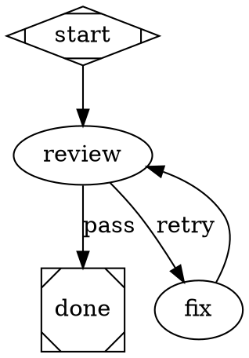
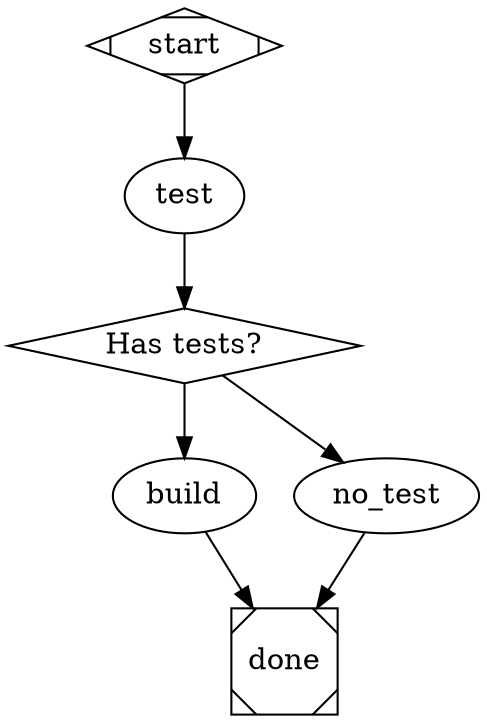

# Routing Reference

Complete reference for the Attractor pipeline engine's routing system.

## Contents

1. [Overview](#1-overview)
2. [The `report_outcome` Tool](#2-the-report_outcome-tool)
3. [Condition Expression Language](#3-condition-expression-language)
4. [Edge Selection Algorithm](#4-edge-selection-algorithm)
5. [`stack.steer` and `stack.observe` Node Types](#5-stacksteer-and-stackobserve-node-types)
6. [Common Patterns and Pitfalls](#6-common-patterns-and-pitfalls)
7. [Data Flow Diagram](#7-data-flow-diagram)

---

## 1. Overview

The routing system determines which node executes next after each node
completes. Three mechanisms work together to produce a routing decision:

**`report_outcome` tool** — The executing agent calls this at the end of a
node's work to signal the outcome. It carries the `status`, an optional
`preferred_label` routing signal, optional `suggested_next_ids`, and optional
`context_updates` that are merged into the pipeline context before edge
selection runs.

**Edge conditions** — Each outgoing edge may carry a `condition` attribute
containing a boolean expression evaluated against the outcome and the current
pipeline context. Conditions are the primary routing mechanism for structured
decision points.

**Five-step edge selection algorithm** — When a node finishes, the engine
runs a deterministic priority-ordered algorithm over the node's outgoing edges
to select the single best edge to follow (spec §3.3: when several edges match,
weight then lexical order break the tie — exactly one successor is chosen).
Parallel fan-out is component-based: it happens only at `shape=component`
nodes via `ParallelHandler`, never from plain multi-edge conditions.

Understanding how these three pieces interact is essential for writing
pipelines that route correctly under all outcome combinations, including
failure cases.

---

## 2. The `report_outcome` Tool

The agent calls `report_outcome` at the end of a node's execution to
communicate the outcome back to the pipeline engine. The engine reads
`last_outcome` from the tool after the node handler returns, constructs an
`Outcome` object, and passes it into edge selection.

### Interface

```
report_outcome(
    status:             string,    -- REQUIRED
    preferred_label:    string,    -- optional
    suggested_next_ids: string[],  -- optional
    context_updates:    object,    -- optional
    notes:              string,    -- optional
    failure_reason:     string     -- optional
)
```

### Parameters

| Parameter | Required | Type | Description |
|-----------|----------|------|-------------|
| `status` | Yes | `"success"` \| `"partial_success"` \| `"retry"` \| `"fail"` \| `"skipped"` | The execution status. Must be a valid `StageStatus` enum value. Validated on call; invalid values return an error. |
| `preferred_label` | No | string | Free-form routing signal. Matched against edge `label` attributes and evaluated as the `outcome` key in condition expressions. This is how custom-labeled edges are reached. |
| `suggested_next_ids` | No | string[] | Hint to the engine: prefer edges whose target node ID appears in this list. Lower priority than condition matches and preferred label matches. |
| `context_updates` | No | object | Key-value pairs merged into the pipeline context before edge selection runs. Values are accessible in subsequent conditions via `context.<key>`. |
| `notes` | No | string | Human-readable summary of what the agent did. Appears in logs and pipeline output. Not used for routing. |
| `failure_reason` | No | string | Explanation of why the node failed. Included in logs and output. Not used for routing. |

### Critical distinction: `status` vs. `preferred_label`

**`status` is not the routing signal for conditional edges.** It records
the execution state (`success`, `fail`, etc.) and is used by the engine for
goal gate evaluation and retry logic.

**`preferred_label` is the routing signal.** Condition expressions evaluate
`outcome`, which resolves to `preferred_label` when set, and falls back to
`status.value` only when `preferred_label` is absent.

```python
# The agent wants to route to a "pass" edge
report_outcome(status="success", preferred_label="pass")
#                      ^                    ^
#                      |                    |
#         records SUCCESS state    "outcome" resolves to "pass"
#         for goal gates           edges see: outcome=pass
```

If `preferred_label` is omitted, `outcome` resolves to the `status` value
(`"success"`, `"fail"`, etc.). In this case, edges with
`condition="outcome=success"` will match — but edges with
`condition="outcome=pass"` will not.

---

## 3. Condition Expression Language

**Canonical source of truth:** `specs/canonical/attractor-spec-canonical.md` §10 — grammar (§10.2),
semantics (§10.3), variable resolution (§10.4), evaluation (§10.5). That snapshot is byte-identical
to upstream `strongdm/attractor` @ `fb57a55` and is normative. This section does not restate it; it
records the **quick reference** plus the places this engine deliberately behaves differently, which
is the part you cannot get from the spec.

### Operators (matches canonical §10.2)

| Operator | Syntax | Meaning |
|----------|--------|---------|
| Equality | `key=value` | True when resolved value equals `value` |
| Inequality | `key!=value` | True when resolved value does not equal `value` |
| Conjunction | `clause1 && clause2` | True when all clauses are true |

Values are compared as strings. Whitespace around operators and values is
stripped before comparison. An empty condition is always eligible.

### Resolution keys

| Key | Resolves to | Status |
|-----|-------------|--------|
| `outcome` | `preferred_label` if set; **otherwise** `status.value`. The primary routing key. | ⚠️ **ENGINE DELTA** — see below |
| `preferred_label` | The raw `preferred_label` field; empty string if not set. | canonical §10.4 |
| `status` | The `StageStatus` enum value (`"success"`, `"fail"`, …). Resolves via context lookup; use `outcome` in most cases. | canonical §10.4 |
| `context.<key>` | A pipeline context variable set via `context_updates` in `report_outcome` or by earlier nodes. Missing keys resolve to the empty string. | canonical §10.4 |
| `context.tool.last_line` | Last line of a `parallelogram` (tool) node's stdout. | ⚠️ **ENGINE EXTENSION** — `specs/EXTENSIONS.md` §20 |

### ⚠️ Engine delta: `outcome` resolves `preferred_label` **first**

Canonical §10.4 defines `outcome` as `outcome.status` **only**, with `preferred_label` as a separate
key. This engine resolves `outcome` to `preferred_label` when one is set, falling back to
`status.value` — `conditions.py`, ledgered as `specs/EXTENSIONS.md` §22 / `SPEC_CONFORMANCE.md`
ATX-5. It is load-bearing: it is how a node steers its own routing through `report_outcome`.

It is also **not behavior-neutral**, and that is the trap: one key, two meanings.

```python
# The agent wants to route to a "pass" edge
report_outcome(status="success", preferred_label="pass")
#                      ^                    ^
#                      |                    |
#         records SUCCESS state    "outcome" resolves to "pass"
#         for goal gates           edges see: outcome=pass
```

A node that emits `preferred_label="retry"` alongside `status="success"` will match
`condition="outcome=retry"` — the label wins. If you need to branch on the *status* regardless of
any label, say so explicitly with `status=…` rather than `outcome=…`.

### ⚠️ Engine extension: `tool.last_line` routing, and the stale-label discipline

`ToolHandler` publishes the last line of the command's stdout as `context.tool.last_line`, which is
the idiom for routing on **observed evidence** rather than on a model's self-assessment — a shell
command prints a routing token and the edge matches it.

`tool.last_line` is set **only on success**. On failure the handler returns `FAIL` before setting
it, so on a second visit the key still holds the *stale* value from the prior success. A bare
`context.tool.last_line=X` edge and an `outcome=fail` edge on the same node can then both match at
once, and the engine deterministically picks one (weight, then lexical) which may not be the one you
meant. `attractor lint`'s **TOPO-002** flags exactly this shape.

**Discipline: conjoin `&& outcome=success` onto every `last_line` edge that shares a source node
with a failure edge**, so the label edge only fires when the label is fresh:

```dot
// AMBIGUOUS — on a second visit, stale last_line + FAIL both match
tool -> done [condition="context.tool.last_line=green"]
tool -> fix  [condition="outcome=fail"]

// EXPLICIT — the conjunction ensures the label edge only fires on fresh success
tool -> done [condition="context.tool.last_line=green && outcome=success"]
tool -> fix  [condition="outcome=fail"]
```

### Examples

```dot
// Route based on custom outcome labels
// Agent calls: report_outcome(status="success", preferred_label="pass")
A -> B [condition="outcome=pass"];
A -> C [condition="outcome=retry"];

// Inequality routing: catch anything except retry
// Matches "pass", "skip", "success", and any other non-retry value
A -> B [condition="outcome!=retry"];
A -> C [condition="outcome=retry"];

// Compound condition: context variable AND outcome
// Agent calls: report_outcome(status="success", preferred_label="pass",
//                             context_updates={"has_tests": "true"})
A -> B [condition="context.has_tests=true && outcome=pass"];
A -> C [condition="context.has_tests=false"];

// Evidence routing off a tool node, with the stale-label conjunction
test_gate -> done      [condition="context.tool.last_line=gate_pass && outcome=success"];
test_gate -> implement [condition="context.tool.last_line=gate_fail && outcome=success"];
test_gate -> escalate  [condition="outcome=fail"];

// Routing on raw status value (less common)
// Appropriate exactly when you must ignore any preferred_label this node emits
A -> B [condition="status=success"];
```

---

## 4. Edge Selection Algorithm

**Canonical source of truth:** `specs/canonical/attractor-spec-canonical.md` §3.3 (prose at `:410-418`,
pseudocode at `:421-458`). Read it there. The five-step priority order — condition match, preferred
label, suggested next IDs, highest weight, lexical tiebreak — is implemented as specified in
`edge_selection.py`, and is not restated at length here.

Two properties of the canonical algorithm are worth stating plainly because they are routinely
misremembered:

- **Steps 2–5 draw from UNCONDITIONAL edges only.** An edge whose `condition` was evaluated and
  returned `false` in Step 1 is *out*. It cannot be revived by a label match, by
  `suggested_next_ids`, or by the weight/lexical tiebreak. Canonical `:438`, `:445`, `:449` all say
  "condition is empty"; `edge_selection.py` enforces the same.
- **Nothing eligible ⇒ `RETURN NONE`** (canonical `:453`). Selection does not fall back to "pick
  something from all the edges."

### Algorithm summary

| Step | Trigger | Candidate pool |
|------|---------|----------------|
| 1 | `condition` evaluates to `true` | Condition-matching edges (weight, then lexical, if several) |
| 2 | `preferred_label` is set | **Unconditional** edges with a matching `label` (normalized: lowercased, trimmed, accelerator prefixes `[Y] `, `Y) `, `Y - ` stripped) |
| 3 | `suggested_next_ids` is set | **Unconditional** edges whose target ID appears in the list |
| 4–5 | None of the above | **Unconditional** edges: highest `weight`, then lexically smallest target ID |
| — | Nothing eligible | `None` → the engine hard-fails (see below) |

### Where this engine differs from canonical §3.3

These deltas are the real content of this section — everything above is the spec.

#### ⚠️ Delta 1 — no-matching-edge is a LOUD hard failure, not a quiet success

Canonical §3.2 step 6 (`:390-393`) treats a dead end as normal completion: return the last outcome
if it was `FAIL`, otherwise `Outcome(status=SUCCESS, notes="Pipeline completed")`. **This engine
does not.** When `select_edge()` returns `None`, the engine terminates the pipeline with
`status=FAIL` and emits a `PIPELINE_ERROR` event carrying `error_type=no_matching_edge`, whatever
the last outcome was. A routing hole is reported as a routing hole.

Ledgered: `specs/EXTENSIONS.md` §33, `SPEC_CONFORMANCE.md` ATX-11.

#### ⚠️ Delta 2 — a `FAIL` outcome is fail-fast and does not traverse plain edges

On a `FAIL` outcome the engine does **not** hand unconditional edges to Step 4–5. A failed node does
not drift into the next node in line just because an unlabelled arrow points there. Three explicit
opt-ins remain fully supported, and they are the only ways forward from a `FAIL`:

| Opt-in | Where it goes | Effect |
|--------|---------------|--------|
| `condition="outcome=fail"` on an edge | the edge | Matched normally in Step 1 |
| `runs_on="always"` / `runs_on="failure"` on the **target** node | downstream node | That unconditional edge becomes eligible under `FAIL` |
| `continue_on_fail="true"` on the **failing** node | the failing node | Engine converts `FAIL`→`SUCCESS` before selection, so unconditional edges work normally |

If none of the three is present, selection yields `None` and Delta 1 fires. Ledgered:
`specs/EXTENSIONS.md` §16.

#### ⚠️ Delta 3 — `outcome=` resolves `preferred_label` before `status`

Step 1 evaluates conditions through the engine's resolver, so every `outcome=` condition inherits
the §3 delta above. Ledgered: `specs/EXTENSIONS.md` §22, `SPEC_CONFORMANCE.md` ATX-5.

### What the lexical tiebreak can still decide

The tiebreak is real, but its scope is narrow. It only runs when a genuine tie survives:

- **several conditional edges match simultaneously** in Step 1 (e.g. the stale-`last_line` shape in
  §3), or
- **several unconditional edges of equal `weight`** reach Step 4–5.

It can no longer choose among edges whose conditions all *failed* — that case is `None`, and
`None` is a hard failure. See [Pitfall: the lexical tiebreak](#pitfall-the-lexical-tiebreak-historical-shape-and-current-scope).

---

## 5. `stack.steer` and `stack.observe` Node Types

`stack.steer` and `stack.observe` are semantic-only node type aliases used in
pipeline graphs. They are not registered as distinct handler types in the
engine.

Both fall through to the `codergen` handler — the same handler used for
`shape=box` nodes. A `stack.steer` or `stack.observe` node is an LLM task node
in every respect that affects execution.

```dot
// These three nodes behave identically at runtime
observe_node [type="stack.observe", prompt="Gather information about: $goal"]
steer_node   [type="stack.steer",   prompt="Decide next action for: $goal"]
plain_node   [prompt="Do something"]
```

The intended documentation convention:

| Type | Signal to pipeline readers |
|------|---------------------------|
| `stack.steer` | This node makes a routing decision. It calls `report_outcome` with a `preferred_label` that drives the next edge. |
| `stack.observe` | This node gathers information. It typically updates pipeline context via `context_updates` for later nodes to use. |

The pipeline validator emits a WARNING for unrecognized `type` values,
including `stack.steer` and `stack.observe`. This warning is expected and does
not affect execution.

```
WARNING: Node "decide" has unrecognized type "stack.steer" -- defaulting to codergen
```

---

## 6. Common Patterns and Pitfalls

### Pattern: Pass/retry routing

The most common two-path routing structure. The node either passes or signals
that it needs another attempt.



The agent calls:
```
report_outcome(status="success", preferred_label="pass")   // to proceed
report_outcome(status="fail",    preferred_label="retry")  // to loop back
```

### Pattern: Defensive routing (recommended)

Use `!=` on the forward path so that the node can proceed even if the agent
calls `report_outcome` with `status="success"` and no `preferred_label`.

```dot
review -> done [condition="outcome!=retry", label="pass",  weight=10]
review -> fix  [condition="outcome=retry",  label="retry", weight=5]
```

**Why this matters:** If the agent completes successfully but forgets to set
`preferred_label`, `outcome` resolves to `"success"` (the status value).

- `"success" != "retry"` is `true` — the forward edge matches, pipeline
  continues correctly.
- `"success" = "pass"` is `false` — with the non-defensive pattern,
  neither edge matches, nothing is eligible, and the engine hard-fails the
  run with `error_type=no_matching_edge` (§4, Delta 1).

Use `condition="outcome=pass"` only when you can guarantee the agent will
always set `preferred_label="pass"` explicitly and you want an explicit
failure if it does not.

### Pattern: Context-driven branching

Use `context_updates` to carry a decision through several nodes before it
affects routing.



The agent on `test` calls:
```
report_outcome(
    status="success",
    context_updates={"has_tests": "true"}
)
```

The `gate` node is `shape=diamond` (the `conditional` handler), which runs no
LLM call and proceeds immediately to edge selection using the current outcome
and context.

---

### Pitfall: the lexical tiebreak (historical shape, and current scope)

**Historical — this is no longer what happens.** An earlier engine, when *no*
condition matched and *no* unconditional edge existed, fell back to picking
among the condition-failed edges by weight then lexical order, silently. That
behavior is gone, and this doc taught it for longer than the engine did.

**The incident, as it happened:** a review loop with two outgoing edges:

```dot
ReviewConsensus -> Fix  [condition="outcome=retry"]
ReviewConsensus -> Test [condition="outcome=pass"]
```

The agent on `ReviewConsensus` called `report_outcome(status="success")`
without setting `preferred_label`, so `outcome` resolved to `"success"`.

- `"success" = "retry"` is false — first edge eliminated.
- `"success" = "pass"` is false — second edge eliminated.
- No unconditional edges exist.
- The old fallback picked by lexical order: `"Fix"` < `"Test"`.
- The engine routed to `Fix` silently, causing an infinite loop.

**On today's engine, that same graph hard-fails immediately.** Steps 2–5 draw
from unconditional edges only, so both condition-failed edges stay eliminated;
`select_edge()` returns `None`; the engine terminates with `status=FAIL` and a
`PIPELINE_ERROR` carrying `error_type=no_matching_edge`. This matches canonical
§3.3 (`:453`, `RETURN NONE`) on the selection side and diverges from canonical
§3.2 step 6 on the termination side — loudly, on purpose (Delta 1 in §4).

The infinite loop is now a stopped pipeline naming the node it could not route
out of. That is better, and it is still a graph you have to fix.

**What the lexical tiebreak can still decide.** It has not been removed — its
scope is narrower than this doc used to imply. It runs only on a genuine tie:

- several **conditional** edges matching simultaneously (Step 1), or
- several **unconditional** edges of equal `weight` (Steps 4–5).

**The fix is unchanged: defensive inequality routing.** It was the right advice
when the failure was a silent misroute and it is the right advice now that the
failure is a hard stop — because it makes routing *total*, so neither failure
mode can occur. Some value always matches:

```dot
// Defensive: catches "success", "pass", and anything other than "retry"
ReviewConsensus -> Test [condition="outcome!=retry", weight=10]
ReviewConsensus -> Fix  [condition="outcome=retry",  weight=5]
```

Ensuring the agent always sets `preferred_label` explicitly also works, but it
depends on a model remembering to do something; the inequality edge does not.

---

### Pitfall: Failure without `report_outcome`

If a node fails (crash, timeout, unhandled exception) without calling
`report_outcome`, the engine constructs a synthetic outcome:

- `status = "fail"`
- `preferred_label = null`
- `outcome` resolves to `"fail"`

With defensive `!=` routing:

```dot
A -> B [condition="outcome!=retry"]
A -> C [condition="outcome=retry"]
```

`"fail" != "retry"` is `true` — the pipeline takes the forward path (`B`)
despite the failure. The forward node receives no useful context about what
failed.

**Mitigations:**

1. Add an explicit failure condition with a higher weight:
   ```dot
   A -> B [condition="outcome!=retry && outcome!=fail", weight=10]
   A -> C [condition="outcome=retry",                   weight=5]
   A -> error_handler [condition="outcome=fail",         weight=8]
   ```

2. Add a node-level `retry_target` on the failing node to redirect on failure:
   ```dot
   A [retry_target="error_handler"]
   ```
   This follows spec §3.7 step 2. For per-node or subgraph failure recovery,
   use a `condition="outcome=fail"` edge (§3.7 step 1) or a node-level
   `retry_target` / `fallback_retry_target` on the failing node (§3.7 steps 2–3).
   If neither is present, the engine halts loud with the failure reason (§3.7 step 4).

   > **Scope note:** Graph-level `retry_target` and `fallback_retry_target` apply
   > **only** to the goal-gate-unsatisfied-at-exit path (§3.4 — *"jump to if exit is
   > reached with unsatisfied goal gates"*). They are **not** consulted on arbitrary
   > per-node failure. Relying on them to catch unhandled node failures is off-spec
   > and will cause the engine to halt loud instead.

3. Use `goal_gate=true` on critical nodes — the engine will not exit the
   pipeline successfully if a goal gate node never reached `SUCCESS`.

---

## 7. Data Flow Diagram

The complete path from an agent decision to an edge selection:

```
Agent calls report_outcome(status="success", preferred_label="pass")
    |
    v
ReportOutcomeTool validates status, stores outcome in last_outcome:
    {
        "status": "success",
        "preferred_label": "pass"
    }
    |
    v
Node handler returns; backend reads last_outcome.
Constructs: Outcome(status=SUCCESS, preferred_label="pass")
    |
    v
context_updates (if any) are merged into PipelineContext.
    |
    v
Edge selection runs over outgoing edges of the completed node:
    |
    |-- Step 1: Evaluate conditions
    |       condition="outcome=pass"
    |           _resolve_key("outcome") -> "pass"   (preferred_label is set)
    |           "pass" == "pass"  ->  TRUE  -> candidate
    |
    |       condition="outcome=retry"
    |           _resolve_key("outcome") -> "pass"
    |           "pass" == "retry" ->  FALSE -> eliminated
    |
    |-- Exactly one candidate -> selected immediately.
    |
    v
Engine follows the selected edge to the target node.
Target node executes with the updated pipeline context.
```

---

### Resolution key reference (quick lookup)

| Condition key | When `preferred_label="pass"` | When `preferred_label` omitted, `status="success"` |
|---------------|-------------------------------|-----------------------------------------------------|
| `outcome` | `"pass"` | `"success"` |
| `preferred_label` | `"pass"` | `""` (empty) |
| `status` | `"success"` | `"success"` |
| `context.my_key` | value from context | value from context |

---

## Further Reading

- [DOT-AUTHORING-GUIDE.md](DOT-AUTHORING-GUIDE.md) — Pipeline patterns,
  node attributes, and authoring best practices
- [DOT-SYNTAX.md](DOT-SYNTAX.md) — Quick reference tables and copy-paste
  patterns
- [APP-INTEGRATION-GUIDE.md](APP-INTEGRATION-GUIDE.md) — Using pipelines
  from Python code
- [GETTING-STARTED.md](GETTING-STARTED.md) — Installation and first run
