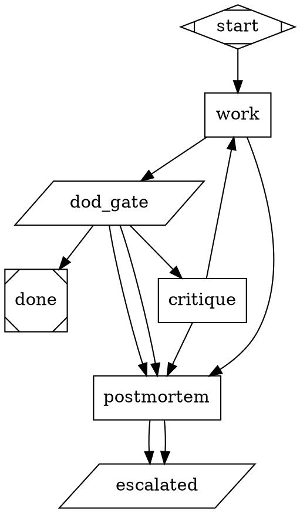

# The composed-child contract

You are the `compose` node of `objective-runner.dot`. No shipped lane fits this
objective, but the objective *is* machine-checkable — so you are going to write a
purpose-built child pipeline for it, and then the runner is going to execute what
you wrote.

Two gates outside your context check your output before it is allowed to run:

| Gate | What it is | What it owns |
|---|---|---|
| `lint_gate` | `attractor lint` — the engine's own linter | executability: parse errors, dead conditional edges (TOPO-001), stale-label collisions (TOPO-002), failure routed into the success exit (TOPO-006), pipe-masked gate exit codes (CMD-001/002). **ERRORs block.** Warnings are recorded, not fatal. |
| `contract_gate` | `check_child_contract.py` | design shape: the nine checks below — and C9 *executes* your `dod.sh` once, before your child ever runs. Any FAIL sends you back here with the report. |

Neither gate can be argued with, and neither one is you. That is deliberate: in a
live run of this repo's own pipelines, a worker fabricated its own convergence
evidence and the gate reading that file passed it. The gates that caught it were
the ones outside the worker's context. Write for those gates.

You get `max_compose` rewrites (default 2, so 3 attempts total) before the run
escalates. Read `.objective/lint-report.txt` and `.objective/contract-report.txt`
before every rewrite — they name exactly what failed.

---

## Write exactly two files

### 1. `.objective/gen/dod.sh` — the definition of done

A shell script, run from the workspace root, that **exits 0 if and only if the
objective is satisfied**.

- It must be able to *fail*, and it must be **red right now**, before any of the
  work exists. Say so with **exit code 1** — not 0 (already satisfied), and not
  2 or more (a script that crashed is broken, not red). This is **C9**, and it is
  not advice: `contract_gate` runs your `dod.sh` once at admission and returns
  `contract_bad` unless it exits 1. Run it yourself first and check `$?`.
- On admission the gate records **`sha256(dod.sh)`** in `.objective/dod.sha256`.
  The parent re-hashes before it re-runs the file, so the DoD that gets re-run is
  the one that was admitted. See *The pin, and what it is not*, below.
- No `echo pass`. No "an LLM said it looked right". Assert something: a test
  runs, a file exists with required content, a schema validates, a command
  exits 0.
- Keep it fast and idempotent. It is run at least twice: once by your child's
  gate, and again by the parent, in a different context, after your child
  finishes.
- Write its output somewhere under `.objective/gen/` so failures are readable.

### 2. `.objective/gen/child.dot` — the child pipeline

A complete, runnable attractor. Build it from what this bundle ships — do not
invent new machinery:

| Source | What to take from it |
|---|---|
| `examples/patterns/task-runner.dot` | the convergence skeleton: attempt → verify → critique → budget wall → postmortem |
| `examples/pipelines/practical/bug-fix.dot` | the shape of a lean 2-loop attractor with a root-cause wall and a fail-loud escalation node |
| `examples/gates/README.md` | the gate idioms (A: always exit 0; B: exit-code gate) and the stale-label discipline |
| `examples/gates/base-sha-anchor.dot` | how to make "did work actually land?" a machine question |

---

## The nine checks (`check_child_contract.py`)

| # | Check | Why it exists |
|---|---|---|
| C1 | **Exactly one exit node** (`shape=Msquare`) | An engine admission rule: `validate_or_raise` refuses a graph with zero or two exits. Two "terminals" are expressed as one green exit plus a fail-loud escalation node. |
| C2 | **A tool node runs `dod.sh`** | The child's exit must be gated on the same definition of done the parent will re-run. A gate the composer can satisfy by writing a file is not a gate. |
| C3 | **No `goal_gate=true` on a `box` node** | Verification inside the context that produced the evidence is not verification. Gates are `parallelogram`; workers are `box`. |
| C4 | **At least one cycle** | If there is no path backwards, nothing converges — and this should have been a recipe, not an attractor. |
| C5 | **A tool node walls an iteration budget and routes exhaustion** | Put the counter *in the gate* so green and red paths both spend it. A loop with no wall runs until the engine's step cap kills it with a bare FAIL, bypassing your postmortem. |
| C6 | **A reachable node exits nonzero when it cannot converge** | A non-converging run must be a LOUD red, not a quiet green. Use the `bug-fix.dot` idiom: `max_retries=0`, `printf escalated; exit 1`, no fail-route out of it. |
| C7 | **Every `box` node has an `outcome=fail` route or a `retry_target`** | A FAIL does not traverse plain edges. An unrouted worker failure runs the pipeline off the rim. |
| C8 | **The child consumes `$goal`** | The objective is cloned into your child's context as `goal`. If nothing reads it, your pipeline is working on nothing in particular. |
| C9 | **`dod.sh` exits 1 when run right now** | The only check that *executes* anything. Everything else about a vacuous `exit 0` definition of done looks perfect: the shape passes, the child converges on its first attempt, and the parent re-runs the same vacuous script and agrees. Running it *before the work exists* is the only way to tell "this check can go green" from "this check was always green". |

---

## The pin, and what it is not

C9 proves your `dod.sh` was red **at admission**. It cannot, by itself, prove the
script the parent re-runs later is the same one. So on admission `contract_gate`
records `sha256(dod.sh)` in `.objective/dod.sha256`, and `triage_gate` does the
same for `.objective/evidence-command`. Before the parent's `evidence_gate`
re-runs anything, it re-hashes both. A mismatch is not a red check and not a
retry — the gate prints `tampered`, exits nonzero, and the run leaves through
`postmortem → escalated` with the altered path named on stderr.

That closes a real accident class. Without it, a child could pass every gate
honestly and then, mid-run, overwrite `.objective/gen/dod.sh` with `exit 0`;
one file touch anywhere gives `delta=changed`, and `rc=0 && delta=changed` is
`evidence_ok`. The pin turns "the check I approved" and "the check I ran" into
the same question.

**Be clear about what this is.** The pin is **anti-accident, not
anti-adversary.** `.objective/` lives in the workspace the child writes to, so a
child determined to defeat the pin can rewrite `dod.sh` *and* `dod.sha256`
together. Closing that structurally means custody outside the workspace — the
pin held somewhere the child cannot reach, or the DoD executed from a copy taken
at admission. That is deliberately out of scope here: this is an exemplar, and
the honest statement of a boundary teaches more than a defence that only looks
complete. What the pin does buy is that **drift, overwrite, and cleanup scripts
now fail loudly instead of passing quietly** — and a child would have to take a
second, deliberate step to get past it.

---

## A child that satisfies every check

Copy the shape, not the words.

---

## Things that will get you sent back

- **A DoD that cannot fail.** `printf pass`, `true`, `test -d .` — or any check
  that was already green before the work existed. C9 runs it and reads `$?`.
- **A DoD that crashes.** Exit 2, 127, or a signal is a *broken script*, not a
  red check. C9 names that case separately, because a crash that happens to be
  nonzero would otherwise look like healthy convergence pressure.
- **Weakening `dod.sh` to get past a gate.** This does **not** buy a louder
  failure later — it is refused at admission. C9 executes the script before your
  child runs; a hollow DoD never gets to run at all. And rewriting it *after*
  admission does not work either: the pin no longer matches, and the parent's
  evidence gate hard-fails the run instead of re-running it.
- **Putting the gate inside the worker** (`goal_gate=true` on a `box`, or a
  worker that writes its own "converged" file for a gate to read).
- **A straight line.** `plan -> implement -> test` with no back-edge is a recipe
  wearing a graph's clothes.
- **An unbounded loop.** No budget wall means the engine's step cap terminates
  the run with a bare FAIL and your postmortem never runs.
- **A `.dot` that only exists in your head.** Write both files to disk. The
  next gate opens them.
